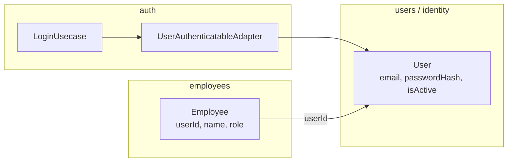

# Auth × Identity — Trade-off e débito técnico

Documento de decisão arquitetural do `grau-api` sobre **onde vivem as credenciais** e como o módulo `auth` obtém um usuário autenticável sem acoplar o domínio a `employees`.

Companion: [`project-structure.md`](./project-structure.md) · módulo de referência: `src/modules/employees` · auth em construção: `src/modules/auth`.

---

## Contexto

Hoje o employee é criado com `email` + `password` (hash via bcrypt) na collection `Employee`. O módulo `auth` precisa desses dados para login e emissão de token, mas:

1. O domínio de `auth` deve permanecer **genérico** (`AuthenticatableUser`), sem importar o domain de `employees`.
2. No futuro pode existir outro ator (ex.: `customer`) com as mesmas necessidades de autenticação.
3. Extrair um bounded context de **identity / users** agora tem custo (migração de schema, orquestração no create, mais módulos) sem segundo ator ainda.

---

## Decisão atual (pragmática)

**Adotar um driven adapter no `auth` que lê a collection `Employee` e mapeia para `AuthenticatableUser`.**

```text
LoginUsecase
  → FindAuthenticatableByEmailPort          (auth — genérico)
       ↑
  EmployeeAuthenticatableAdapter            (auth/infrastructure)
       → collection Employee
       → AuthenticatableUser | null
```

### O que é permitido

| Camada do auth | Pode conhecer Employee? |
|----------------|-------------------------|
| `domain` / `application` / `presentation` | **Não** — só `AuthenticatableUser` e erros de auth |
| `infrastructure/outbound` (adapter) | **Sim** — schema/collection, mapeamento para o tipo do auth |
| `auth.module.ts` / `app.ts` | **Sim** — wiring (`connection.model('Employee', …)`) |

### O que é proibido (anti-pattern)

- `LoginUsecase` (ou domain de auth) importar entity, policies ou ports internos de `employees`
- Colocar `FindAuthenticatableByEmailPort` no `EmployeeMongooseRepository`
- Duplicar regras de negócio de employee dentro de `auth`

### Por que não é anti-pattern

O acoplamento fica **só na borda de infrastructure** (anti-corruption layer leve). O hexágono de auth continua falando em `AuthenticatableUser`. Isso é débito de **persistência compartilhada**, não de domínio cruzado.

---

## Trade-off

| Critério | Adapter → Employee (atual) | Identity próprio (`users`) |
|----------|----------------------------|----------------------------|
| Desacoplamento de domínio | Suficiente (application/domain limpos) | Mais forte |
| Simplicidade / YAGNI | Alta — um ator só | Mais módulos e migração |
| Multi-ator (employee + customer) | Adapter por fonte ou query composta | Natural — uma collection de credenciais |
| Dono da senha / email | Implicitamente `employees` | Explícito: `users` |
| Custo de mudança de schema Employee | Adapter de auth pode quebrar | Auth isolado; employees sem password |
| Alinhamento a produtos maduros / IdP | Intermediário | Mais próximo do mercado |

**Escolha:** priorizar entrega do login com adapter pragmático. Registrar identity como **débito técnico consciente** para quando o gatilho abaixo disparar.

---

## Débito técnico futuro — extrair Identity

### Estado alvo

```text
users          → id, email, passwordHash, isActive, …
employees      → id, userId, name, role, nif, …   (sem password)
customers      → id, userId, …                    (futuro)

auth           → autentica apenas contra users
```



### Responsabilidades no estado alvo

| Módulo | Dono de | Não faz |
|--------|---------|---------|
| `users` / identity | Credenciais, ativo/inativo da conta | Regras de role/NIF de loja |
| `auth` | Login, compare, JWT | Possuir collection de employee |
| `employees` | Dados operacionais / papel | Senha e fluxo de login |

### Fluxos no estado alvo

**Create employee (orquestrado no composition root ou application service):**

1. Criar `User` (email + password hash + isActive)
2. Criar `Employee` com `userId` (+ name, role, …)

**Login:**

1. `FindAuthenticatableByEmail` → collection `users`
2. Compare + checagem de `isActive`
3. JWT com claims mínimas (`sub` = userId, email; role via claim ou resolução posterior em employees)

### Gatilhos para pagar o débito

Pagar este débito quando **qualquer** item for verdadeiro:

1. Surgir um segundo ator autenticável (ex.: customer) com email/senha.
2. “Conta” passar a ser conceito de negócio (recuperação de senha, lockout, 2FA, status de conta independente do employee).
3. O schema/invariantes de employee mudarem com frequência e quebrarem o adapter de auth de forma recorrente.
4. Houver necessidade clara de IdP externo (Auth0, Cognito, etc.) e a fronteira `users` facilitar a migração.

Até lá, manter o adapter e **não** extrair `users` “por pureza”.

### Checklist de migração (quando pagar)

- [ ] Criar módulo `users` (hexágono) com entity/schema de credenciais
- [ ] Migrar dados: employees existentes → users + `employee.userId`; remover `password` do schema de employee
- [ ] Ajustar `CreateEmployeeUsecase` (ou orquestrador) para criar user + employee
- [ ] Trocar `EmployeeAuthenticatableAdapter` por adapter contra `users`
- [ ] Garantir que `auth` application/domain continuam só com `AuthenticatableUser`
- [ ] Atualizar este documento e [`project-structure.md`](./project-structure.md)

---

## Modelo genérico já adotado (não muda com o débito)

Independente da fonte (Employee hoje, User amanhã), o auth trabalha com:

```typescript
type AuthenticatableUser = {
  id: string;
  name: string;
  email: string;
  passwordHash: string;
  isActive: boolean;
  role: string; // string de propósito — sem enums de outros módulos
};
```

Port outbound:

```typescript
interface FindAuthenticatableByEmailPort {
  findAuthenticatableByEmail(email: string): Promise<AuthenticatableUser | null>;
}
```

Falhas de autenticação (não encontrado, senha inválida, inativo) convergem para `AuthenticationError` com mensagem genérica — política atual de produto.

---

## Decisão registrada

| Campo | Valor |
|-------|-------|
| Status | Aceito (pragmático) |
| Data | 2026-07-18 |
| Abordagem atual | Adapter no `auth` → collection `Employee` |
| Débito | Extrair identity (`users`) nos gatilhos acima |
| Não fazer agora | Módulo `users`, split de senha do employee, IdP externo |

Atualize este arquivo quando a decisão mudar (ex.: início da extração de identity ou adoção de IdP).
