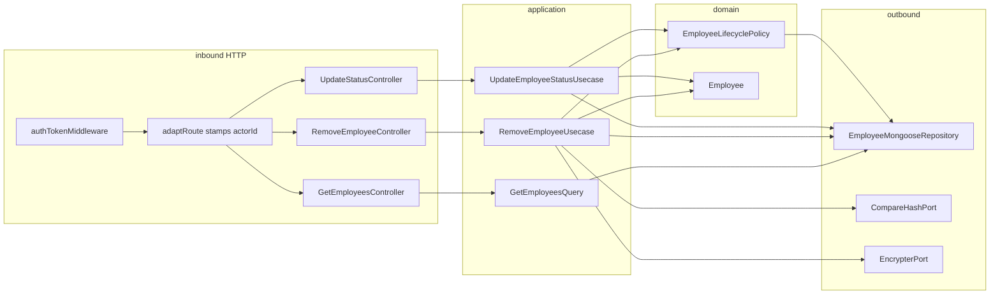

# Design Doc: Employee Lifecycle (v1)

**Status:** Draft — backend shape  
**Date:** 21/08/2026  
**PRD:** [`docs/prd/employee-lifecycle-v1.md`](../prd/employee-lifecycle-v1.md)  
**Glossary:** [`src/modules/employees/CONTEXT.md`](../../src/modules/employees/CONTEXT.md)  
**ADRs:** [`docs/adr/remove-or-inactivate-emp/`](../adr/remove-or-inactivate-emp/)  
**Constitution:** [`AGENTS.md`](../../AGENTS.md) · hexagon: [`employees/AGENT.md`](../../src/modules/employees/AGENT.md)

This document closes **where** Deactivate / Reactivate / Remove live in `grau-api`, **which seams** they cross, and **how** HTTP looks for the frontend. Implementation specs per slice live in [`docs/specs/employee-lifecycle/`](../specs/employee-lifecycle/). It does **not** specify any module that may later store `employeeId` (that stays with the domain expert). It does **not** replace the PRD for product copy or Vue screens.

---

## 1. Problem

The PRD already defines **what** must happen. The employees hexagon today does **not**:

1. Know the **Actor**. `POST /api/employee/update-status` accepts `{ id, status }` from any valid token and will Deactivate an ADMIN. `adaptRoute` never forwards `req.decoded`.
2. Distinguish **Remove** from Deactivate. There is no `REMOVED`, no anonymize path, no Actor password.
3. Hide gone people. `GET /api/employees` returns every document matching filters.
4. Protect **Last Admin**. A single ADMIN can be set `INACTIVE` / `VACATION` and lock the platform once MANAGER cannot Reactivate ADMINs.

Complexity (matrix, Last Admin, anonymize sentinels, step-up password) must sit **behind a deep domain policy**, not in Vue and not in Express middleware.

---

## 2. Objectives and non-goals

### Objectives v1

- Keep work in the existing `employees` hexagon (no new module).
- One domain service for the PRD matrix + Last Admin, used by **both** `update-status` and Remove.
- Stamp `actorId` from the JWT in `adaptRoute` so the body cannot forge the Actor.
- Add `POST /api/employee/remove` with Actor password (step-up).
- Add `Status.REMOVED`, persist anonymized fields, exclude `REMOVED` from the list.
- HTTP codes the frontend can branch on: `400` / `401` / `403` / `409`.

### Non-goals v1

- Hard delete of the Mongo document.
- Audit UI / `?status=REMOVED`.
- Revoking JWTs (Auth sibling: re-check current status after decode).
- Login accepting `VACATION`.
- Create-employee authorization (who may create which role).
- Behaviour of other contexts when they see a `REMOVED` `employeeId`.
- Changing `docs/prd-comissionamento-v1-1.md` or `docs/design-comissionamento-v1.md`.

---

## 3. Language

Use the employees glossary. Do not invent parallel terms.

| Term | In this hexagon |
|------|-----------------|
| Deactivate / Reactivate / Remove / Anonymize / Actor / Target / Removed / Last Admin | [`CONTEXT.md`](../../src/modules/employees/CONTEXT.md) |
| Intent | Internal policy input: `DEACTIVATE` \| `REACTIVATE` \| `VACATION` \| `REMOVE` |

`VACATION` is an operational `update-status` transition, not the INACTIVE fork. On the policy matrix it follows **Deactivate** (MANAGER → `EMPLOYEE` only; ADMIN → any role except Last Admin leaving `ACTIVE`). The PRD table names Deactivate/Reactivate explicitly; Vacation is the remaining operational status and is treated the same cell so the floor manager can still send an `EMPLOYEE` on vacation.

---

## 4. Forms considered

### Where the matrix lives

| | A — Domain `EmployeeLifecyclePolicy` | B — Duplicate in each use case | C — HTTP middleware / controller |
|--|--------------------------------------|--------------------------------|----------------------------------|
| Depth | High (one `assertCan`) | Shallow | Shallow |
| Locality | Tests and changes in one place | Diverges on the next edit | Breaks Express-free presentation |
| Constitution | Domain owns invariants | Application copies domain | Outward layer owns business rules |

**Chosen: A** ([ADR 0010](../adr/remove-or-inactivate-emp/0010-lifecycle-policy-is-a-domain-service.md)). `EmployeePoliciesService` stays create-time **email** occupancy. Different concern.

### How Actor is identified

| | A — `adaptRoute` stamps `actorId` from JWT | B — Second adapter on lifecycle routes | C — Controller decodes `Authorization` |
|--|--------------------------------------------|----------------------------------------|----------------------------------------|
| Forgery | JWT overwrites body `actorId` | Same if done well | Easy to get wrong |
| Surface | One shared adapter | Two adapters, no real variation | Token knowledge in employees presentation |

**Chosen: A** ([ADR 0011](../adr/remove-or-inactivate-emp/0011-adapt-route-stamps-actor-id.md)).

### How `REMOVED` is stored

| | A — `Status.REMOVED` | B — `removedAt` + stay `INACTIVE` | C — Second collection |
|--|----------------------|-----------------------------------|----------------------|
| Glossary | Matches **Removed** | Hides Remove behind INACTIVE | Splits identity |
| HTTP | `isOperationalStatus` for body/query | Ambiguous filters | Two write models |

**Chosen: A** ([ADR 0013](../adr/remove-or-inactivate-emp/0013-removed-is-a-status-enum-value.md)).

---

## 5. Decision of form (v1)

```text
shared adaptRoute          → actorId from req.decoded.id
employees domain           → EmployeeLifecyclePolicy + Employee.anonymize()
employees application      → UpdateEmployeeStatusUsecase (actor + policy)
                           → RemoveEmployeeUsecase (policy + step-up + anonymize)
employees query            → GetEmployeesQuery / findAll never return REMOVED
employees persistence      → status enum + removedAt; $set anonymized fields
```



Do **not** put the matrix in Vue only. Do **not** call the repository from a controller.

---

## 6. As-is vs to-be (this hexagon)

| Surface | Today | v1 |
|---------|--------|----|
| `adaptRoute` | body + params + query + headers | same, then `actorId` from JWT |
| `UpdateEmployeeStatusDto` | `{ id, status }` | `{ actorId, id, status }` |
| `update-status` use case | find → reconstitute → transition → `$set` status | same **after** policy `assertCan` |
| Remove | missing | `POST /api/employee/remove` |
| `EmployeeModel.Status` | `ACTIVE \| INACTIVE \| VACATION` | + `REMOVED` |
| List filter validation | `isStatus` | `isOperationalStatus` (`REMOVED` → `400`) |
| `findAll` | optional `status` equality | always `{ status: { $ne: REMOVED } }` |
| `employees.module` | `encrypter` only | + `CompareHashPort` (same `BcryptAdapter`) |
| HTTP helpers | `400` / `401` / `201` / `200` / `500` | + `403` `forbidden` + `409` `conflict` |

`BcryptAdapter` already implements both ports. Auth already injects it as `compareHash`. Employees only received `encrypt`.

---

## 7. Domain

### 7.1 `EmployeeModel.Status`

```ts
enum Status { ACTIVE, INACTIVE, VACATION, REMOVED }

OPERATIONAL_STATUSES = ACTIVE | INACTIVE | VACATION

isStatus(value)              // reconstitution, persistence
isOperationalStatus(value)   // update-status body, list query
```

`update-status` continues to reject `REMOVED` as a payload (`400` + `InvalidParamError('status')`).

### 7.2 `Employee`

Keep `activate` / `deactivate` / `putOnVacation`. Add `anonymize()`:

- Precondition: current status is `INACTIVE`; otherwise domain error (policy should have refused earlier).
- Sets `status = REMOVED`, `removedAt = now`, `name` sentinel (`Removed`), `email` sentinel `removed.{id}@anonymized.invalid`, `phone = null`, `nif = null`.
- Does **not** hash passwords (no I/O). The use case assigns `Password.fromHash(encryptedRandom)` via `changePassword` before persist, or passes the hash into a persist DTO after `anonymize()`.

Do not persist `employee.toJSON()` as a full document (`Password.toJSON()` is `'[REDACTED]'`). Same rule as update-status.

### 7.3 `EmployeeLifecyclePolicy`

Pure domain service. Constructor: `CountNonRemovedAdminsPort & CountActiveAdminsPort` (domain outbound ports; same repository implements both).

```ts
type LifecycleIntent = 'DEACTIVATE' | 'REACTIVATE' | 'VACATION' | 'REMOVE'

assertCan(input: {
  actor: Employee        // reconstituted
  target: Employee
  intent: LifecycleIntent
}): void
```

Rules (in this order):

1. Actor must be `ACTIVE`. Otherwise throw an actor-credentials error (mapped to `401`, opaque).
2. `actor.id === target.id` and intent is `REMOVE` → refuse (belt-and-braces; statuses already differ).
3. **Matrix**
   - `EMPLOYEE` actor → refuse all (`403`).
   - `MANAGER` actor → allow `DEACTIVATE` / `REACTIVATE` / `VACATION` only if `target.role === EMPLOYEE`; else refuse (`403`). `REMOVE` → refuse (`403`).
   - `ADMIN` actor → allow all intents on any role, except step 4.
4. **Last Admin:**
   - `DEACTIVATE` | `VACATION` on an ADMIN who is currently `ACTIVE`: if `countActiveAdmins() === 1` → `LastAdminProtectedError` (`409`). Leftover `INACTIVE` / `VACATION` ADMINs do not count.
   - `REMOVE` on an ADMIN: if `countNonRemovedAdmins() === 1` → `LastAdminProtectedError` (`409`).
   - `REACTIVATE` of a leftover `INACTIVE` ADMIN (legacy) is allowed for an ADMIN actor.
   - `DEACTIVATE` of an ADMIN who is already `VACATION` does not call `countActiveAdmins` (target is not leaving `ACTIVE`).
5. **Remove extra:** intent `REMOVE` requires `target.status === INACTIVE`; else `409`. Already `REMOVED` → `409` (or not-found opacity on the list; by id this is conflict).

Counting:
- Operational leave (`DEACTIVATE` / `VACATION`): `{ role: ADMIN, status: ACTIVE }`.
- Remove / legacy: `{ role: ADMIN, status: { $ne: REMOVED } }`. `INACTIVE` / `VACATION` ADMINs still count for Remove. Going forward, policy + update-status must not create a Last Admin who is not `ACTIVE`.

### 7.4 New domain errors (illustrative names)

| Error | Typical HTTP |
|-------|----------------|
| `ActorAuthenticationFailedError` | `401` |
| `EmployeeLifecycleForbiddenError` | `403` |
| `LastAdminProtectedError` | `409` |
| `EmployeeNotInactiveError` | `409` |
| `EmployeeAlreadyRemovedError` | `409` |

Existing `EmployeeNotFoundError`, `EmployeeAlreadyInactiveError`, etc. stay `400` as today.

---

## 8. Application

### 8.1 Update status (existing command, tightened)

```ts
UpdateEmployeeStatusDto {
  actorId: string
  id: string
  status: OperationalStatus  // not REMOVED
}
```

Flow:

1. Load Actor by `actorId`; miss → `ActorAuthenticationFailedError`.
2. Load Target by `id`; miss → `EmployeeNotFoundError`.
3. Reconstitute both (`Password.fromHash`).
4. Map `status` → intent (`ACTIVE` → `REACTIVATE`, `INACTIVE` → `DEACTIVATE`, `VACATION` → `VACATION`).
5. `lifecyclePolicy.assertCan({ actor, target, intent })`.
6. `activate` / `deactivate` / `putOnVacation` (unchanged transition errors).
7. `$set` `{ status, deactivateAt }` only.

No encrypter. No email policy.

### 8.2 Remove (new command)

```ts
RemoveEmployeeDto {
  actorId: string       // JWT
  targetId: string      // body.id
  actorPassword: string // body.password
}

RemoveEmployeeResultDto { id: string }
```

Flow:

1. Load Actor; miss → `401` error (do not leak).
2. `CompareHashPort.compare(actorPassword, actor.password)` — fail → same `401` error.
3. Load Target; miss → `EmployeeNotFoundError` (`400`).
4. Reconstitute; `assertCan(..., REMOVE)`.
5. Generate a random secret (application layer, e.g. `crypto.randomBytes`); `EncrypterPort.encrypt`.
6. `target.anonymize()`; apply hashed password.
7. `AnonymizeEmployeeRepositoryPort.anonymize({ id, name, email, phone: null, nif: null, password, status: REMOVED, removedAt })`.
8. Return `{ id }`.

### 8.3 List (existing query, tightened)

- Controller: `isOperationalStatus` instead of `isStatus`. `?status=REMOVED` → `400`.
- Repository `buildFindFilter`: always `status: { $ne: REMOVED }`. If the caller also passed an operational `status`, AND that equality (still not `REMOVED`).
- `total` / `totalPages` stay on the **filtered** set (including the `REMOVED` exclusion).

Create is unchanged: `ensureEmailIsAvailable` still blocks a live original email on `INACTIVE`. After anonymize, `findByEmail(original)` is a miss → Create may reuse it as a **new** id.

---

## 9. HTTP (frontend contract)

All routes stay behind `authTokenMiddleware`.

```http
POST /api/employee/update-status
Authorization: Bearer <Actor token>
{ "id": "<Target>", "status": "INACTIVE" | "ACTIVE" | "VACATION" }
```

```http
POST /api/employee/remove
Authorization: Bearer <Actor token>
{ "id": "<Target>", "password": "<Actor password>" }
```

```http
GET /api/employees?status=ACTIVE|INACTIVE|VACATION&...
```

Do **not** send `actorId` in the body. Ignore it if sent; the adapter overwrites it.

| Result | Status | Body |
|--------|--------|------|
| update-status OK | `200` | `{ data: { id, status } }` |
| remove OK | `200` | `{ data: { id } }` |
| list OK | `200` | `{ data: { employees, page, limit, total, totalPages } }` |
| missing field / invalid operational status / not found / already-in-status | `400` | `{ error }` |
| Actor password / Actor missing / Actor not `ACTIVE` | `401` | `{ error }` opaque |
| Matrix refusal | `403` | `{ error }` |
| Last Admin / Remove not `INACTIVE` / already `REMOVED` | `409` | `{ error }` |
| Unexpected | `500` | `{ error }` |

Add `forbidden` and `conflict` next to `unauthorized` in `@shared/presentation/helpers/http-helper`.

Controllers stay Express-free. They map domain errors to the table above (update-status already maps some to `400`; extend the `catch`).

---

## 10. Persistence

**Schema**

- `status` enum: `ADMIN` roles unchanged; status adds `REMOVED`.
- `removedAt: Date | null` (default `null`).

**Indexes:** unique `email` remains. Sentinels `removed.{id}@anonymized.invalid` are unique per id.

**Repository additions** (same `EmployeeMongooseRepository`):

| Method | Behaviour |
|--------|-----------|
| `countNonRemovedAdmins` | `countDocuments({ role: 'ADMIN', status: { $ne: 'REMOVED' } })` |
| `countActiveAdmins` | `countDocuments({ role: 'ADMIN', status: 'ACTIVE' })` |
| `anonymize` | `updateOne` `$set` of anonymized fields only |
| `findAll` | always exclude `REMOVED` |
| `findById` / `findByEmail` | unchanged (Remove and policy need to load `REMOVED` / sentinels if hit) |

Mapper: `removedAt` on write snapshot and reconstitution. Read model may omit it on the list (list never returns `REMOVED`). If reconstitution needs it, include it on `toCreate`.

---

## 11. Shared adapter (`adaptRoute`)

```ts
const request = {
  ...(req.body || {}),
  ...(req.params || {}),
  ...(req.query || {}),
  ...(req.headers || {}),
  ...(req.decoded?.id ? { actorId: String(req.decoded.id) } : {}),
}
```

`actorId` is applied **last**. Create and list ignore it. Routes without `decoded` (login) omit it.

`authTokenMiddleware` continues to set `req.decoded`. Do not decode JWT in employees presentation.

---

## 12. Wiring

`makeEmployeesModule({ connection, encrypter, compareHash, authTokenMiddleware })`.

`app.ts`: pass `bcryptAdapter` as both `encrypter` and `compareHash` (same instance Auth already uses for compare).

Composition order (extend today’s factory):

1. Model + `EmployeeMongooseRepository`
2. `EmployeePoliciesService` (email)
3. `EmployeeLifecyclePolicy(repository)` 
4. `CreateEmployeeUsecase` / `GetEmployeesQuery` (query uses tightened repo)
5. `UpdateEmployeeStatusUsecase(find, updateStatus, lifecyclePolicy)` — needs Actor load via `FindEmployeeByIdPort`
6. `RemoveEmployeeUsecase(find, compareHash, encrypter, lifecyclePolicy, anonymizeRepo)`
7. Controllers + `makeEmployeeRoutes` + `POST /employee/remove`

---

## 13. Sequences

**Update status**

```text
Client
  → authTokenMiddleware → adaptRoute (actorId)
  → UpdateEmployeeStatusController
  → UpdateEmployeeStatusUsecase
      → find Actor, find Target
      → EmployeeLifecyclePolicy.assertCan
      → activate | deactivate | putOnVacation
      → updateStatus $set
  → 200 | 400 | 401 | 403 | 409
```

**Remove**

```text
Client
  → authTokenMiddleware → adaptRoute (actorId)
  → RemoveEmployeeController  (requires id, password)
  → RemoveEmployeeUsecase
      → find Actor, compare password
      → find Target
      → EmployeeLifecyclePolicy.assertCan(REMOVE)
      → encrypt random secret
      → Employee.anonymize
      → anonymize $set
  → 200 { data: { id } }
```

**List**

```text
Client
  → GetEmployeesController (isOperationalStatus)
  → GetEmployeesQuery
  → findAll (filter AND status ≠ REMOVED)
  → 200
```

---

## 14. Implementation slices (API playbook)

Follow [`AGENTS.md`](../../AGENTS.md) new-command / new-query steps. Specs: [`docs/specs/employee-lifecycle/`](../specs/employee-lifecycle/). Suggested order:

| Slice | What ships | Spec |
|-------|------------|------|
| 0 | `adaptRoute` `actorId`; `forbidden` / `conflict` helpers + specs | [`00-adapt-route-and-http-helpers.md`](../specs/employee-lifecycle/00-adapt-route-and-http-helpers.md) |
| 1 | Domain: `REMOVED`, `isOperationalStatus`, errors, `anonymize()`, `EmployeeLifecyclePolicy` + count ports + specs | [`01-domain.md`](../specs/employee-lifecycle/01-domain.md) |
| 2 | Schema `removedAt` + enum; repo `countNonRemovedAdmins`, `countActiveAdmins`, `anonymize`, `findAll` exclusion + specs | [`02-persistence.md`](../specs/employee-lifecycle/02-persistence.md) |
| 3 | Tighten `UpdateEmployeeStatus` (actor + policy + HTTP map) + specs | [`03-update-employee-status.md`](../specs/employee-lifecycle/03-update-employee-status.md) |
| 4 | `RemoveEmployee` DTO/ports/use case/controller/route/module/`.http` + specs | [`04-remove-employee.md`](../specs/employee-lifecycle/04-remove-employee.md) |
| 5 | List controller `isOperationalStatus`; `AGENT.md` contract | [`05-list-and-module-contract.md`](../specs/employee-lifecycle/05-list-and-module-contract.md) |

Do not implement JWT re-check in this feature. Document it as Auth follow-up.

---

## 15. Interview notes (backend grilling)

Product rules live in the PRD. These were **shape** decisions:

- **Policy in domain, not HTTP** — otherwise Vue and a raw HTTP client diverge; controllers must stay framework-agnostic.
- **Same policy for `update-status` and Remove** — shipping Remove-only would leave `POST /update-status` as a bypass of the matrix.
- **`adaptRoute` stamps Actor** — one invariant; body `actorId` is never trusted.
- **`401` / `403` / `409`** — frontend can tell step-up failure vs hidden action vs Last Admin / wrong state without treating everything as `400`.
- **`REMOVED` on the status enum** — one lifecycle field; operational HTTP keeps a subset so `update-status` cannot “patch to removed”.

---

## 16. Acceptance mapping (API)

Mirrors PRD §7 at the HTTP boundary:

- [ ] MANAGER + `INACTIVE` `EMPLOYEE` → Reactivate `200`; Remove `403`
- [ ] ADMIN + `INACTIVE` `EMPLOYEE` + correct password → Remove `200`; list omits them; Create with old email succeeds as new id
- [ ] ADMIN + wrong password → `401`; no persist
- [ ] Remove while `ACTIVE` / `VACATION` → `409`
- [ ] MANAGER + Target `MANAGER` or `ADMIN` (any lifecycle intent) → `403`
- [ ] Last Admin + Deactivate / Vacation / Remove → `409`
- [ ] Two ADMINs: A Removes `INACTIVE` B → `200`; A remains non-`REMOVED` ADMIN
- [ ] Body `actorId` ignored / overwritten by JWT
- [ ] `update-status` `{ status: "REMOVED" }` → `400`
- [ ] `GET /api/employees?status=REMOVED` → `400`
