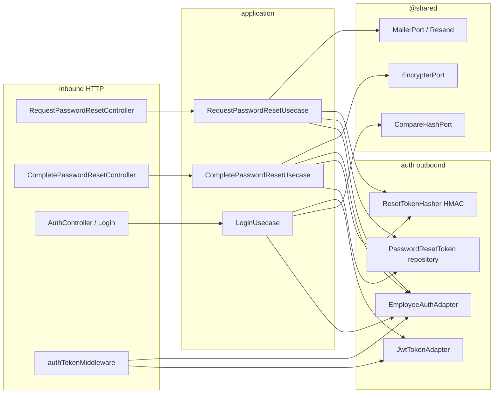

# Design Doc: Password Reset (v1)

**Status:** Draft — backend shape  
**Date:** 01/09/2026  
**PRD:** [`docs/prd/password-reset-v1.md`](../prd/password-reset-v1.md)  
**Glossary:** [`src/modules/auth/CONTEXT.md`](../../src/modules/auth/CONTEXT.md) · [`src/modules/employees/CONTEXT.md`](../../src/modules/employees/CONTEXT.md) (login-capable)  
**ADRs:** [`docs/adr/password-reset/`](../adr/password-reset/)  
**Identity:** [`docs/auth-identity-tradeoff.md`](../auth-identity-tradeoff.md) (option B — hash stays on `Employee`)  
**Lifecycle:** [`docs/design-docs/employee-lifecycle-v1.md`](./employee-lifecycle-v1.md) (JWT status re-check on Deactivate / Remove stays a sibling)  
**Constitution:** [`AGENTS.md`](../../AGENTS.md)

This document closes **where** Password Reset lives in `grau-api`, **which seams** it crosses, and **how** HTTP looks for the frontend. It does **not** replace the PRD for product copy or Vue screens. It does **not** specify the `grau-frontend` page beyond the link contract (`/reset-password?token=`). Implementation specs per slice live in [`docs/specs/password-reset/`](../specs/password-reset/) (same playbook as lifecycle). Load the spec for the slice you are implementing.

---

## 1. Overview and context

Club Grau already authenticates collaborators with `POST /auth` (email + password → Session Token). The password is a bcrypt hash on the `Employee` document. There is no path back in when the password is forgotten.

A mock for “Recuperação de Senha” showed the current password. That is impossible without plaintext or reversible encryption and is rejected ([ADR 0001](../adr/password-reset/0001-password-reset-does-not-reveal.md)).

Without this feature, a login-capable collaborator (`ACTIVE` or `VACATION`) who loses the password is locked out. `VACATION` is a full session (lifecycle v1.1 / ADR 0014), but **login today still refuses anyone who is not `ACTIVE`**. Auth middleware only verifies the JWT signature: a stolen Session Token survives a password change.

**What the person experiences**

1. On the login screen they submit an email to `POST /auth/password-reset`.
2. If they are login-capable and outside cooldown, they receive an email whose link opens **`grau-frontend`** (`https://<origin>/reset-password?token=...`), not an HTML page from this API.
3. They generate a password in the browser and/or type + confirm, then `POST /auth/password-reset/complete`.
4. They go back to login and `POST /auth` with the new password. The email link never issues a Session Token.

Complexity (opacity, cooldown, one-time consume, session kill) sits in the **auth** hexagon behind ports, not in Vue and not in a `mail` module.

---

## 2. Objectives and non-goals

### Objectives v1

- Two unauthenticated commands in the existing `auth` hexagon: **request** and **complete**.
- Login accepts **login-capable** (`loginCapable === true` from the adapter), not `ACTIVE` only.
- Persist at most one outstanding Reset Token per owner in an **auth-owned** collection.
- Send email through `MailerPort` (Resend adapter); request HTTP never returns the token.
- Complete replaces the password hash on `Employee`, consumes the token, increments `sessionVersion`, returns `{ id }` **without** a JWT.
- After complete, previously issued Session Tokens fail `401` on authenticated routes.
- HTTP the frontend can branch on: request always `200`; complete `200` / `400`.

### Non-goals v1

- Revealing, decrypting, or copying the current password.
- Change-password while already authenticated.
- Hexagon `mail` / HTTP for sending email.
- Extracting Identity (`users`); splitting the password off `Employee`.
- Welcome, receipts, or any template other than `password-reset`.
- Auto-login after complete.
- Revoking Session Tokens on Deactivate / Remove (lifecycle sibling: re-check current status after decode).
- A generate-password endpoint on this API (frontend-only).
- Customer (or any second authenticatable actor).
- Queue, retries dashboard, or template CMS.
- Putting `sessionVersion` on the `Employee` entity or glossary.

---

## 3. Language

Use the auth glossary. Do not invent parallel terms. **Login-capable** is employees language; auth consumes a boolean from the adapter.

| Term | In this hexagon |
|------|-----------------|
| Password Reset / Reset Token / Session Token | [`auth/CONTEXT.md`](../../src/modules/auth/CONTEXT.md) |
| Login-capable | [`employees/CONTEXT.md`](../../src/modules/employees/CONTEXT.md) — `ACTIVE` \| `VACATION` |
| Request | Unauthenticated command: email in → opaque `200`; maybe one email with a raw Reset Token |
| Complete | Unauthenticated command: raw token + new password → new hash; no Session Token |

`sessionVersion` is a persistence/JWT stamp, not a glossary term. Do not call it a token.

---

## 4. Forms considered

Closed in the grilling session. Product rules stay in the PRD; these are **shape** decisions.

### Where the Reset Token lives

| | A — Auth Mongo collection | B — Fields on `Employee` | C — Redis |
|--|---------------------------|--------------------------|-----------|
| Owner | Auth (Reset Token is auth vocabulary) | Employees carry a flow they do not own | New infra for a 30-minute secret |
| One outstanding | Unique `ownerId` | Natural (one doc) | Key convention |
| Identity (option B) | Hash of the **password** stays on Employee | Employee becomes a mini-`users` | Split brain |

**Chosen: A** ([ADR 0007](../adr/password-reset/0007-reset-token-lives-in-auth-collection.md)).

### How Session Tokens die after complete

| | A — `passwordChangedAt` + JWT `iat` | B — `sessionVersion` + claim | C — `jti` denylist |
|--|-------------------------------------|------------------------------|---------------------|
| Happy path | Same UNIX second as Login can reject the **new** token | No clock | Infra + `jti` we do not issue today |
| Existing JWTs | Already have `iat` | Absent claim = `0` | No `jti` |

**Chosen: B** ([ADR 0008](../adr/password-reset/0008-session-version-invalidates-jwts.md)). Middleware does **not** re-check `INACTIVE` / `REMOVED` in this feature.

### Where `MailerPort` lives

| | A — Auth outbound only | B — `@shared` (like bcrypt) | C — Hexagon `mail` |
|--|------------------------|-----------------------------|---------------------|
| v1 callers | Auth only | Auth only; seam ready for welcome/receipts | Forbidden by PRD |

**Chosen: B** ([ADR 0009](../adr/password-reset/0009-mailer-port-lives-in-shared.md)). The team will reuse the same port from other hexagons the way they reuse `EncrypterPort`.

### How auth knows login-capable

| | A — `loginCapable: boolean` on the snapshot | B — Auth helper on `'ACTIVE' \| 'VACATION'` | C — `Status` enum in `@shared` |
|--|---------------------------------------------|---------------------------------------------|--------------------------------|
| Anti-corruption | Mapper translates; use cases see a boolean | Auth domain learns employees literals | Both hexagons coupled to shared |

**Chosen: A.** `status: string` remains on the snapshot for the JWT claim (Actor / roles). Use cases for Login / request / complete gate on `loginCapable` only.

### How the Reset Token is hashed

| | A — HMAC-SHA256 + dedicated pepper | B — SHA-256 | C — bcrypt (`EncrypterPort`) |
|--|------------------------------------|-------------|------------------------------|
| Lookup by hash | Yes | Yes | No (salt → would scan) |

**Chosen: A** ([ADR 0010](../adr/password-reset/0010-reset-token-hash-is-hmac-sha256.md)). Pepper is `PASSWORD_RESET_PEPPER`, not `JWT_SECRET`.

### Who knows `sessionVersion`

| | A — Schema + auth adapters only | B — `Employee` entity | C — Second auth collection |
|--|---------------------------------|----------------------|----------------------------|
| Glossary | Untouched | Pollutes employees with a session stamp | Two writes on complete |

**Chosen: A.** Create / update-status / anonymize `$set`s must **not** include `sessionVersion` (a full-document replace would reset it to `0` and resurrect old JWTs).

### What consume does to the row

| | A — Delete | B — `usedAt` flag |
|--|------------|-------------------|
| Reuse | Miss → same “invalid or expired” | Must not leak “already used” |
| Request after complete | No row → new email is allowed | Must ignore used and replace |

**Chosen: A.** Password policy failure does **not** delete. Complete while the owner is no longer login-capable **does** delete (cannot retry after Reactivate without a new request).

### Persist vs send on request

| | A — Send, then persist | B — Persist, rollback if send fails | C — Persist, `500` on send fail |
|--|------------------------|-------------------------------------|----------------------------------|
| Enumeration | Opaque `200` | Opaque `200` if rollback | `500` only on the login-capable path = leak |
| Live link | Send fails → previous row untouched | Replace kills the live link unless restored | Cooldown without inbox |

**Chosen: A** ([ADR 0011](../adr/password-reset/0011-reset-request-sends-before-persist.md)).

---

## 5. Decision of form (v1)

```text
@shared                      → MailerPort + Resend adapter + fake
auth domain                  → errors (opaque request success is not an error;
                               invalid reset token; password mismatch)
auth application             → RequestPasswordResetUsecase
                             → CompletePasswordResetUsecase
                             → LoginUsecase (loginCapable)
auth presentation            → two new controllers; AuthController stays Login
auth inbound HTTP            → POST /auth/password-reset
                             → POST /auth/password-reset/complete
                             → authTokenMiddleware compares sessionVersion
auth outbound                → EmployeeAuthAdapter (read + replace hash + $inc)
                             → PasswordResetToken repository (auth collection)
                             → HMAC hasher (not EncrypterPort)
employees persistence        → sessionVersion: Number, default 0
                             → entity / toCreate / anonymize do not touch it
```



Do **not** import employees domain from auth application. Do **not** call the repository from a controller. Do **not** put the Reset Token on the Employee document.

---

## 6. As-is vs to-be (this hexagon)

| Surface | Today | v1 |
|---------|--------|----|
| `POST /auth` | `status !== 'ACTIVE'` → opaque `401` | `!loginCapable` → same opaque `401` (`VACATION` succeeds) |
| `AuthenticatableUser` | `id, name, email, passwordHash?, status, role` | + `loginCapable`, + `sessionVersion` |
| `TokenPayload` | same minus hash | + `sessionVersion` (omit/`0` on legacy tokens) |
| `EmployeeAuthAdapter` | `findAuthenticatableByEmail` only | + `findAuthenticatableById`; + replace password hash + `$inc sessionVersion` |
| `authTokenMiddleware` | verify signature, set `req.decoded` | after decode: load by id, compare `sessionVersion`, else `401` |
| `makeAuthModule` | login + JWT + routes `POST /` | + mailer, encrypter, reset-token repo, hasher, two routes |
| `app.ts` | `BcryptAdapter` into auth as `compareHash` | + `encrypter` + `mailer` into auth |
| Employee schema | no session stamp | `sessionVersion` default `0` |
| Employee entity | unchanged | **still** unchanged |
| Mail | missing | `MailerPort` in `@shared` |

`BcryptAdapter` already implements encrypt + compare. Auth only received `compareHash`. Complete needs `encrypt`.

---

## 7. Domain

Auth domain stays generic (`AuthenticatableUser`). It does not import `Employee` or `Status`.

### 7.1 `AuthenticatableUser`

```ts
type AuthenticatableUser = {
  id: string
  name: string
  email: string
  passwordHash?: string
  status: string          // JWT claim only
  role: string
  loginCapable: boolean   // adapter-derived; ACTIVE | VACATION → true
  sessionVersion: number  // 0 when the schema field is missing
}
```

`TokenPayload` = `Omit<AuthenticatableUser, 'passwordHash' | 'loginCapable'>`  
(keep `status`, `role`, `sessionVersion`; never put `passwordHash` or `loginCapable` in the JWT).

### 7.2 Login-capable

The mapper is the anti-corruption layer:

```ts
loginCapable = status === 'ACTIVE' || status === 'VACATION'
sessionVersion = document.sessionVersion ?? 0
```

Login / request / complete **do not** switch on status strings.

### 7.3 Reset Token (write model, auth collection)

Not an employees concept. Suggested document:

| Field | Rule |
|-------|------|
| `ownerId` | Authenticatable id (Employee `_id`). Unique. |
| `tokenHash` | HMAC-SHA256(raw, pepper). Indexed. |
| `issuedAt` | Cooldown clock (15 minutes). |
| `expiresAt` | TTL 30 minutes. App rejects if `expiresAt <= now`. Optional Mongo TTL index `expireAfterSeconds: 0` on `expiresAt` for cleanup. |

Raw secret: 32 bytes `crypto.randomBytes`, encoded **base64url** in the query string. The raw value is never persisted.

Consume = **delete** the row.

### 7.4 Errors (illustrative names)

| Error | Typical HTTP | When |
|-------|----------------|------|
| *(none)* | `200` opaque | Request: unknown / not login-capable / cooldown / mail fail |
| `InvalidResetTokenError` | `400` | Complete: unknown, expired, already deleted, or owner no longer login-capable. **One** message: invalid or expired link. |
| `PasswordNotMatchError` | `400` | `password !== passwordConfirmation`. Auth-owned class, **same message as Create**. Do not import employees domain. |
| `InvalidPasswordError` | `400` | `Password.create` (shared VO). Token **not** consumed. |
| `AuthenticationError` | `401` | Login (unchanged opacity). Middleware: missing / invalid / `sessionVersion` mismatch. |

---

## 8. Application

### 8.1 Login (existing command, tightened)

```ts
if (!user || !user.loginCapable) throw new AuthenticationError()
// compare hash, then:
tokenProvider.generateToken({ ..., sessionVersion: user.sessionVersion })
```

### 8.2 Request (new command)

```ts
RequestPasswordResetDto { email: string }
RequestPasswordResetResultDto { ok: true }  // always this shape
```

Flow:

1. `findAuthenticatableByEmail`. If miss or `!loginCapable` → `{ ok: true }`.
2. `findResetTokenByOwnerId`. If row exists and `now - issuedAt < 15min` → `{ ok: true }` (do not send, do not replace).
3. Generate raw token; compose `resetUrl = ${FRONTEND_PUBLIC_ORIGIN}/reset-password?token=${raw}`.
4. `MailerPort.send({ to: email, template: 'password-reset', vars: { resetUrl } })`.
5. If send throws: log, return `{ ok: true }` (previous row untouched).
6. HMAC(raw); upsert by `ownerId` (`issuedAt = now`, `expiresAt = now + 30min`). Last wins.
7. Return `{ ok: true }`.

Never put the raw token in the HTTP response.

### 8.3 Complete (new command)

```ts
CompletePasswordResetDto {
  token: string
  password: string
  passwordConfirmation: string
}
CompletePasswordResetResultDto { id: string }
```

Flow:

1. If `password !== passwordConfirmation` → `PasswordNotMatchError` (do not consume).
2. `Password.create(password)` → VO errors (do not consume).
3. HMAC(token); `findByTokenHash`. Miss or `expiresAt <= now` → `InvalidResetTokenError`.
4. `findAuthenticatableById(ownerId)`. Miss or `!loginCapable` → **delete** the row → `InvalidResetTokenError` (same message).
5. `EncrypterPort.encrypt` (bcrypt).
6. Auth write adapter: `$set: { password: hash }`, `$inc: { sessionVersion: 1 }`.
7. Delete the Reset Token row.
8. Return `{ id }`. No Session Token.

Auth application uses `@shared` `Password` + `EncrypterPort`. It does not call `Employee.changePassword`.

### 8.4 Session check (middleware, not a use case)

After a successful decode:

1. `findAuthenticatableById(decoded.id)`. Miss → `401` `{ error: 'Invalid token' }`.
2. `(decoded.sessionVersion ?? 0) !== user.sessionVersion` → same `401`.
3. Otherwise `req.decoded = payload` (without `passwordHash` / `loginCapable`) and `next()`.

The lookup does **not** refuse `INACTIVE` / `REMOVED` here. That remains the lifecycle sibling.

Middleware becomes **async** (it is sync today). Fail closed on adapter errors (`401` or `500` — pick `500` only for unexpected I/O; do not leak whether the id exists beyond the existing “Invalid token” copy).

---

## 9. HTTP (frontend contract)

Mounted at `/auth` (see `app.ts`). Request and complete are **unauthenticated**. Do not run `authTokenMiddleware` on them.

```http
POST /auth
Content-Type: application/json

{ "email": "<email>", "password": "<new or existing>" }
```

```http
POST /auth/password-reset
Content-Type: application/json

{ "email": "<email>" }
```

```http
POST /auth/password-reset/complete
Content-Type: application/json

{
  "token": "<raw Reset Token from the link>",
  "password": "<new password>",
  "passwordConfirmation": "<same>"
}
```

| Result | Status | Body |
|--------|--------|------|
| Login OK | `200` | `{ data: { token } }` |
| Login unknown / wrong password / not login-capable | `401` | `{ error }` opaque (`AuthenticationError`) |
| Request (any email / cooldown / mail fail) | `200` | `{ data: { ok: true } }` |
| Complete OK | `200` | `{ data: { id } }` — **no** token |
| Complete missing fields | `400` | `{ error }` |
| Complete mismatch / weak password | `400` | `{ error }` (Create-equivalent messages) |
| Complete invalid / expired / consumed / not login-capable | `400` | `{ error }` one message (*invalid or expired link*) |
| Authenticated route, `sessionVersion` mismatch | `401` | `{ error: 'Invalid token' }` |
| Unexpected | `500` | `{ error }` |

No `403` / `409` in this feature.

**Frontend (`grau-frontend`, not this repo):** unauthenticated page from the email link. Generate locally **or** type + confirm; submit complete; link back to login. No current-password field. Generate-secure-password is browser-only and must satisfy `Password.create` (8+, upper, lower, digit, special) or the API returns `400` and the token stays usable.

---

## 10. Persistence

### 10.1 Employee (credentials stay here)

- `sessionVersion: { type: Number, default: 0 }`.
- `password` unchanged (bcrypt string).
- Entity, `toCreate`, update-status `$set`, anonymize `$set`: **do not** mention `sessionVersion`.
- Auth write on complete only:

```ts
updateOne(
  { _id: ownerId },
  { $set: { password: hash }, $inc: { sessionVersion: 1 } },
)
```

### 10.2 PasswordResetToken (auth collection)

Suggested model name `PasswordResetToken`. Indexes: unique `ownerId`; unique (or unique-sparse) `tokenHash`.

| Method | Behaviour |
|--------|-----------|
| `findByOwnerId` | Outstanding row or `null` |
| `findByTokenHash` | Outstanding row or `null` |
| `upsertByOwnerId` | Replace hash + `issuedAt` + `expiresAt` (last wins) |
| `deleteByOwnerId` / `deleteById` | Consume |

### 10.3 Env (design)

| Var | Role |
|-----|------|
| `JWT_SECRET` / `TOKEN_EXPIRATION_TIME` | Session Token (existing) |
| `PASSWORD_RESET_PEPPER` | HMAC of the Reset Token |
| `FRONTEND_PUBLIC_ORIGIN` | Origin for `resetUrl` (no trailing path) |
| `RESEND_API_KEY` | Resend adapter |
| `RESEND_FROM` | From address (ops must verify the domain) |

---

## 11. Shared mailer

```ts
type MailTemplate = 'password-reset'  // widen later; do not invent templates in v1

interface MailerPort {
  send(input: {
    to: string
    template: MailTemplate
    vars: Record<string, string>
  }): Promise<void>
}
```

- Port: `@shared/application/ports` (next to `EncrypterPort`).
- Adapter: `@shared/infrastructure/adapters/resend`.
- Fake: in-memory / no-op for specs; record calls.
- v1 template must never put the password in the message. Vars for `password-reset`: `resetUrl` only.
- `auth` is the only caller in this version. Wiring in `app.ts` (same place as `BcryptAdapter`).

---

## 12. Wiring

`makeAuthModule({ connection, compareHash, encrypter, mailer, /* env via configs */ })`.

Composition order (extend today’s factory):

1. `Employee` model + `EmployeeAuthAdapter` (find by email, find by id, replace credentials).
2. `PasswordResetToken` model + repository.
3. HMAC hasher (`PASSWORD_RESET_PEPPER`).
4. `JwtTokenAdapter` (payload includes `sessionVersion`).
5. `LoginUsecase` (loginCapable + sessionVersion claim).
6. `RequestPasswordResetUsecase` (find + cooldown + send-then-upsert).
7. `CompletePasswordResetUsecase` (VO + consume + `$set`/`$inc`).
8. Controllers + `makeAuthRoutes` (`POST /`, `POST /password-reset`, `POST /password-reset/complete`).
9. `makeAuthTokenMiddleware(decoder, findById)` — async sessionVersion check.

`app.ts`: pass `bcryptAdapter` as `compareHash` **and** `encrypter`; pass `ResendMailerAdapter`.

---

## 13. Sequences

**Request**

```text
Client (login screen)
  → RequestPasswordResetController
  → RequestPasswordResetUsecase
      → find by email
      → if !loginCapable or cooldown: 200 { ok: true }
      → generate raw token, compose resetUrl
      → MailerPort.send
      → on send fail: 200 { ok: true } (no persist)
      → upsert hashed token
  → 200 { data: { ok: true } }
```

**Complete**

```text
Client (frontend /reset-password)
  → CompletePasswordResetController
  → CompletePasswordResetUsecase
      → mismatch / Password.create → 400, row intact
      → HMAC + findByTokenHash
      → load owner; if !loginCapable: delete row → 400
      → bcrypt hash
      → $set password, $inc sessionVersion
      → delete row
  → 200 { data: { id } }
```

**Login (after complete, or VACATION)**

```text
Client
  → AuthController
  → LoginUsecase
      → find by email, loginCapable, compare
      → JWT with sessionVersion
  → 200 { data: { token } }
```

**Authenticated route after complete (old JWT)**

```text
Client
  → authTokenMiddleware
      → decode
      → findById
      → sessionVersion mismatch → 401 Invalid token
```

---

## 14. Implementation slices (API playbook)

Follow [`AGENTS.md`](../../AGENTS.md) new-command steps. Specs: [`docs/specs/password-reset/`](../specs/password-reset/). Implement **one slice at a time**, in this order. Do not skip. Do not pull later-slice HTTP/use-case work into an earlier slice.

Each row is summarized here; the normative implementation contract is the spec in [`docs/specs/password-reset/`](../specs/password-reset/). Do not implement JWT status re-check (Deactivate / Remove) in any of these slices.

| Slice | Ships | Does **not** ship | Prompt sketch |
|-------|--------|-------------------|---------------|
| **0 — Mailer seam** | `MailerPort` in `@shared/application/ports`; Resend adapter + spec; in-memory fake; env `RESEND_API_KEY` / `RESEND_FROM` wired only if needed for the adapter constructor. | Auth use cases, HTTP, Employee schema, Resend template CMS. | Implement slice 0 of password-reset following this design §11 / [ADR 0009](../adr/password-reset/0009-mailer-port-lives-in-shared.md). Add `MailerPort.send({ to, template, vars })` and a Resend adapter with a fake. Template union is `'password-reset'` only. Do not mount routes or call Resend from auth yet. |
| **1 — Persistence seams** | Employee schema `sessionVersion` default `0` (entity / `toCreate` / anonymize untouched). Auth collection `PasswordResetToken` + mapper + repository + specs. HMAC hasher port/adapter (`PASSWORD_RESET_PEPPER`) + spec. | Login behaviour, middleware I/O, request/complete HTTP. | Implement slice 1 following §10 / [ADR 0007](../adr/password-reset/0007-reset-token-lives-in-auth-collection.md) / [ADR 0008](../adr/password-reset/0008-session-version-invalidates-jwts.md) / [ADR 0010](../adr/password-reset/0010-reset-token-hash-is-hmac-sha256.md). Unique `ownerId`. Hasher is HMAC-SHA256, not `EncrypterPort`. |
| **2 — Login tighten** | Mapper sets `loginCapable` + `sessionVersion`. `LoginUsecase` gates on `loginCapable`. JWT encode/decode carries `sessionVersion` (missing → `0`). Specs: `VACATION` succeeds; `INACTIVE` / `REMOVED` / unknown stay opaque `401`. | Middleware DB lookup, reset HTTP. | Implement slice 2 following §8.1 / §6. Stop hardcoding `ACTIVE`. Do not import employees `Status`. Do not add password-reset routes. |
| **3 — Middleware sessionVersion** | `FindAuthenticatableById` on the employee auth adapter. `authTokenMiddleware` async: after decode, load + compare; mismatch / miss → `401` `{ error: 'Invalid token' }`. Specs for claim `0` vs stored `0` (legacy OK) and mismatch. | Request/complete, `$inc`, status re-check. | Implement slice 3 following §8.4 / [ADR 0008](../adr/password-reset/0008-session-version-invalidates-jwts.md). Do not refuse `INACTIVE` here. Wire `findById` in `makeAuthModule`. |
| **4 — Request command** | DTO + inbound/outbound ports + `RequestPasswordResetUsecase` + controller + `POST /auth/password-reset` + module wiring + specs. Send-then-persist. Cooldown 15 min. Opaque `{ ok: true }`. Compose `resetUrl` from `FRONTEND_PUBLIC_ORIGIN`. | Complete, hash replace, `$inc`. | Implement slice 4 following §8.2 / §13 / [ADR 0011](../adr/password-reset/0011-reset-request-sends-before-persist.md). Mail fail and unknown email share the same `200`. Never return the token. |
| **5 — Complete command** | DTO + use case + controller + `POST /auth/password-reset/complete` + write adapter (`$set` password + `$inc sessionVersion`) + delete row + specs. `Password.create` + auth-owned mismatch error. No JWT in the response. | Generate-password HTTP, auto-login, Deactivate revocation. | Implement slice 5 following §8.3 / §9. Policy failures do not delete the token. Not login-capable deletes then `400` same invalid-link message. After success, a slice-3 middleware check must `401` the old JWT. |
| **6 — Contract** | `src/client/auth.http` (login + request + complete). Living `src/modules/auth/AGENT.md` (routes, DTOs, errors, ports). Confirm `CONTEXT.md` still matches (no implementation leak). | New product rules. | Implement slice 6 following §9 and the playbook “update AGENT.md on contract change”. Document the lifecycle sibling (status re-check) as follow-up, do not implement it. |

**Dependencies:** `4` needs `0` + `1`. `5` needs `1` + `2` + `3` (so “old JWT dies” is testable). `2` does not need `0`. Do not merge `4` and `5` into one spec.

---

## 15. Interview notes (backend grilling)

Product rules live in the PRD. These were **shape** decisions:

- **Reset Token collection, not Employee fields** — option B of identity is about the password hash, not parking the whole reset flow on collaborators.
- **`sessionVersion`, not `passwordChangedAt`** — complete → login must not fail on a same-second `iat` compare.
- **`MailerPort` in `@shared`** — same reuse rule as bcrypt; v1 still has one caller.
- **`loginCapable` on the snapshot** — auth use cases never switch on employees status literals.
- **HMAC + dedicated pepper** — complete looks up by hash; bcrypt cannot; do not couple to `JWT_SECRET`.
- **Schema-only `sessionVersion`** — employees glossary stays about lifecycle, not sessions.
- **Delete on consume** — one row = one outstanding; audit is out of scope.
- **Send-then-persist** — no email enumeration via `500`; no cooldown without inbox; previous link survives a failed send.
- **`400` on complete, never `401`** — there is no Session Token on that route.

---

## 16. Trade-offs and alternatives

| Decision | We chose | We rejected | Cost we accept |
|----------|----------|-------------|----------------|
| Token store | Auth collection | Employee fields; Redis | Extra model/repo in auth; two writes on complete (token delete + Employee `$set`) |
| Session kill | `sessionVersion` + per-request find-by-id | `passwordChangedAt`; denylist | Every authenticated request hits Mongo (today the middleware is CPU-only) |
| Mailer home | `@shared` | Auth-only port; `mail` hexagon | Shared widens before a second caller exists (team accepted, same as bcrypt) |
| Login-capable | Boolean on snapshot | Auth status helper; shared `Status` | Tests can set `loginCapable` ≠ `status`; mapper is the source of truth |
| Token hash | HMAC-SHA256 + pepper | SHA-256; bcrypt | New env; rotating the pepper burns live links (TTL 30 min) |
| `sessionVersion` owner | Schema + auth adapters | Entity field; auth collection | A future full-document Employee replace can reset the stamp to `0` |
| Consume | Delete | `usedAt` | No audit trail of used tokens |
| Request I/O order | Send then upsert | Persist first; `500` on mail fail | Rare email whose token never persisted; old link still works |
| Complete HTTP | `400` for dead token | `401` | Frontend must not treat complete like a missing JWT |

Identity extraction (`users`) remains **deferred**. Trigger 2 fired; we paid a write adapter instead ([ADR 0006](../adr/password-reset/0006-password-hash-stays-on-employee.md)). Second authenticatable actor, lockout/2FA, or an IdP still pays that debt.

---

## 17. Open questions

Points that still need validation or another team. They do **not** block slice 0.

| # | Question | Who | Default if unanswered |
|---|----------|-----|------------------------|
| 1 | Exact Vue path: `/reset-password` vs another route? | `grau-frontend` | `/reset-password?token=` as in the PRD |
| 2 | Resend: verified domain and `RESEND_FROM` value? | Ops / platform | Adapter reads env; do not hardcode a from-address |
| 3 | Email HTML in the adapter vs Resend dashboard template id? | Ops + product | Adapter composes a minimal body with `resetUrl` only; swap later without changing `MailerPort` |
| 4 | Portuguese product copy inside the email? | Product | Out of this API’s glossary; keep the link, no password |
| 5 | Mongo TTL index on `expiresAt` vs app-only expiry? | Backend at slice 1 | App check is mandatory; TTL index is optional cleanup |
| 6 | Middleware I/O failure: `401` vs `500`? | Backend at slice 3 | Unexpected I/O → `500`; miss / mismatch → `401` |
| 7 | When to re-check live status after JWT decode (Deactivate / Remove)? | Auth follow-up, **not** this PRD | Document in `AGENT.md` slice 6; do not implement here |

---

## 18. Acceptance mapping (API)

Mirrors PRD §7 at the HTTP boundary:

- [ ] `POST /auth/password-reset` with a login-capable email → `200` `{ ok: true }`; email contains `resetUrl` with the raw token; token not in the HTTP body.
- [ ] Same request with unknown / `INACTIVE` / `REMOVED` → same `200`; no email.
- [ ] Second request within 15 minutes → same `200`; no second email; first token still valid.
- [ ] Resend failure after a login-capable request → same `200`; previous outstanding token unchanged (or none).
- [ ] Complete with valid token + matching passwords that pass `Password` VO → new hash; token unusable; no JWT in the response.
- [ ] After complete, `POST /auth` with the **new** password succeeds for `ACTIVE` and for `VACATION`.
- [ ] After complete, `POST /auth` with the **old** password fails opaquely.
- [ ] After complete, a Session Token issued **before** complete is `401` on an authenticated route.
- [ ] Complete with mismatch or weak password → `400`; token still usable.
- [ ] Complete with expired / reused / unknown token → `400` invalid-or-expired; no write.
- [ ] Complete after Deactivate (owner no longer login-capable) → `400` same message; token deleted.
- [ ] Login with `VACATION` + correct password → `200` + Session Token (regression vs old `ACTIVE`-only check).
- [ ] Login with `INACTIVE` or `REMOVED` → same opaque `401` as unknown credentials.
- [ ] No current-password field is required or returned by the API.
- [ ] Mailer adapter can be faked in tests; production wiring is Resend; email body has the link, not the password.
