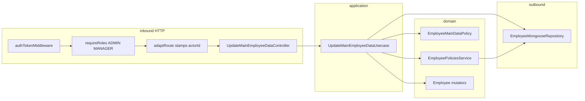

# Design Doc: Update Main Employee Data (v1)

**Status:** Draft — backend shape  
**Date:** 12/09/2026  
**PRD:** [`docs/prd/update-employee-v1.md`](../prd/update-employee-v1.md)  
**Glossary:** [`src/modules/employees/CONTEXT.md`](../../src/modules/employees/CONTEXT.md)  
**ADRs:** [`docs/adr/update-main-employee-data/`](../adr/update-main-employee-data/)  
**Siblings:** [`employee-lifecycle-v1`](./employee-lifecycle-v1.md) · [`password-reset-v1`](./password-reset-v1.md) (JWT / email change stay Auth)  
**Constitution:** [`AGENTS.md`](../../AGENTS.md) · hexagon: [`employees/AGENT.md`](../../src/modules/employees/AGENT.md)

This document closes **where** Update Main Employee Data lives in `grau-api`, **which seams** it crosses, and **how** HTTP looks for the frontend. It does **not** replace the PRD for product copy or Vue screens. Implementation specs: [`docs/specs/update-main-employee-data/`](../specs/update-main-employee-data/). Load the spec for the slice you are implementing.

---

## 1. Problem

The PRD already defines **what** must happen. The employees hexagon today does **not**:

1. Expose a write that corrects identity after Create. There is no PATCH. Operators cannot fix a typo in name, email, phone, or username without inventing a full-record replace.
2. Separate **Edit Collaborator** sections. A single “update employee” would mix Status (Last Admin, INACTIVE fork) and password (personal / Auth) into the same body.
3. Apply a **sparse** Main Data delta. Create always writes a full snapshot. Lifecycle `$set`s only `status` / `deactivateAt` or anonymize sentinels. Nothing `$set`s `name` / `email` / `phone` / `username` without touching `password`.

`Employee` already has `changeName` / `changeEmail` / `changePhone`. There is no `changeUsername`. `EmployeePoliciesService.ensureEmailIsAvailable` treats the Target’s own email as occupied. `EmployeeLifecyclePolicy` owns Deactivate / Reactivate / Vacation / Remove and still gates Actor as `ACTIVE` only — the wrong home for this matrix.

Complexity (sparse PATCH, login-capable Actor, MANAGER-not-self, occupancy except self, no password hash) must sit **behind a deep domain policy + a dedicated command**, not in Vue and not in Express middleware alone.

---

## 2. Objectives and non-goals

### Objectives v1

- Keep work in the existing `employees` hexagon (no new module).
- One command: `UpdateMainEmployeeDataUsecase`.
- One domain service: `EmployeeMainDataPolicy` (matrix + Actor login-capable + Target not Removed).
- Sparse `PATCH /api/employee/:id/main-data` — only present Main Data keys are corrected.
- HTTP gate: `authTokenMiddleware` + `requireRoles('ADMIN', 'MANAGER')` + `adaptRoute` (same `requiredRoleEmployee` as Create / List / update-status / remove).
- Persist with `$set` of present keys only. Never `toJSON()` (password would be `'[REDACTED]'`).
- HTTP the frontend (and curl) can branch on: `400` / `401` / `403` / `409`.

### Non-goals v1

- Get employee by id (modal hydrates from List).
- Personal / professional sections.
- `status` or `password` on this body (reject if sent).
- Username uniqueness.
- Revoking Session Tokens when email changes (Auth sibling; same gap as Deactivate).
- Changing `EmployeeLifecyclePolicy` Actor from `ACTIVE` to login-capable.
- Changing Create’s `ensureEmailIsAvailable` signature (`exceptId`).
- `mail` / welcome email on email change.

---

## 3. Language

Use the employees glossary. Do not invent parallel terms.

| Term | In this hexagon |
|------|-----------------|
| Edit Collaborator / Main Employee Data / Update Main Employee Data / Email occupancy / Actor / Target / Removed / Login-capable | [`CONTEXT.md`](../../src/modules/employees/CONTEXT.md) |

`EmployeeMainDataPolicy` is an implementation name, not a glossary term. Do not call this command update employee, update profile, or Edit Collaborator.

Presence of a field means the JSON **key** is in the body (`"username": null` is present). Omitted keys are unchanged.

---

## 4. Forms considered

Closed in the grilling session. Product rules stay in the PRD; these are **shape** decisions.

### Where the matrix lives

| | A — Domain `EmployeeMainDataPolicy` | B — New intent on `EmployeeLifecyclePolicy` | C — Rules in the use case |
|--|-------------------------------------|---------------------------------------------|---------------------------|
| Depth | One `assertCan` for identity correction | Lifecycle + Main Data in one class | Application copies the invariant |
| Last Admin / Remove | Never enter | Need `if (intent)` skips | Easy to forget |
| Actor | Login-capable; lifecycle stays `ACTIVE`-only until its own PRD | Silent lifecycle change or a flag | Diverges from the hexagon |

**Chosen: A** ([ADR 0001](../adr/update-main-employee-data/0001-main-data-policy-is-a-domain-service.md)). `EmployeePoliciesService` stays email occupancy. `EmployeeLifecyclePolicy` stays Deactivate / Reactivate / Vacation / Remove.

### How the entity applies the sparse delta

| | A — Existing mutators + `changeUsername` | B — `applyMainData({ ... })` on the entity | C — Reconstitute / replace props |
|--|------------------------------------------|--------------------------------------------|----------------------------------|
| Sparseness | Application calls only the mutators for present keys | Entity learns HTTP “omitted vs present” | Leaves `activate` / `anonymize` style |
| `phone` | This use case never calls `changePhone(null)` | Needs a present-and-null sentinel | Easy to overwrite too much |

**Chosen: A.** `changePhone(null)` remains valid for Anonymize. Username stays a primitive (same as Create).

### Where “not a collision with self” lives

| | A — Use case skips occupancy when new `Email` equals current | B — `ensureEmailIsAvailable(email, { exceptId })` | C — `ensureEmailIsAvailableForUpdate` |
|--|--------------------------------------------------------------|---------------------------------------------------|---------------------------------------|
| Create | Untouched | New signature | Two methods, one rule |

**Chosen: A.** Occupancy semantics do not change. Compare after `Email.create` (trim + lower-case) so case is not a false collision.

### What the persist port receives

| | A — `$set` only keys **present** on the command | B — Always `$set` the four Main Data fields from the entity | C — `toJSON()` |
|--|------------------------------------------------|-------------------------------------------------------------|----------------|
| Race | A name PATCH does not stomp a concurrent username write | Stale other three fields | Redacted password |

**Chosen: A.** `username: null` (clear) is a present key and goes into `$set`. Do not `$unset`.

### `status` / `password` on the body

| | A — Ignore if any Main Data key exists | B — `400` if `status` or `password` is present | C — `400` on any extra key |
|--|----------------------------------------|------------------------------------------------|----------------------------|
| Curl / buggy Save | `200` while Status did not change | Visible failure | Schema lock; future personal fields break |

**Chosen: B.** Unknown keys (`role`, `nif`, `foo`) are ignored. Empty / only-unknown body is still `400` (nothing to correct).

### Which errors the policy throws

| | A — Reuse lifecycle’s three errors | B — Reuse Actor + Removed; new matrix error | C — All-new family |
|--|------------------------------------|---------------------------------------------|---------------------|
| Logs / specs | Matrix named “Lifecycle” on a non-lifecycle command | Honest name; same HTTP | Noise |

**Chosen: B.** `EmployeeMainDataForbiddenError` → `403`. Occupancy stays `EmployeeAlreadyExistsError` / `EmployeeInactiveError`. Target miss stays `EmployeeNotFoundError`.

---

## 5. Decision of form (v1)

```text
shared adaptRoute                 → actorId from JWT (already shipped)
employees domain                  → changeUsername + EmployeeMainDataPolicy
employees application             → UpdateMainEmployeeDataUsecase
                                    (skip occupancy when email unchanged)
employees persistence             → updateMainData $set of present keys
employees HTTP                    → PATCH /employee/:id/main-data
                                    + requireRoles('ADMIN', 'MANAGER')
```



Do **not** put the matrix in Vue only. Do **not** call the repository from a controller. Do **not** persist `employee.toJSON()`.

---

## 6. As-is vs to-be (this hexagon)

| Surface | Today | v1 |
|---------|--------|-----|
| Edit Collaborator write | missing | `PATCH /api/employee/:id/main-data` |
| `Employee` | `changeName` / `changeEmail` / `changePhone` | + `changeUsername(string \| null)` |
| Authority | `EmployeeLifecyclePolicy` (lifecycle intents; Actor `ACTIVE`) | + `EmployeeMainDataPolicy` (no intent; Actor login-capable) |
| Email occupancy | Create always calls `ensureEmailIsAvailable` | Same service; this command skips when email omitted or equal |
| Persist identity | only via Create `insert` | + `updateMainData` `$set` of present keys |
| Route gate | Create/List/update-status/remove already `requireRoles('ADMIN','MANAGER')` | Same helper on the new PATCH |
| `adaptRoute` | stamps `actorId` / `actorRole` | unchanged |
| Occupancy HTTP on Create | often `500` via `serverError` | this controller maps occupancy → `409` (PRD) |
| Session after email change | n/a | leftover JWT still valid (Auth sibling) |

---

## 7. Domain

### 7.1 `Employee`

Keep `changeName` / `changeEmail` / `changePhone`. Add:

```ts
changeUsername(username: string | null): void
```

No VO. The use case normalizes blank / whitespace to `null` before calling. This command **never** calls `changePhone(null)`.

Reconstitute the Target with `username: snapshot.username ?? null` (update-status today omits it and defaults `null` — wrong if this command needs the current username in memory). Other profile fields may stay defaulted; they are not written.

### 7.2 `EmployeeMainDataPolicy`

Pure domain service. **No** count ports. **No** intent enum.

```ts
assertCan(input: {
  actor: Employee   // reconstituted
  target: Employee
}): void
```

Rules (in this order):

1. Actor is login-capable (`ACTIVE` \| `VACATION`). Else `ActorAuthenticationFailedError` (opaque; same class as lifecycle).
2. Target is `REMOVED` → `EmployeeAlreadyRemovedError`.
3. Matrix:
   - `EMPLOYEE` actor → `EmployeeMainDataForbiddenError`.
   - `MANAGER` actor → allow only if `target.role === EMPLOYEE` **and** `actor.id !== target.id`; else `EmployeeMainDataForbiddenError`.
   - `ADMIN` actor → allow any Target including self.

Last Admin does not apply. Step-up password does not apply. Do not call `EmployeeLifecyclePolicy`.

`requireRoles` already refuses `EMPLOYEE` at the route. Rule 3 remains belt-and-braces (curl that bypasses the gate, future route mistake).

### 7.3 Errors

| Error | Typical HTTP | When |
|-------|----------------|------|
| `ActorAuthenticationFailedError` | `401` | Actor id missing/blank, not found, or not login-capable |
| `EmployeeMainDataForbiddenError` | `403` | Matrix refusal (new class; same message idea as lifecycle: action not allowed) |
| `EmployeeAlreadyRemovedError` | `409` | Target Removed |
| `EmployeeAlreadyExistsError` | `409` | New email held by `ACTIVE` |
| `EmployeeInactiveError` | `409` | New email held by `INACTIVE` / `VACATION` |
| `EmployeeNotFoundError` | `400` | Target id miss |
| `InvalidEmailError` / `Name` / `Phone` VO | `400` | Present value fails the VO |

Do not throw `EmployeeLifecycleForbiddenError` from this command.

### 7.4 Email occupancy

Unchanged: [`EmployeePoliciesService.ensureEmailIsAvailable`](../../src/modules/employees/domain/services/employee-policies.service.ts). A non-Removed holder still occupies. Removed sentinels do not occupy the original address.

---

## 8. Application

### 8.1 Ports and DTOs

```ts
interface UpdateMainEmployeeDataPort {
  execute(params: UpdateMainEmployeeDataDto): Promise<UpdateMainEmployeeDataResultDto>
}

interface UpdateMainEmployeeDataDto {
  actorId: string                 // adaptRoute; never from the client body
  id: string                      // path :id
  name?: string
  email?: string
  phone?: string
  username?: string | null        // present + blank/null → clear
}

interface UpdateMainEmployeeDataResultDto {
  id: string
}

interface UpdateMainEmployeeDataRepositoryPort {
  updateMainData(params: {
    id: string
    name?: string
    email?: string
    phone?: string
    username?: string | null
  }): Promise<void>
}
```

Inbound DTO only contains keys the controller decided were present. The repository `$set`s exactly those keys (`username` may be `null`).

### 8.2 Use case flow

1. `actorId` empty/blank → `ActorAuthenticationFailedError`.
2. `FindEmployeeByIdPort.findById(actorId)` — miss → same `401` error.
3. `FindEmployeeByIdPort.findById(id)` — miss → `EmployeeNotFoundError`.
4. `Employee.reconstitute` Actor and Target (`Password.fromHash`; `username` from snapshot; `removedAt: snapshot.removedAt ?? null`). Never `Employee.create`.
5. `EmployeeMainDataPolicy.assertCan({ actor, target })`.
6. For each **present** field, validate and mutate:
   - `name` → `Name.create` → `changeName`.
   - `email` → `Email.create`. If `email.value !== target.email.value` → `ensureEmailIsAvailable(email.value)`. Then `changeEmail`.
   - `phone` → `Phone.create` (not null) → `changePhone`.
   - `username` → trim; `''` → `null`; `changeUsername`.
7. `updateMainData({ id, ...present normalized values })`. Do not pass omitted keys.
8. Return `{ id }`.

No encrypter. No `CompareHashPort`. No lifecycle policy.

If the controller already refused an empty patch, the use case may still treat “no Main Data keys” as a programming error (`400` via a small domain/application error, or assume the controller never forwards that). Prefer the controller as the HTTP gate; do not persist an empty `$set`.

---

## 9. HTTP (frontend contract)

```http
PATCH /api/employee/:id/main-data
Authorization: Bearer <Actor token>
Content-Type: application/json

{ "name": "...", "email": "...", "phone": "...", "username": "..." }
```

`:id` is the Target. Do not send `id` or `actorId` in the body. `adaptRoute` merges params then stamps `actorId` last — path `id` wins over a forged body `id`; JWT wins over a forged `actorId`.

Route:

```ts
router.patch(
  '/employee/:id/main-data',
  authTokenMiddleware,
  requiredRoleEmployee, // requireRoles('ADMIN', 'MANAGER')
  adaptRoute(updateMainEmployeeDataController),
)
```

Success: `200` `{ data: { id } }` via `ok(...)`.

| Situation | HTTP |
|-----------|------|
| No Main Data key / only unknown keys | `400` |
| `name` / `email` / `phone` present and blank / whitespace / `null` | `400` |
| Invalid email / phone / name VO | `400` |
| `status` or `password` key present | `400` `InvalidParamError` |
| Target not found | `400` |
| Actor missing, not found, or not login-capable | `401` |
| `EMPLOYEE` token | `403` at `requireRoles` (and/or domain) |
| MANAGER on MANAGER / ADMIN / self | `403` |
| Target Removed | `409` |
| Email occupied (`ACTIVE` or `INACTIVE` / `VACATION`) | `409` |
| Unexpected | `500` |

**Presence:** `'username' in body` (JSON `null` is present → clear). After `adaptRoute`, detect Main Data / dangerous keys on the flattened request the same way other controllers read fields; do not treat path `id` or stamped `actorId` as Main Data.

**Username:** present + `""` / whitespace / `null` → forward `null` (clear).  
**Name / email / phone:** present + empty → `400`; do not forward.

Controllers stay Express-free. Raw shape: `UpdateMainEmployeeDataRequest`.

---

## 10. Persistence

No schema change. Unique index on `email` stays.

`EmployeeMongooseRepository` implements `UpdateMainEmployeeDataRepositoryPort`:

```ts
updateOne(
  { _id: id },
  { $set: /* only keys !== undefined on the params object */ },
)
```

| Key on params | `$set` |
|---------------|--------|
| omitted | not in `$set` |
| `name` / `email` / `phone` string | that field |
| `username: null` | `username: null` |
| `username: "jdoe"` | `username: "jdoe"` |

Invalid ObjectId → no match (use case already loaded the Target; treat as unexpected I/O if update hits 0 documents, or no-op after a successful load — pick **throw unexpected** so a deleted-between-load-and-write is not a silent `200`).

Mapper / `toCreate` / read model: unchanged. List already returns Main Data.

---

## 11. Wiring

`makeEmployeesModule` today already has `EmployeePoliciesService`, `EmployeeLifecyclePolicy`, and `requireRoles`. Extend:

1. `EmployeeMainDataPolicy` (no ports).
2. `UpdateMainEmployeeDataUsecase(findById, policies, mainDataPolicy, updateMainDataRepo)` — same repository instance implements find + email + `updateMainData`.
3. `UpdateMainEmployeeDataController`.
4. `makeEmployeeRoutes` + `PATCH /employee/:id/main-data`.

Do not construct the repository inside the controller or use case.

---

## 12. Sequences

```text
Client
  → authTokenMiddleware
  → requireRoles('ADMIN', 'MANAGER')
  → adaptRoute (path id + actorId from JWT)
  → UpdateMainEmployeeDataController
      → reject empty Main Data / blank name|email|phone / status|password
  → UpdateMainEmployeeDataUsecase
      → find Actor, find Target
      → EmployeeMainDataPolicy.assertCan
      → Email.create; occupancy only if email changed
      → changeName | changeEmail | changePhone | changeUsername
      → updateMainData $set present keys
  → 200 { data: { id } } | 400 | 401 | 403 | 409
```

---

## 13. Implementation slices (API playbook)

Follow [`AGENTS.md`](../../AGENTS.md) new-command steps. Specs: [`docs/specs/update-main-employee-data/`](../specs/update-main-employee-data/). Do not implement HTTP in slice 0.

Implement **one slice at a time**, in this order. Do not skip. Do not pull later-slice HTTP/use-case work into an earlier slice.

`adaptRoute` already stamps `actorId`. `forbidden` / `conflict` helpers already exist. No infra-shared slice.

| Slice | Spec | Ships | Does **not** ship | Prompt sketch |
|-------|------|--------|-------------------|---------------|
| **0 — Domain** | [`00-domain.md`](../specs/update-main-employee-data/00-domain.md) | `changeUsername`; `EmployeeMainDataForbiddenError`; `EmployeeMainDataPolicy.assertCan` + specs (login-capable Actor; Removed Target; matrix including MANAGER self). | Occupancy skip, Mongo `$set`, HTTP, `requireRoles`. | Implement slice 0 of Update Main Employee Data following [`00-domain.md`](../specs/update-main-employee-data/00-domain.md). Do not add a lifecycle intent. Do not change `EmployeeLifecyclePolicy` Actor to login-capable. |
| **1 — Persistence** | [`01-persistence.md`](../specs/update-main-employee-data/01-persistence.md) | `UpdateMainEmployeeDataRepositoryPort` + `updateMainData` on `EmployeeMongooseRepository` + spec (`$set` only present keys; `username: null` persists). | Use case, occupancy, routes. | Implement slice 1 following [`01-persistence.md`](../specs/update-main-employee-data/01-persistence.md). Same `$set`-only rule as `updateStatus` / `anonymize`. No schema migration. Do not write `toJSON()`. |
| **2 — Use case** | [`02-usecase.md`](../specs/update-main-employee-data/02-usecase.md) | DTO + inbound port + `UpdateMainEmployeeDataUsecase` + spec. Load Actor/Target; policy; occupancy only when `Email` ≠ current; mutators; persist patch. | Controller, route, `AGENT.md`. | Implement slice 2 following [`02-usecase.md`](../specs/update-main-employee-data/02-usecase.md). Reconstitute with snapshot `username`. Skip `ensureEmailIsAvailable` on omitted/same email. Never `changePhone(null)`. |
| **3 — HTTP + contract** | [`03-http-and-contract.md`](../specs/update-main-employee-data/03-http-and-contract.md) | Request + controller (sparse presence; `status`/`password` → `400`; path `:id`) + `PATCH` route with `authTokenMiddleware` + `requireRoles('ADMIN','MANAGER')` + module + `employee.http` + living `AGENT.md`. Occupancy → `409`. | Get-by-id, personal/professional, JWT revoke, lifecycle Actor change. | Implement slice 3 following [`03-http-and-contract.md`](../specs/update-main-employee-data/03-http-and-contract.md). Map `EmployeeMainDataForbiddenError` → `403`. Do not trust body `id` / `actorId`. |

**Dependencies:** `1` does not need `2`. `2` needs `0` + `1`. `3` needs `2`. Do not merge `2` and `3` into one spec.

---

## 14. Jira cards

Created as **Tarefa** on Grau System Board (`KAN`), column **Prioritized**, labels `update-main-employee-data` + `slice-N`. Body is the team template; the spec is the implementation contract.

| Slice | Card | Spec |
|-------|------|------|
| 0 — Domain | [KAN-21](https://paulodevmais.atlassian.net/browse/KAN-21) | [`00-domain.md`](../specs/update-main-employee-data/00-domain.md) |
| 1 — Persistence | [KAN-22](https://paulodevmais.atlassian.net/browse/KAN-22) | [`01-persistence.md`](../specs/update-main-employee-data/01-persistence.md) |
| 2 — Use case | [KAN-23](https://paulodevmais.atlassian.net/browse/KAN-23) | [`02-usecase.md`](../specs/update-main-employee-data/02-usecase.md) |
| 3 — HTTP + contract | [KAN-24](https://paulodevmais.atlassian.net/browse/KAN-24) | [`03-http-and-contract.md`](../specs/update-main-employee-data/03-http-and-contract.md) |

---

## 15. Interview notes (backend grilling)

Product rules live in the PRD. These were **shape** decisions:

- **Own policy, not a lifecycle intent** — Last Admin, step-up, and Actor `ACTIVE`-only do not belong here; a future reader must not “fix” Main Data by adding `UPDATE_MAIN_DATA` to `EmployeeLifecyclePolicy`.
- **Mutators, not `applyMainData`** — sparseness is a command/HTTP concern.
- **Skip occupancy in the use case** — occupancy still means “non-Removed holder”; self is this command’s exception, not a new Create API.
- **`$set` present keys** — “changed” in the PRD is “what this command writes”, not a four-field section snapshot (races).
- **`400` on `status` / `password`** — curl and a Save that still posts Status must fail visibly; other extras stay ignored.
- **`EmployeeMainDataForbiddenError`** — same `403` as lifecycle, honest name.
- **`requireRoles` on the route** — same gate as Create/List; domain still enforces MANAGER cells.
- **Four horizontal slices** — domain → persist → use case → HTTP, same playbook as lifecycle.

---

## 16. Trade-offs and alternatives

| Decision | We chose | We rejected | Cost we accept |
|----------|----------|-------------|----------------|
| Matrix home | `EmployeeMainDataPolicy` | Lifecycle intent; use-case `if`s | Second policy class; two matrices to keep aligned on MANAGER→EMPLOYEE |
| Sparse apply | Mutators + `changeUsername` | `applyMainData` on the entity | Use case lists four `if`s |
| Occupancy self | Skip call | `exceptId` on the service | A future command must remember the skip |
| Persist | Present-key `$set` | Four-field snapshot; `toJSON()` | Port API uses optional keys + `username: null` |
| Dangerous extras | `400` for `status`/`password` | Ignore; reject all extras | Frontend Save must omit Status/password |
| Matrix error | New class | Reuse `EmployeeLifecycleForbiddenError` | One more `instanceof` in the controller |
| Actor login-capable | Only this policy | Fix lifecycle in the same PR | Update-status still refuses a `VACATION` Actor until its own change |

---

## 17. Open questions

They do **not** block slice 0.

| # | Question | Who | Default if unanswered |
|---|----------|-----|------------------------|
| 1 | Vue Save payload: omit Status/password vs two requests from the same modal? | `grau-frontend` | Two requests; this PATCH must `400` if they are merged |
| 2 | Create occupancy HTTP (`500` today) — align to `409` later? | Backend / product | Out of this command; only this controller maps `409` |
| 3 | When to revoke JWTs after email change / Deactivate? | Auth sibling | Do not implement here; document in `AGENT.md` slice 3 |
| 4 | `VACATION` Actor on update-status / remove? | Lifecycle follow-up | Do not change `EmployeeLifecyclePolicy` in these slices |
| 5 | 0-document `$set` after a successful `findById` | Backend at slice 1 | Unexpected `500`, not silent `200` |

---

## 18. Acceptance mapping (API)

Mirrors PRD §7 at the HTTP boundary (slice 3 closes these; earlier slices prove the same rules under the ports):

- [ ] ADMIN + Target `EMPLOYEE` + `{ "name": "João Silva" }` → `200 { data: { id } }`; email, phone, username unchanged.
- [ ] ADMIN + `{ "username": "" }` → username `null`; other Main Data unchanged.
- [ ] `{ "phone": "" }` or `{ "name": "" }` → `400`; no write.
- [ ] Empty body → `400`; no write.
- [ ] Email changed to a free address → persist; Target’s previous email is not a self-collision.
- [ ] Email changed to an address held by `ACTIVE` → `409`; no write.
- [ ] Email changed to an address held by `INACTIVE` → `409`; no write.
- [ ] MANAGER + Target `EMPLOYEE` → allowed; MANAGER + MANAGER / ADMIN / self → `403`.
- [ ] EMPLOYEE token → `403`.
- [ ] Target `REMOVED` → `409`.
- [ ] Target `INACTIVE` or `VACATION` + valid name patch → `200`.
- [ ] Body cannot spoof `actorId`; Target id is `:id`.
- [ ] `status` / `password` in the body → `400`; those fields unchanged.
- [ ] Persistence writes only the present Main Data fields (no full document / redacted password).
