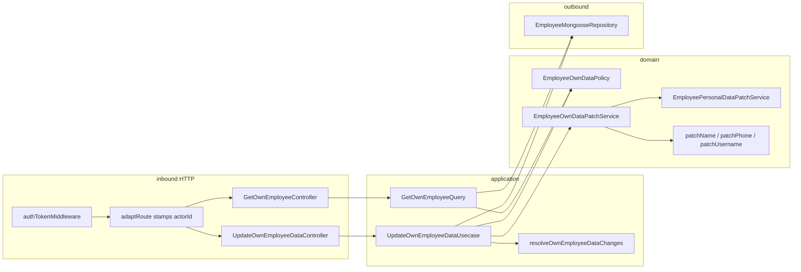

# Design Doc: Update Own Employee Data (v1)

**Status:** Draft — backend shape  
**Date:** 01/10/2026  
**PRD:** [`docs/prd/update-own-employee-data-v1.md`](../prd/update-own-employee-data-v1.md)  
**Glossary:** [`src/modules/employees/CONTEXT.md`](../../src/modules/employees/CONTEXT.md)  
**ADRs:** none for v1 (class boundaries; reversible without a migration)  
**Siblings:** [`update-main-employee-data-v1`](./update-main-employee-data-v1.md) · [`update-personal-employee-data-v1`](./update-personal-employee-data-v1.md) · [`update-professional-employee-data-v1`](./update-professional-employee-data-v1.md)  
**Constitution:** [`AGENTS.md`](../../AGENTS.md) · hexagon: [`employees/AGENT.md`](../../src/modules/employees/AGENT.md)

This document closes **where** Update Own Employee Data and Get Own Employee live in `grau-api`, **which seams** they cross, and **how** HTTP looks for the frontend. It does **not** replace the PRD for product copy or Vue screens. Implementation specs: [`docs/specs/update-own-employee-data/`](../specs/update-own-employee-data/). Load the spec for the slice you are implementing.

One prerequisite is not an own-data slice: align `UpdateMainEmployeeDataController` with its existing HTTP spec so blank `username` clears. See [§13](#13-implementation-slices-api-playbook).

---

## 1. Problem

The PRD already defines **what** must happen. The employees hexagon today does **not**:

1. Expose a self-service write. Edit Collaborator PATCHes refuse an `EMPLOYEE` Actor and refuse `MANAGER` + self. There is no `PATCH /api/employee/me`.
2. Expose a self-service read. `GET /api/employees` is `ADMIN` | `MANAGER`. `findById` returns `EmployeeModel.toCreate`, which includes `password`. The Session Token does not carry phone, username, or personal fields.
3. Apply name, phone, username, and Personal Employee Data in **one** `$set`. `updateMainData` and `updatePersonalData` are two `updateOne`s. `updateMainData`'s type includes `email` and runs occupancy when that key is present.
4. Treat blank `username` as clear on the Main Data HTTP boundary. Domain `patchUsername`, persistence, and [`03-http-and-contract.md`](../specs/update-main-employee-data/03-http-and-contract.md) already clear it. `UpdateMainEmployeeDataController` rejects blank `username` with `InvalidParamError` before the use case.

`EmployeePersonalDataPatchService` already owns gender, languages, emergency contact, NIF, and address (VOs, clear-to-null, errors). This command reuses it. It does **not** call `EmployeeMainDataPatchService`.

---

## 2. Objectives and non-goals

### Objectives v1

- Keep work in the existing `employees` hexagon (no new module).
- One command: `UpdateOwnEmployeeDataUsecase`. One query: `GetOwnEmployeeQuery`.
- One domain policy: `EmployeeOwnDataPolicy.assertCan(status)` — login-capable only.
- One domain patch service: `EmployeeOwnDataPatchService`. It applies `name` / `phone` / `username` through the existing entity mutators and delegates the five personal fields to `EmployeePersonalDataPatchService`.
- One application resolver: `resolveOwnEmployeeDataChanges`, over the eight writable keys. New `EmptyOwnEmployeeDataError`.
- Sparse `GET` and `PATCH /api/employee/me`. Target is the Actor from the Session Token. No path `:id`. No `requireRoles`.
- Persist with one `updateOwnData` `$set` of the keys the patch service returned. Copy the personal `nif` number coercion. Never `toJSON()`. Never call `updateMainData` or `updatePersonalData`.
- Read model is `GetEmployeesItemDto` via `mapEmployeeReadModel` (`FindOwnEmployeePort`). PATCH returns that model **after** the write. No `password`.
- HTTP codes the frontend can branch on: `400` / `401` / `500`. There is no `403` and no `409` on these two routes.
- Prerequisite: `UpdateMainEmployeeDataController` forwards blank `username` as `null`.

### Non-goals v1

- Edit Collaborator routes, matrices, or policies (`EmployeeMainDataPolicy`, `EmployeePersonalDataPolicy`, `EmployeeProfessionalDataPolicy`).
- Email on this write, including ADMIN self. Occupancy does not run.
- Professional fields, `status`, `password`, `employmentId`.
- Get employee by id of **another** collaborator.
- Revoking or reissuing the Session Token when `name` changes.
- Authenticated change-password (Auth).
- Fetching the card at application boot.
- A new read-model type. The list item DTO is the card payload.
- Widening `EmployeeMainDataPatchService` or teaching it to skip email.

---

## 3. Language

Use the employees glossary. Do not invent parallel terms.

| Term | In this hexagon |
|------|-----------------|
| Profile Card / Get Own Employee / Update Own Employee Data / Main Employee Data / Personal Employee Data / Actor / Login-capable / Target | [`CONTEXT.md`](../../src/modules/employees/CONTEXT.md) |

`EmployeeOwnDataPolicy`, `EmployeeOwnDataPatchService`, and `FindOwnEmployeePort` are implementation names, not glossary terms.

There is no Target on this command or query. The only record is the Actor's. A collaborator who is not login-capable is an Actor without a session (`401`), not a Removed Target (`409`).

Presence of a field means the JSON **key** is in the body (`"username": null` is present). Omitted writable keys are unchanged. Ignored keys (`email`, `password`, `status`, `role`, `jobTitle`, `employmentId`, `id`, unknown) do not count as a field to correct.

| Field | Present + valid | Present + `null` / blank / whitespace |
|-------|-----------------|----------------------------------------|
| `name`, `phone` | store | `400` — do not clear |
| `username` and the five personal fields | store | clear to `null` |

---

## 4. Forms considered

Closed in the grilling session. Product rules stay in the PRD; these are **shape** decisions.

### Who applies mutations

| | A — `EmployeeOwnDataPatchService` delegates personal; name / phone / username via entity mutators | B — Use case calls both existing patch services | C — `updateMainData` then `updatePersonalData` |
|--|--|--|--|
| Email / occupancy | The own service does not depend on `EmployeeMainDataPatchService` | Stays out only while nobody passes `email` | The main port's type includes `email` |
| Clear rules | Personal service is reused | Both families reused | Two writes |
| Atomicity | One persist patch | One persist patch | Two `updateOne`s |

**Chosen: A.**

### Persist

| | A — New `updateOwnData`, one `$set` | B — Both existing repository methods | C — Widen `updateMainData` with personal fields |
|--|--|--|--|
| Atomicity | One `updateOne` | Two `updateOne`s | One `updateOne` on the operator port |
| `nif` | Copy the personal number coercion | The second write already coerces | The main port does not coerce `nif` today |

**Chosen: A.**

### Read model

| | A — `FindOwnEmployeePort` + `mapEmployeeReadModel`; PATCH re-reads after `$set` | B — PATCH maps the in-memory entity; GET uses the port | C — Both start from `findById` (`toCreate`) and strip `password` |
|--|--|--|--|
| One shape | GET and PATCH call the same port | Two builders | Query depends on the write snapshot |
| Password | Absent from the read port | PATCH must remember to omit it | Write snapshot crosses the query |

**Chosen: A.** `findById` stays the write snapshot used to reconstitute the entity on PATCH. The write port stays `Promise<void>`.

### Policy input

| | A — `assertCan(status)` | B — An `Employee`, like Main / Personal | C — `{ actor, target }` |
|--|--|--|--|
| GET | Passes `readModel.status`. No `reconstitute` (`Employee.reconstitute` requires `password`) | GET must `findById` only to satisfy the policy | Same, and invents a Target |
| `INACTIVE` / `REMOVED` | `ActorAuthenticationFailedError` → `401` | Easy to throw `EmployeeAlreadyRemovedError` → `409` | The Removed `409` is the natural reading of a Target parameter |

**Chosen: A.** Actor missing (`findById` or read model `null`) is `401` in the use case and the query, before the policy, same as the siblings' missing-Actor branch. No role. No `EmployeeAlreadyRemovedError`.

### Blank username

The own PRD clears `username` on `""` / `null`. `patchUsername` and the Main Data HTTP spec already do. `UpdateMainEmployeeDataController` returns `400` for blank `username` and never calls the use case.

| | A — Clear to `null` on the Profile Card, and fix the Main Data controller | B — `400` on the Profile Card, matching today's Main controller |
|--|--|--|
| `{ "username": "" }` | Persists `null` | No write |
| `name` / `phone` blank | Stay `400` | Stay `400` |

**Chosen: A.** The Main Data fix restores [`03-http-and-contract.md`](../specs/update-main-employee-data/03-http-and-contract.md). It is a prerequisite, not an own-data slice. `name`, `email`, and `phone` on that controller stay required-if-present.

### Empty body

`resolveMainEmployeeDataChanges` throws when no main key is defined. `resolvePersonalEmployeeDataChanges` throws when no personal key is defined. `{ "address": "Rua B" }` would hit the main empty error. `{ "name": "Ana" }` would hit the personal empty error. `{ "email": "other@example.com" }` must not count as a field to correct.

| | A — `resolveOwnEmployeeDataChanges` over the eight writable keys | B — Call both resolvers and ignore the empty one |
|--|--|--|
| One section of the card | Proceeds | Names the other command's empty error |
| `{}` or only ignored keys | `EmptyOwnEmployeeDataError` | Wrong error name |

**Chosen: A.** The controller returns `MissingParamError` when none of the eight keys are in the body, before `execute`. Both map to `400`.

### `INACTIVE` Actor and `{}`

The controller empty check runs before `execute`. A leftover JWT with `PATCH {}` never reaches the policy.

| | A — `{}` is always `400` | B — Load the Actor first; `INACTIVE` + `{}` is `401` |
|--|--|--|
| Combined case | `400`, no policy, no write | `401` |
| Login-capable + `{}` | `400` | `400` after the policy |
| GET | Unchanged (`401` when the Actor is missing or not login-capable) | Unchanged |

**Chosen: A.** Same recorte as the Main and Personal controllers: an empty body does not open the use case. `401` applies to GET, and to PATCH that carries at least one writable key when the Actor is missing or not login-capable. `{ "name": "" }` is also `400` in the controller (`InvalidParamError`), before `execute`, including for an `INACTIVE` Actor.

### Slice cut

| | A — Five own slices; Main username fix inside own HTTP | B — Main username fix is a prerequisite; then five slices | C — Four slices; query merged into HTTP |
|--|--|--|--|
| Username fix | Lands only when `PATCH /me` lands | Reviewed alone, against the spec that already exists | Same as A |
| Query | Own slice, before routes | Same | Controller and query in one slice |
| Persistence | `updateOwnData` and `FindOwnEmployeePort` together | Same | Same |

**Chosen: B.**

---

## 5. Decision of form (v1)

```text
prerequisite                      → UpdateMainEmployeeDataController
                                    blank username → null (existing HTTP spec)
shared adaptRoute                 → actorId from JWT (already shipped)
employees domain                  → EmployeeOwnDataPolicy.assertCan(status)
                                    + EmployeeOwnDataPatchService
                                    + EmployeePersonalDataPatchService (reuse)
                                    + EmptyOwnEmployeeDataError
employees application             → resolveOwnEmployeeDataChanges
                                    + UpdateOwnEmployeeDataUsecase
                                    + GetOwnEmployeeQuery
employees persistence             → updateOwnData one $set (nif number coercion)
                                    + FindOwnEmployeePort via mapEmployeeReadModel
employees HTTP                    → GET + PATCH /employee/me
                                    + authTokenMiddleware only
```



Do **not** put login-capable checks in Vue only. Do **not** call the repository from a controller. Do **not** persist `employee.toJSON()`. Do **not** call `EmployeeMainDataPatchService`, `updateMainData`, or `updatePersonalData` from this command. Do **not** return `EmployeeModel.toCreate` from GET or from PATCH `200`. Do **not** add `requireRoles` on these two routes.

---

## 6. As-is vs to-be (this hexagon)

| Surface | Today | v1 |
|---------|--------|----|
| Profile Card read | missing; List is `ADMIN` \| `MANAGER` | `GET /api/employee/me` → `GetEmployeesItemDto` |
| Profile Card write | missing | `PATCH /api/employee/me`, eight writable keys, one `$set` |
| Authority | Operator policies refuse `EMPLOYEE` and `MANAGER` + self | `EmployeeOwnDataPolicy` on status only; any login-capable role, self only |
| Domain patch | Main (async, occupancy, includes email); Personal (sync) | + `EmployeeOwnDataPatchService` (sync; delegates personal) |
| Empty body | Per-section empty errors | + `EmptyOwnEmployeeDataError` for the eight-key union |
| Read of one collaborator | `findById` → `toCreate` (password) | + `FindOwnEmployeePort` → `mapEmployeeReadModel` |
| Persist mixed main-without-email + personal | two `updateOne`s | + `updateOwnData` |
| Main HTTP `username` | controller `400` on blank | blank → `null`, per the existing Main HTTP spec |
| Operator PATCH routes | `requireRoles('ADMIN', 'MANAGER')` | **unchanged** |
| `adaptRoute` | stamps `actorId` | unchanged |
| Session after `name` change | leftover JWT | leftover JWT (Auth sibling) |

---

## 7. Domain

No new entity mutators. `patchName`, `patchPhone`, `patchUsername`, and the personal `assign*` methods already exist. `Employee.normalizeUsername` already trims and maps blank to `null`.

### 7.1 `EmployeeOwnDataPolicy`

```ts
assertCan(status: EmployeeModel.Status): void
```

`ACTIVE` and `VACATION` return. Any other status throws `ActorAuthenticationFailedError`.

The method does not take an `Employee`, a role, or a Target. It does not throw `EmployeeAlreadyRemovedError`, `EmployeeNotFoundError`, or any `*ForbiddenError`.

`GetOwnEmployeeQuery` and `UpdateOwnEmployeeDataUsecase` both call it. The query passes `readModel.status`. The use case passes `actor.status` after reconstitute. Missing Actor is **not** this method's job.

### 7.2 `EmployeeOwnDataPatchService`

Synchronous. Constructor takes `EmployeePersonalDataPatchService`. No outbound ports. No `EmployeeMainDataPatchService`. No `EmployeePoliciesService`.

```ts
apply(
  actor: Employee,
  changes: OwnEmployeeDataChanges,
): OwnEmployeeDataPersistPatch
```

`OwnEmployeeDataChanges` is the eight writable keys that survived the resolver. Values are never `undefined`. `null` means present.

```ts
type OwnEmployeeDataField =
  | 'name'
  | 'phone'
  | 'username'
  | 'gender'
  | 'languages'
  | 'emergencyContact'
  | 'nif'
  | 'address'

type OwnEmployeeDataChanges = Partial<
  Record<OwnEmployeeDataField, string | null>
>

type OwnEmployeeDataPersistPatch = {
  name?: string
  phone?: string
  username?: string | null
  gender?: string | null
  languages?: string | null
  emergencyContact?: string | null
  nif?: string | null
  address?: string | null
}
```

| Field | Rule |
|-------|------|
| `name` present | Must be a non-blank string. `actor.patchName(value)`. Always include `name` on the persist patch. `null` throws `InvalidNameError` (do not use a truthy `if (changes.name)`, which would skip `null`). |
| `phone` present | Must be a non-blank string. `actor.patchPhone(value)`. Always include `phone`. `null` throws `InvalidPhoneFormatError`. |
| `username` present, including `null` | `actor.patchUsername(value)`. Always include `username` (`null` clears). |
| Any personal key present | Build a `PersonalEmployeeDataChanges` with **only** those keys. `personalPatchService.apply(actor, personalChanges)`. Merge the returned patch. |

`email` is not a key of these types. Invalid gender, NIF, phone, and emergency contact throw the errors the personal service and the VOs already throw (`InvalidEmployeeGenderError`, `InvalidNifError`, `InvalidPhoneFormatError`). Any throw aborts `apply`. The use case must not call `updateOwnData`.

In-memory mutations inside a failed `apply` are discarded with the entity. Persistence sees a patch only when `apply` returns.

### 7.3 Errors

| Error | Typical HTTP | When |
|-------|-------------|------|
| `ActorAuthenticationFailedError` | `401` | `actorId` missing or blank; Actor `findById` miss; own read model miss; status not login-capable |
| `EmptyOwnEmployeeDataError` | `400` | Resolver: none of the eight keys defined. Safety net under the controller's `MissingParamError` |
| `MissingParamError` | `400` | Controller: none of the eight keys in the body (ignored keys do not count) |
| `InvalidParamError` | `400` | Controller: `name` or `phone` present and blank / `null` / whitespace |
| `InvalidNameError` | `400` | `patchName` / VO, when a non-blank name is still invalid |
| `InvalidPhoneFormatError` | `400` | `phone` or `emergencyContact` |
| `InvalidNifError` | `400` | `nif` format or check digit |
| `InvalidEmployeeGenderError` | `400` | `gender` present, non-null, not `male` \| `female` \| `other` |
| Unexpected, including `matchedCount === 0` or a null re-read after a found Actor | `500` | Same guard style as `updateMainData` / `updatePersonalData` |

New class: `EmptyOwnEmployeeDataError` only. Reuse the others. Do not throw `EmptyMainEmployeeDataError`, `EmptyPersonalEmployeeDataError`, `EmployeeMainDataForbiddenError`, `EmployeePersonalDataForbiddenError`, `EmployeeNotFoundError`, or `EmployeeAlreadyRemovedError` from this command or query.

There is no `403` product path and no `409` occupancy path.

---

## 8. Application

### 8.1 Ports and DTOs

```ts
interface UpdateOwnEmployeeDataPort {
  execute(params: UpdateOwnEmployeeDataDto): Promise<GetEmployeesItemDto>
}

interface UpdateOwnEmployeeDataDto {
  actorId: string
  name?: string
  phone?: string
  username?: string | null
  gender?: string | null
  languages?: string | null
  emergencyContact?: string | null
  nif?: string | null
  address?: string | null
}

interface UpdateOwnEmployeeDataRepositoryPort {
  updateOwnData(params: { id: string } & OwnEmployeeDataPersistPatch): Promise<void>
}

interface FindOwnEmployeePort {
  findOwnEmployee(id: string): Promise<GetEmployeesItemDto | null>
}

interface GetOwnEmployeePort {
  execute(params: { actorId: string }): Promise<GetEmployeesItemDto>
}
```

The command result **is** `GetEmployeesItemDto`. Do not introduce a second read-model interface and do not return `{ id }`.

The inbound DTO contains only keys the controller decided were present, plus `actorId`. It has no `id`, no `email`, no `password`.

`FindEmployeeByIdPort` stays the write snapshot (`EmployeeModel.toCreate`). PATCH uses it to reconstitute. GET does not.

### 8.2 `resolveOwnEmployeeDataChanges`

```ts
function resolveOwnEmployeeDataChanges(
  fields: Partial<Record<OwnEmployeeDataField, string | null | undefined>>,
): OwnEmployeeDataChanges
```

Strip `undefined`. Throw `EmptyOwnEmployeeDataError` if none of the eight keys remain. Do not call `resolveMainEmployeeDataChanges` or `resolvePersonalEmployeeDataChanges`. `null` stays.

### 8.3 Use case flow

1. `actorId` empty or blank → `ActorAuthenticationFailedError`.
2. `FindEmployeeByIdPort.findById(actorId)` — miss → same `401` error.
3. `EmployeeSnapshotMapper.toEntity`. Never `Employee.create`. Do not change the mapper in these slices: fields it does not forward (`employmentId`) are not written by this command.
4. `EmployeeOwnDataPolicy.assertCan(actor.status)`.
5. `resolveOwnEmployeeDataChanges(...)`.
6. `EmployeeOwnDataPatchService.apply(actor, changes)`.
7. `updateOwnData({ id: actorId, ...patch })`.
8. `FindOwnEmployeePort.findOwnEmployee(actorId)`. `null` → throw unexpected (`500`). The Actor was just found; this is not `401`.
9. Return the read model.

No encrypter. No occupancy. No operator policy. No second Target load.

Order is the contract: policy, then resolver, then patch, then one `$set`, then re-read. Any throw before step 7 → no `$set`. Step 8 runs only after a successful `$set`.

A direct `execute` with every writable field `undefined` still throws `EmptyOwnEmployeeDataError`, and only after the Actor check. HTTP `{}` never reaches `execute` (controller `MissingParamError`).

### 8.4 `GetOwnEmployeeQuery`

Queries in this hexagon do not call operator policies, `Employee.create`, or the encrypter. This query **does** call `EmployeeOwnDataPolicy`, because the only rule is login-capable status and the read model already carries `status`. It does not reconstitute an `Employee`.

1. `actorId` empty or blank → `ActorAuthenticationFailedError`.
2. `findOwnEmployee(actorId)` — `null` → same `401` error. Not `EmployeeNotFoundError`.
3. `assertCan(readModel.status)`.
4. Return the read model.

Do not call `FindEmployeeByIdPort` from this query. Do not require a previous PATCH.

---

## 9. HTTP (frontend contract)

### 9.1 Prerequisite — Main Data username

`UpdateMainEmployeeDataController` today runs `isBlank` on every present main key, including `username`, and returns `InvalidParamError`. The HTTP spec for that command already says blank `username` forwards `null`.

Change that controller only:

- `username` present + `""` / whitespace / `null` → DTO `username: null`. The use case and `patchUsername` already clear.
- `name`, `email`, and `phone` present + blank / `null` / whitespace stay `InvalidParamError`.
- `status` and `password` keys stay `400`, as they are today on that route.
- Update the controller spec that currently expects `400` for blank `username`. Expect `execute` with `username: null`.

Do not import own-data types. Do not change `EmployeeMainDataPolicy` or `updateMainData`.

### 9.2 Profile Card

```http
GET /api/employee/me
Authorization: Bearer <Actor token>
```

```http
PATCH /api/employee/me
Authorization: Bearer <Actor token>
Content-Type: application/json

{
  "name": "João Silva",
  "phone": "+351 912 345 678",
  "username": "joao",
  "gender": "male",
  "languages": "Português",
  "emergencyContact": "+351 912 345 678",
  "nif": "123456789",
  "address": "Rua do Grau, 10, Lisboa"
}
```

No path `:id`. Do not send `id` or `actorId` in the body. `adaptRoute` spreads the body, then stamps `actorId` from the JWT, which overwrites a forged `actorId`. A body `id` is ignored.

Routes:

```ts
router.get(
  '/employee/me',
  authTokenMiddleware,
  adaptRoute(getOwnEmployeeController),
)
router.patch(
  '/employee/me',
  authTokenMiddleware,
  adaptRoute(updateOwnEmployeeDataController),
)
```

`/employee/:id/main-data` does not capture `/employee/me`. Still register the literal `me` paths and do not add a Target parameter later to “match the other PATCHes”.

Success (GET and PATCH): `200` `{ data: GetEmployeesItemDto }` via `ok(readModel)`.

| Situation | HTTP |
|-----------|------|
| PATCH with none of the eight writable keys (`{}`, only ignored keys, only `email`) | `400` `MissingParamError` — before `execute`, including when the Actor is `INACTIVE` |
| `name` or `phone` present and blank / `null` / whitespace | `400` `InvalidParamError` — before `execute` |
| Invalid `name` VO, `phone`, `emergencyContact`, `gender`, `nif` | `400` |
| Use case reached with no defined writable field | `400` `EmptyOwnEmployeeDataError` |
| GET or PATCH (with at least one writable key): Actor id missing, not found, or not login-capable | `401` |
| Unexpected, `matchedCount === 0`, re-read `null` after a found Actor | `500` |

**Presence:** `'phone' in body` (JSON `null` is present). Do not treat stamped `actorId` as a writable key.

**Controller normalize (PATCH), then call the port:**

- Writable keys: `name`, `phone`, `username`, `gender`, `languages`, `emergencyContact`, `nif`, `address`.
- None of them in the body → `MissingParamError`. Ignored keys do not count. Do not copy Main's `password` / `status` → `400`. On this route those keys are ignored.
- `name` / `phone` present and blank → `InvalidParamError`. Do not forward.
- `username`, `gender`, `languages`, `emergencyContact`, `nif`, `address`: present + `null` / `""` / whitespace → forward `null` (clear).
- `nif` JSON number → `String(nif)` before the blank check, same coercion point as Personal. A numeric nif is not blank.
- `gender` non-null invalid stays a string and fails in the patch service (`InvalidEmployeeGenderError`).

`PATCH /api/employee/:id/main-data`, `…/personal-data`, and `…/professional-data` stay `requireRoles('ADMIN', 'MANAGER')`.

Controllers stay Express-free. Raw shapes: `GetOwnEmployeeRequest`, `UpdateOwnEmployeeDataRequest`.

---

## 10. Persistence

No schema change. No index change. The eight fields already exist. `nif` is stored as a number, same as `updatePersonalData`.

`EmployeeMongooseRepository` implements `UpdateOwnEmployeeDataRepositoryPort` and `FindOwnEmployeePort`.

```ts
updateOne(
  { _id: id },
  { $set: /* only keys !== undefined on the params object */ },
)
```

When `'nif' in $set` and `$set.nif !== null`, set `$set.nif = Number($set.nif)` before `updateOne`. Same coercion as `updatePersonalData`. `nif: null` stays `null`.

| Key on params | `$set` |
|---------------|--------|
| omitted | not in `$set` |
| `name` / `phone` string | that string |
| `username: null` | `username: null` |
| `username: "joao"` | `username: "joao"` |
| personal field `null` | that key `null` |
| `nif` non-null string | `nif` as number |

`findOwnEmployee` loads one document by `_id` and returns `mapEmployeeReadModel(document)`, or `null` when there is no document. Do not filter by status in the repository. Login-capable is the policy's job. Do not use `FindEmployeesPort.findAll`.

`matchedCount === 0` → throw unexpected (`500`), same message style as `updateMainData`. Do not silent-`200`.

Do **not** `$unset`. Do **not** write `email`, `password`, `status`, `role`, `jobTitle`, `employmentId`, `deactivateAt`, `removedAt`. Do **not** call `updateMainData` or `updatePersonalData` from `updateOwnData`.

---

## 11. Wiring

`makeEmployeesModule` already constructs `EmployeePersonalDataPatchService`, `FindEmployeeByIdPort` (the repository), and `authTokenMiddleware`. Extend:

1. `EmployeeOwnDataPolicy` (no ports).
2. `EmployeeOwnDataPatchService(personalDataPatchService)` — the instance that already exists.
3. `UpdateOwnEmployeeDataUsecase(findById, ownDataPolicy, ownDataPatchService, updateOwnDataRepository, findOwnEmployee)`.
4. `GetOwnEmployeeQuery(findOwnEmployee, ownDataPolicy)`.
5. `UpdateOwnEmployeeDataController`, `GetOwnEmployeeController`.
6. `makeEmployeeRoutes` + `GET` / `PATCH /employee/me` with `authTokenMiddleware` only.

The repository is both `UpdateOwnEmployeeDataRepositoryPort` and `FindOwnEmployeePort`. Do not construct it inside the controller, use case, or query. Do not construct a second personal patch service.

---

## 12. Sequences

```text
GET /api/employee/me
  → authTokenMiddleware
  → adaptRoute (actorId from JWT)
  → GetOwnEmployeeController
  → GetOwnEmployeeQuery
      → actorId blank → 401
      → findOwnEmployee → null → 401
      → EmployeeOwnDataPolicy.assertCan(status) → not ACTIVE|VACATION → 401
  → 200 { data: GetEmployeesItemDto }
```

```text
PATCH /api/employee/me
  → authTokenMiddleware
  → adaptRoute (actorId from JWT, overwrites body actorId)
  → UpdateOwnEmployeeDataController
      → none of the eight keys → 400 MissingParamError (no execute)
      → name or phone present and blank → 400 InvalidParamError (no execute)
      → clearable blanks → null; nif number → string
  → UpdateOwnEmployeeDataUsecase
      → findById Actor (miss / blank id → 401)
      → reconstitute
      → EmployeeOwnDataPolicy.assertCan(status) → 401
      → resolveOwnEmployeeDataChanges → empty → 400
      → EmployeeOwnDataPatchService.apply
          → patchName / patchPhone / patchUsername
          → EmployeePersonalDataPatchService.apply
          → any throw → no $set
      → updateOwnData one $set
      → findOwnEmployee → null → 500
  → 200 { data: GetEmployeesItemDto } | 400 | 401 | 500
```

---

## 13. Implementation slices (API playbook)

Follow [`AGENTS.md`](../../AGENTS.md) new-command and new-query steps. Specs: [`docs/specs/update-own-employee-data/`](../specs/update-own-employee-data/). Do not implement own HTTP in slice 0.

Implement **one slice at a time**, in this order. Do not skip. Do not pull later-slice HTTP or use-case work into an earlier slice.

`adaptRoute` already stamps `actorId`. No infra-shared slice. No schema migration.

| Slice | Spec | Ships | Does **not** ship | Prompt sketch |
|-------|------|--------|-------------------|---------------|
| **P — Main username** | Existing [`03-http-and-contract.md`](../specs/update-main-employee-data/03-http-and-contract.md) | `UpdateMainEmployeeDataController`: blank `username` forwards `null`. Controller spec updated (today it expects `400`). | Own-data types, routes, policies. `name` / `email` / `phone` stay `400`. `status` / `password` on that route stay `400`. | Correct `UpdateMainEmployeeDataController` so it matches its HTTP spec: blank `username` clears. Do not treat `username` as a required field. Do not change `EmployeeMainDataPolicy`. |
| **0 — Domain** | `00-domain.md` | `EmptyOwnEmployeeDataError`; `EmployeeOwnDataPolicy.assertCan` + spec (`ACTIVE` and `VACATION` pass; `INACTIVE` and `REMOVED` throw `ActorAuthenticationFailedError`; no role, no Target); `EmployeeOwnDataPatchService.apply` + spec (delegates personal; `patchName` / `patchPhone` / `patchUsername`; `username: null` on the patch; invalid `nif` throws and the caller has no patch to persist; no `email` key). | Mongo `$set`, HTTP, use case, query, Main controller. | Implement slice 0 of Update Own Employee Data following `00-domain.md`. Do not call `EmployeeMainDataPatchService`. Do not add a mutator. Do not throw `EmployeeAlreadyRemovedError`. |
| **1 — Persistence** | `01-persistence.md` | `UpdateOwnEmployeeDataRepositoryPort` + `updateOwnData` + spec (one `$set`; `username: null` persists; non-null `nif` stored as number; `matchedCount` guard; no `email`). `FindOwnEmployeePort.findOwnEmployee` + spec (`mapEmployeeReadModel`; `null` when missing; no status filter; no `password`). | Use case, query, routes. | Implement slice 1 following `01-persistence.md`. Do not call `updateMainData` or `updatePersonalData`. Do not write `toJSON()`. No schema migration. |
| **2 — Use case** | `02-usecase.md` | DTO + inbound port + `resolveOwnEmployeeDataChanges` + `UpdateOwnEmployeeDataUsecase` + spec. Policy, then resolver, then patch, then one `$set`, then re-read. Returns `GetEmployeesItemDto`. Invalid `nif` with `name` does not call `updateOwnData`. | Controller, route, query, `AGENT.md`. | Implement slice 2 following `02-usecase.md`. Never `Employee.create`. Do not return `{ id }`. Re-read `null` is unexpected `500`, not `401`. |
| **3 — Query** | `03-query.md` | `GetOwnEmployeePort` + `GetOwnEmployeeQuery` + spec. Read port + `assertCan(status)`. Miss and not-login-capable → `ActorAuthenticationFailedError`. | Controller, route. Does not wait on slice 2. | Implement slice 3 following `03-query.md`. Do not call `findById`. Do not reconstitute. Do not return `password`. |
| **4 — HTTP + contract** | `04-http-and-contract.md` | Both requests + controllers (sparse presence; clearable blanks → `null`; `name` / `phone` blank → `InvalidParamError`; ignored keys) + `GET` and `PATCH /employee/me` with `authTokenMiddleware` only + module + `employee.http` + living `AGENT.md`. | Get-by-id of another collaborator, JWT reissue, operator route changes. | Implement slice 4 following `04-http-and-contract.md`. Map `ActorAuthenticationFailedError` → `401`. Map empty / invalid param / VO errors → `400`. Do not add `requireRoles`. Do not trust body `actorId`. Leave operator PATCHes unchanged. |

**Dependencies:** P is independent and lands first. `1` does not need `2`. `2` needs `0` + `1`. `3` needs `0` + the read port from `1`, not `2`. `4` needs `2` + `3`. Do not merge `2` and `4`. Do not merge `3` and `4`.

---

## 14. Jira cards

To be created as **Tarefa** on Grau System Board (`KAN`), column **Prioritized**, labels `update-own-employee-data` + `slice-N` (`slice-P` for the prerequisite).

| Slice | Card | Spec |
|-------|------|------|
| P — Main username | TBD | `docs/specs/update-main-employee-data/03-http-and-contract.md` |
| 0 — Domain | TBD | `docs/specs/update-own-employee-data/00-domain.md` |
| 1 — Persistence | TBD | `docs/specs/update-own-employee-data/01-persistence.md` |
| 2 — Use case | TBD | `docs/specs/update-own-employee-data/02-usecase.md` |
| 3 — Query | TBD | `docs/specs/update-own-employee-data/03-query.md` |
| 4 — HTTP + contract | TBD | `docs/specs/update-own-employee-data/04-http-and-contract.md` |

---

## 15. Interview notes (backend grilling)

Product rules live in the PRD. These were **shape** decisions:

- **Own patch service, not `EmployeeMainDataPatchService`** — that class's `apply` includes `email` and occupancy, and it is async because of the port. The Profile Card must not depend on it. Personal rules stay in `EmployeePersonalDataPatchService` so NIF, gender, and emergency contact do not drift.
- **One `updateOwnData`** — two `updateOne`s are not all-or-nothing. The main port's type includes `email`. Non-null `nif` is stored as a number; the own write copies that coercion.
- **`FindOwnEmployeePort` + `mapEmployeeReadModel`** — list and the card share one mapper. PATCH re-reads after `$set` so the `200` is what a following GET would return. `findById` remains the password snapshot and is not the HTTP body.
- **Policy takes `status` only** — GET cannot reconstitute (`password` is required). A Target parameter would invite the operator matrix and `EmployeeAlreadyRemovedError` (`409`). `INACTIVE` and `REMOVED` are `401`.
- **Blank `username` clears, and the Main controller is wrong** — the HTTP spec, the entity, and persistence already clear. The controller treats `username` as required. Fix that controller before the Profile Card copies it. `name` and `phone` stay `400`.
- **One resolver over eight keys** — composing the Main and Personal resolvers names the wrong empty error as soon as only one section is present. Ignored keys, including `email`, are not fields to correct.
- **`{}` is `400` before `execute`** — including a leftover `INACTIVE` JWT. `401` is for GET and for a PATCH that actually carries a writable key. `{ "name": "" }` is the same controller-first `400`.
- **Five slices plus a prerequisite** — the username fix does not import own-data types. The query does not wait on the use case. Persistence keeps the write and the read port together.
- **No ADR** — none of these choices need a migration or a public contract the PRD does not already state.

---

## 16. Trade-offs and alternatives

| Decision | We chose | We rejected | Cost we accept |
|----------|----------|-------------|----------------|
| Mutations | Own patch service; personal delegated; name / phone / username on the entity | Use case calls Main + Personal patch services; two repository writes | Name / phone / username branches live beside the Main patch service |
| Persist | `updateOwnData` | `updateMainData` then `updatePersonalData`; widen `updateMainData` | A third partial-`$set` method, including `nif` coercion |
| Read model | `FindOwnEmployeePort`; PATCH re-reads | Map the entity; strip `password` off `toCreate` | One extra `find` on save |
| Policy | `assertCan(status)` | `Employee` or `{ actor, target }` | Query calls a domain policy (status only) |
| Username | Clear; fix Main HTTP | `400` like today's Main controller | A small behavior fix on an already-shipped route, required by its own spec |
| Empty body | Own resolver + `EmptyOwnEmployeeDataError`; controller `MissingParamError` | Compose the two resolvers | One more error class |
| `INACTIVE` + `{}` | Always `400` | Actor-first `401` | A dead session with an empty body gets validation, not `401` |
| Slices | Prerequisite + five | Fold the query into HTTP; bury the username fix in slice 4 | Slice 3 ships a query with no route until slice 4 |

---

## 17. Open questions

They do **not** block slice P or slice 0.

| # | Question | Who | Default if unanswered |
|---|----------|-----|------------------------|
| 1 | When to reissue the Session Token after `name` changes? | Auth sibling | Do not implement here; JWT `name` may stay stale until the next login. Document in `AGENT.md` slice 4 |
| 2 | When does `authTokenMiddleware` reject a leftover `INACTIVE` / `REMOVED` JWT? | Auth sibling | This feature still enforces login-capable in the employees domain |
| 3 | Get employee by id of another collaborator? | Product / query follow-up | `GET /employee/me` does not replace it |
| 4 | `languages` / `emergencyContact` shape? | Product | Unchanged: `string \| null`; emergency contact is a phone string |
| 5 | Username uniqueness? | Product | Still absent |

---

## 18. Acceptance mapping (API)

Mirrors PRD §8 at the HTTP boundary (slice 4 closes these; earlier slices prove the same rules under the ports). Slice P closes the Main username row.

- [ ] Login-capable `EMPLOYEE` + `GET /api/employee/me` → `200` with list-shaped read model, no `password`.
- [ ] Login-capable `MANAGER` / `ADMIN` + same GET → `200` of **self**, not a list.
- [ ] The API does not require a GET before PATCH.
- [ ] `EMPLOYEE` + `PATCH` `{ "phone": "+351 912 345 678" }` → `200` with the updated read model; email unchanged.
- [ ] `{ "username": "" }` → username `null`; other fields unchanged.
- [ ] `{ "name": "" }` or `{ "phone": "" }` → `400`; no write. This `400` happens before `execute` (`InvalidParamError`), including for an `INACTIVE` Actor.
- [ ] `{ "email": "other@example.com", "address": "Rua B" }` → address persisted; email unchanged.
- [ ] `{ "email": "other@example.com" }` only → `400`; no write.
- [ ] `{ "gender": "invalid" }` → `400`; no write.
- [ ] `{ "nif": null }` → NIF cleared; other fields unchanged.
- [ ] Body with `name` + invalid `nif` → `400`; **name not persisted**.
- [ ] `{}` or only unknown / ignored keys → `400`, including for an `INACTIVE` Actor.
- [ ] `VACATION` Actor → GET and PATCH allowed.
- [ ] Actor `INACTIVE` or `REMOVED` (leftover JWT) + a writable key → `401` on PATCH; no write. Same Actor on GET → `401`; no read model.
- [ ] No `requireRoles('ADMIN', 'MANAGER')` on these two routes; `EMPLOYEE` is not `403` here.
- [ ] `PATCH /api/employee/:id/main-data` and `…/personal-data` still refuse `EMPLOYEE` and refuse `MANAGER` + self.
- [ ] Body cannot spoof `actorId`; there is no Target `:id`.
- [ ] Persistence writes only present writable keys (no email, no password, no status, no role, no jobTitle, no employmentId). Non-null `nif` is stored as a number.
- [ ] PATCH `200` body is the same read model as GET (post-write).
- [ ] Session Token is not reissued on success.
- [ ] `PATCH /api/employee/:id/main-data` with `{ "username": "" }` → `200`; username `null`. Blank `name` / `email` / `phone` on that route stay `400`.
