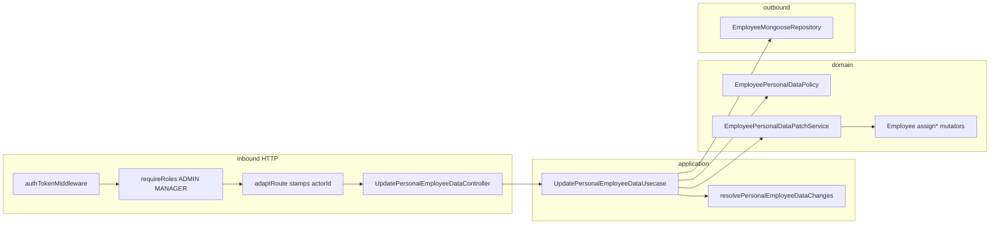

# Design Doc: Update Personal Employee Data (v1)

**Status:** Draft — backend shape  
**Date:** 22/09/2026  
**PRD:** [`docs/prd/update-personal-employee-data-v1.md`](../prd/update-personal-employee-data-v1.md)  
**Glossary:** [`src/modules/employees/CONTEXT.md`](../../src/modules/employees/CONTEXT.md)  
**ADRs:** [`docs/adr/update-personal-employee-data/`](../adr/update-personal-employee-data/)  
**Siblings:** [`update-main-employee-data-v1`](./update-main-employee-data-v1.md) · [`employee-lifecycle-v1`](./employee-lifecycle-v1.md)  
**Constitution:** [`AGENTS.md`](../../AGENTS.md) · hexagon: [`employees/AGENT.md`](../../src/modules/employees/AGENT.md)

This document closes **where** Update Personal Employee Data lives in `grau-api`, **which seams** it crosses, and **how** HTTP looks for the frontend. It does **not** replace the PRD for product copy or Vue screens. Implementation specs: [`docs/specs/update-personal-employee-data/`](../specs/update-personal-employee-data/). Load the spec for the slice you are implementing.

---

## 1. Problem

The PRD already defines **what** must happen. The employees hexagon today does **not**:

1. Expose a write that corrects personal data after Create. There is no `PATCH /personal-data`. Operators cannot fix gender, languages, emergency contact, NIF, or address without inventing a full-record replace.
2. Define `EmployeeModel.Gender`. The `gender` field in `EmployeeProps` is typed as `string | null` but there is no canonical enum. Arbitrary strings pass through without validation.
3. Provide entity mutators for `gender`, `languages`, `address`, and `emergencyContact`. `assignNif` exists; the other four personal fields have no `assign*` method.
4. Apply a **sparse, clearable** Personal Data delta. All five fields are clearable to `null`; Main Data's non-clearable rules (`name`, `email`, `phone` reject null/blank) do not apply here.
5. Enforce the authority matrix for personal data correction. `EmployeeMainDataPolicy` owns Main Data; its matrix is identical today but must stay separate because a future self-service command will require a different matrix.

---

## 2. Objectives and non-goals

### Objectives v1

- Keep work in the existing `employees` hexagon (no new module).
- One command: `UpdatePersonalEmployeeDataUsecase`.
- One domain policy: `EmployeePersonalDataPolicy` (matrix + Actor login-capable + Target not Removed).
- One domain patch service: `EmployeePersonalDataPatchService` (validation + mutation; no outbound ports).
- Sparse `PATCH /api/employee/:id/personal-data` — only present personal data keys are corrected; all five are clearable to `null`.
- `EmployeeModel.Gender` enum added alongside `Role` and `Status`.
- Entity mutators `assignGender`, `assignLanguages`, `assignAddress`, `assignEmergencyContact` added (following `assignNif` pattern).
- HTTP gate: `authTokenMiddleware` + `requireRoles('ADMIN', 'MANAGER')` + `adaptRoute`.
- Persist with `$set` of present keys only. Never `toJSON()`.
- HTTP codes the frontend can branch on: `400` / `401` / `403` / `409`.

### Non-goals v1

- Get employee by id (modal hydrates from List or later query).
- Main / professional sections.
- `status` or `password` on this body.
- Self-service (`EMPLOYEE` editing their own personal data) — separate command, separate policy, out of scope.
- Schema migration for `languages` (stays `string | null`).
- `emergencyContact` VO growth (stays `Phone` only).
- Revoking Session Tokens.
- Changing `EmployeeLifecyclePolicy` or `EmployeeMainDataPolicy`.

---

## 3. Language

Use the employees glossary. Do not invent parallel terms.

| Term | In this hexagon |
|------|-----------------|
| Edit Collaborator / Personal Employee Data / Update Personal Employee Data / Actor / Target / Removed / Login-capable | [`CONTEXT.md`](../../src/modules/employees/CONTEXT.md) |

`EmployeePersonalDataPolicy` and `EmployeePersonalDataPatchService` are implementation names, not glossary terms. Do not call this command update employee, update profile, or Edit Collaborator.

Presence of a field means the JSON **key** is in the body (`"gender": null` is present). Omitted keys are unchanged. Present + `null` (or blank for free-string fields) → clears to `null`.

---

## 4. Forms considered

Closed in the grilling session. Product rules stay in the PRD; these are **shape** decisions.

### Where the matrix lives

| | A — Domain `EmployeePersonalDataPolicy` (new) | B — Add intent to `EmployeeMainDataPolicy` | C — Rules in the use case |
|--|-----------------------------------------------|---------------------------------------------|---------------------------|
| Future self-service | Own policy diverges cheaply when EMPLOYEE + self arrives | Invasive change to Main Data policy when matrices split | Application copies the invariant |
| Last Admin / lifecycle | Never enter | Would need `if (intent)` skips | Easy to forget |
| Symmetry | Each command family has its own policy | Two command families share a policy | No policy |

**Chosen: A.** A future `UpdateOwnPersonalDataUsecase` needs EMPLOYEE + self only. Separate policies diverge cheaply; a merged policy would require invasive changes when the matrices split.

### Policy error class

| | A — New `EmployeePersonalDataForbiddenError` | B — Reuse `EmployeeMainDataForbiddenError` |
|--|----------------------------------------------|---------------------------------------------|
| Honest name | ✅ logs identify the personal data command | ❌ logs say "main data" on personal refusals |
| Precedent | ✅ Main Data created its own over Lifecycle's | ❌ breaks the pattern |
| Cost | +1 error class | none |

**Chosen: A.** Same reasoning that created `EmployeeMainDataForbiddenError` over `EmployeeLifecycleForbiddenError`.

### Domain service vs use case applying mutations

| | A — `EmployeePersonalDataPatchService` (pure domain service, no ports) | B — Use case applies mutations directly |
|--|-------------------------------------------------------------------------|------------------------------------------|
| Symmetry | ✅ mirrors `EmployeeMainDataPatchService` | ❌ personal use case thicker than main |
| Testability | `gender` enum and `nif` coercion tested in isolation | Mixed with coordination in use case spec |
| Ports needed | None (no occupancy check) | None |

**Chosen: A.** `gender` enum validation and `nif` coercion (string → `Nif.create`) are domain rules; they belong in the domain service, keeping the use case as a pure coordinator.

### Entity mutator naming

| | A — `assign*` (follows `assignNif`) | B — `change*` (follows Main Data) |
|--|-------------------------------------|-----------------------------------|
| Internal consistency | ✅ `assignNif` already sets the precedent for personal fields | ❌ `changeGender` blurs the line with Main Data mutators |
| Patch helper needed | No — domain service creates VOs then calls `assign*` | Yes — would need `patchGender` etc. |

**Chosen: A.** `assignGender`, `assignLanguages`, `assignAddress`, `assignEmergencyContact` follow the `assignNif` precedent.

### Empty body error

| | A — New `EmptyPersonalEmployeeDataError` | B — Reuse `EmptyMainEmployeeDataError` |
|--|------------------------------------------|----------------------------------------|
| Honest message | ✅ "At least one personal data field is required" | ❌ message says "main data" on a personal data command |
| Precedent | ✅ each command has its own empty-body error | ❌ breaks the pattern |

**Chosen: A.**

### `gender` validation error

| | A — New `InvalidEmployeeGenderError extends DomainError` | B — `InvalidParamError('gender')` at domain level |
|--|----------------------------------------------------------|---------------------------------------------------|
| Layer purity | ✅ domain error; controller translates to HTTP | ❌ presentation type leaks into domain |
| Consistency with VOs | ✅ `InvalidPhoneFormatError`, Nif VO error are DomainErrors | ❌ gender treated differently from other validated fields |

**Chosen: A.** Controller maps `InvalidEmployeeGenderError → 400 badRequest(new InvalidParamError('gender'))`.

### `nif` coercion location (body: number | string → use case DTO: string)

| | A — Controller coerces before use case DTO | B — Use case DTO accepts `number \| string \| null` |
|--|---------------------------------------------|------------------------------------------------------|
| DTO type purity | ✅ use case DTO is `string \| null \| undefined` | ❌ use case knows about HTTP body types |
| Precedent | ✅ controller already normalizes (username blank → null) | ❌ mixing HTTP concern into application DTO |

**Chosen: A.** Controller coerces `nif` to string if body value is a number; use case DTO receives `string | null | undefined`.

### What the persist port receives

| | A — `$set` only keys **present** on the command | B — Always `$set` all five personal fields | C — `toJSON()` |
|--|------------------------------------------------|---------------------------------------------|----------------|
| Races | A gender PATCH does not stomp a concurrent address write | Stale other four fields | Redacted password |

**Chosen: A.** Same pattern as `updateMainData`. `field: null` (clear) is present and goes into `$set`. `nif` requires internal coercion to `Number` inside the repository (schema type is `Number`; DTO is `string | null`).

---

## 5. Decision of form (v1)

```text
shared adaptRoute                 → actorId from JWT (already shipped)
employees domain                  → EmployeeModel.Gender
                                    + assignGender | assignLanguages | assignAddress | assignEmergencyContact
                                    + EmployeePersonalDataPolicy
                                    + EmployeePersonalDataPatchService (pure, no ports)
employees application             → UpdatePersonalEmployeeDataUsecase
                                    + resolvePersonalEmployeeDataChanges
employees persistence             → updatePersonalData $set of present keys
employees HTTP                    → PATCH /employee/:id/personal-data
                                    + requireRoles('ADMIN', 'MANAGER')
```



Do **not** put the matrix in Vue only. Do **not** call the repository from a controller. Do **not** persist `employee.toJSON()`. Do **not** add a personal-data intent to `EmployeeMainDataPolicy`.

---

## 6. As-is vs to-be (this hexagon)

| Surface | Today | v1 |
|---------|--------|----|
| Edit Collaborator personal section write | missing | `PATCH /api/employee/:id/personal-data` |
| `Employee` entity mutators | `assignNif` only for personal data | + `assignGender`, `assignLanguages`, `assignAddress`, `assignEmergencyContact` |
| `EmployeeModel` | `Role`, `Status` enums | + `Gender` enum (`male \| female \| other`) |
| Authority | `EmployeeMainDataPolicy` (main data; identical matrix today) | + `EmployeePersonalDataPolicy` (same matrix; separate class for future self-service divergence) |
| Domain patch service | `EmployeeMainDataPatchService` (async; occupancy port) | + `EmployeePersonalDataPatchService` (sync; pure; no ports) |
| Errors | `EmployeeMainDataForbiddenError`, `EmptyMainEmployeeDataError` | + `EmployeePersonalDataForbiddenError`, `EmptyPersonalEmployeeDataError`, `InvalidEmployeeGenderError` |
| Persist personal data | only via Create `insert` | + `updatePersonalData` `$set` of present keys |
| Route gate | Create/List/update-status/remove/main-data already `requireRoles` | Same helper on the new PATCH |
| `adaptRoute` | stamps `actorId` / `actorRole` | unchanged |

---

## 7. Domain

### 7.1 `EmployeeModel.Gender`

Add to `employee.model.ts` alongside `Role` and `Status`:

```ts
export enum Gender {
  MALE = 'male',
  FEMALE = 'female',
  OTHER = 'other',
}

export const GENDERS: readonly Gender[] = Object.freeze(Object.values(Gender));

export function isGender(value: unknown): value is Gender {
  return typeof value === 'string' && (GENDERS as string[]).includes(value);
}
```

`null` is not a `Gender` value — it is the cleared state, handled by the patch service separately.

### 7.2 `Employee` — new mutators

Follow `assignNif` pattern. Add:

```ts
assignGender(gender: EmployeeModel.Gender | null): void
assignLanguages(languages: string | null): void
assignAddress(address: string | null): void
assignEmergencyContact(contact: Phone | null): void
```

No `patch*` helpers on the entity for personal fields. The domain patch service is responsible for VO creation and validation, then calls `assign*`. `assignNif` stays unchanged.

### 7.3 `EmployeePersonalDataPolicy`

Pure domain service. No count ports. No intent enum.

```ts
assertCan(input: {
  actor: Employee
  target: Employee
}): void
```

Rules (in this order):

1. Actor is login-capable (`ACTIVE | VACATION`). Else `ActorAuthenticationFailedError` (opaque; same class as lifecycle and main data).
2. Target is `REMOVED` → `EmployeeAlreadyRemovedError`.
3. Matrix:
   - `EMPLOYEE` actor → `EmployeePersonalDataForbiddenError`.
   - `MANAGER` actor → allow only if `target.role === EMPLOYEE` **and** `actor.id !== target.id`; else `EmployeePersonalDataForbiddenError`.
   - `ADMIN` actor → allow any Target including self.

Last Admin does not apply. Step-up password does not apply. Do not call `EmployeeMainDataPolicy` or `EmployeeLifecyclePolicy`.

`requireRoles` already refuses `EMPLOYEE` at the route. Rule 3 remains belt-and-braces (curl that bypasses the gate, future route mistake).

### 7.4 `EmployeePersonalDataPatchService`

Pure, synchronous domain service. No outbound ports (no occupancy check — no uniqueness constraint on personal fields).

```ts
apply(
  target: Employee,
  changes: PersonalEmployeeDataChanges,
): PersonalEmployeeDataPersistPatch
```

`PersonalEmployeeDataChanges` is `Partial<Record<PersonalEmployeeDataField, string | null>>` — keys present in the body only; values are `string | null` (never `undefined`). `PersonalEmployeeDataField = 'gender' | 'languages' | 'emergencyContact' | 'nif' | 'address'`.

Field-by-field logic inside `apply`:

| Field | If value is `null` | If value is non-null |
|-------|-------------------|----------------------|
| `gender` | `target.assignGender(null)` | `EmployeeModel.isGender(value)` → true: `target.assignGender(value as Gender)` / false: throw `InvalidEmployeeGenderError` |
| `languages` | `target.assignLanguages(null)` | `target.assignLanguages(value)` (free string; any non-empty accepted) |
| `emergencyContact` | `target.assignEmergencyContact(null)` | `Phone.create(value)` → `target.assignEmergencyContact(phone)` |
| `nif` | `target.assignNif(null)` | `Nif.create(value)` → `target.assignNif(nif)` |
| `address` | `target.assignAddress(null)` | `target.assignAddress(value)` (free string) |

`PersonalEmployeeDataPersistPatch` mirrors the changes shape and is forwarded directly to the repository. The service returns normalized values (VO `.value` for `emergencyContact` and `nif`; raw string for others; `null` for cleared fields).

### 7.5 Errors

| Error | Typical HTTP | When |
|-------|-------------|------|
| `ActorAuthenticationFailedError` | `401` | Actor id missing/blank, not found, or not login-capable |
| `EmployeePersonalDataForbiddenError` | `403` | Matrix refusal (new class) |
| `EmployeeAlreadyRemovedError` | `409` | Target Removed |
| `EmployeeNotFoundError` | `400` | Target id miss |
| `InvalidEmployeeGenderError` | `400` | `gender` present, non-null, and not in the enum |
| `InvalidPhoneFormatError` | `400` | `emergencyContact` present and invalid phone format |
| Nif VO error | `400` | `nif` present and invalid format / bad check digit |
| `EmptyPersonalEmployeeDataError` | `400` | Body with no personal data field (safety net) |

Do not throw `EmployeeMainDataForbiddenError` or `EmployeeLifecycleForbiddenError` from this command.

---

## 8. Application

### 8.1 Ports and DTOs

```ts
interface UpdatePersonalEmployeeDataPort {
  execute(params: UpdatePersonalEmployeeDataDto): Promise<UpdatePersonalEmployeeDataResultDto>
}

interface UpdatePersonalEmployeeDataDto {
  actorId: string                   // adaptRoute; never from client body
  id: string                        // path :id
  gender?: string | null            // present + null → clear; non-null validated as Gender enum
  languages?: string | null         // present + null/blank → clear (controller normalizes)
  emergencyContact?: string | null  // present + null → clear; non-null validated as Phone VO
  nif?: string | null               // controller already coerced number → string; non-null validated as Nif VO
  address?: string | null           // present + null/blank → clear (controller normalizes)
}

interface UpdatePersonalEmployeeDataResultDto {
  id: string
}

interface UpdatePersonalEmployeeDataRepositoryPort {
  updatePersonalData(params: {
    id: string
    gender?: string | null
    languages?: string | null
    emergencyContact?: string | null
    nif?: string | null
    address?: string | null
  }): Promise<void>
}
```

Inbound DTO only contains keys the controller decided were present. The repository `$set`s exactly those keys (any of them may be `null`).

### 8.2 `resolvePersonalEmployeeDataChanges`

Application-layer function (mirrors `resolveMainEmployeeDataChanges`):

```ts
function resolvePersonalEmployeeDataChanges(
  fields: PersonalEmployeeDataInput,
): PersonalEmployeeDataChanges
```

Strips `undefined` values; throws `EmptyPersonalEmployeeDataError` if no key survives. Called in the use case before `EmployeePersonalDataPatchService.apply`.

### 8.3 Use case flow

1. `actorId` empty/blank → `ActorAuthenticationFailedError`.
2. `FindEmployeeByIdPort.findById(actorId)` — miss → same `401` error.
3. `FindEmployeeByIdPort.findById(id)` — miss → `EmployeeNotFoundError`.
4. `Employee.reconstitute` Actor and Target (`Password.fromHash`; all personal fields from snapshot). Never `Employee.create`.
5. `EmployeePersonalDataPolicy.assertCan({ actor, target })`.
6. `resolvePersonalEmployeeDataChanges({ gender, languages, emergencyContact, nif, address })` — throws `EmptyPersonalEmployeeDataError` if no personal key present.
7. `EmployeePersonalDataPatchService.apply(target, changes)` — validates + mutates; returns `PersonalEmployeeDataPersistPatch`.
8. `updatePersonalData({ id, ...patch })`. Do not pass omitted keys.
9. Return `{ id }`.

No encrypter. No `CompareHashPort`. No occupancy check. No lifecycle policy. No `EmployeeMainDataPolicy`.

---

## 9. HTTP (frontend contract)

```http
PATCH /api/employee/:id/personal-data
Authorization: Bearer <Actor token>
Content-Type: application/json

{
  "gender": "male",
  "languages": "Português",
  "emergencyContact": "+351 912 345 678",
  "nif": "123456789",
  "address": "Rua do Grau, 10, Lisboa"
}
```

`:id` is the Target. Do not send `id` or `actorId` in the body. `adaptRoute` merges params then stamps `actorId` last — path `id` wins over a forged body `id`; JWT wins over a forged `actorId`.

Route:

```ts
router.patch(
  '/employee/:id/personal-data',
  authTokenMiddleware,
  requiredRoleEmployee, // requireRoles('ADMIN', 'MANAGER')
  adaptRoute(updatePersonalEmployeeDataController),
)
```

Success: `200` `{ data: { id } }` via `ok(...)`.

| Situation | HTTP |
|-----------|------|
| No personal field / only unknown keys in body | `400` |
| `gender` non-null and not in enum | `400` |
| `emergencyContact` invalid phone format | `400` |
| `nif` invalid format / bad check digit | `400` |
| Target not found | `400` |
| Actor missing, not found, or not login-capable | `401` |
| `EMPLOYEE` token | `403` at `requireRoles` (and/or domain) |
| MANAGER on MANAGER / ADMIN / self | `403` |
| Target Removed | `409` |
| Unexpected | `500` |

**Presence:** `'gender' in body` (JSON `null` is present → clear). After `adaptRoute`, detect personal fields on the flattened request; do not treat path `id` or stamped `actorId` as personal data keys.

**Clearable fields:**
- `gender` present + `null` → clear. `gender` present + `""` → `InvalidEmployeeGenderError` (empty string is not in the enum).
- `languages` / `address` present + `null` or blank string → controller normalizes to `null` before forwarding.
- `emergencyContact` present + `null` → clear.
- `nif` present + `null` → clear. Body `nif` as number → controller coerces to string.

Unknown keys (`name`, `status`, `password`, `foo`) are ignored. Body with only unknown keys → `400`.

Controllers stay Express-free. Raw shape: `UpdatePersonalEmployeeDataRequest`.

---

## 10. Persistence

No schema change. Personal data fields (`gender`, `languages`, `emergencyContact`, `nif`, `address`) are already in the schema.

`EmployeeMongooseRepository` implements `UpdatePersonalEmployeeDataRepositoryPort`:

```ts
updateOne(
  { _id: id },
  { $set: /* only keys !== undefined on the params object, with nif coerced to Number */ },
)
```

| Key on params | Schema type | `$set` |
|---------------|------------|--------|
| omitted | — | not in `$set` |
| `gender: 'male'` | String | `gender: 'male'` |
| `gender: null` | String | `gender: null` |
| `nif: '123456789'` | **Number** | `nif: 123456789` (coerce `Number(value)`) |
| `nif: null` | **Number** | `nif: null` |
| `emergencyContact: '+351...'` | String | as-is |
| `emergencyContact: null` | String | `emergencyContact: null` |
| `languages: null` | String | `languages: null` |
| `address: 'Rua X'` | String | as-is |

`nif` is `{ type: Number }` in the schema. The mapper already converts `Number → String` on read (`mapEmployeeDocument`) and `String → Number` on write (`mapToCreateDocument`). `updatePersonalData` must replicate the write coercion: `params.nif !== null ? Number(params.nif) : null`.

The same `matchedCount === 0` guard from `updateMainData` applies: throw unexpected if update matches 0 documents.

Mapper / `toCreate` / read model: unchanged.

---

## 11. Wiring

`makeEmployeesModule` today already has `EmployeePoliciesService`, `EmployeeLifecyclePolicy`, `EmployeeMainDataPolicy`, and `requireRoles`. Extend:

1. `EmployeePersonalDataPolicy` (no ports).
2. `EmployeePersonalDataPatchService` (no ports).
3. `UpdatePersonalEmployeeDataUsecase(findById, personalDataPolicy, personalDataPatchService, updatePersonalDataRepo)` — same repository instance implements `findById` + `updatePersonalData`.
4. `UpdatePersonalEmployeeDataController`.
5. `makeEmployeeRoutes` + `PATCH /employee/:id/personal-data`.

Do not construct the repository inside the controller or use case.

---

## 12. Sequences

```text
Client
  → authTokenMiddleware
  → requireRoles('ADMIN', 'MANAGER')
  → adaptRoute (path id + actorId from JWT)
  → UpdatePersonalEmployeeDataController
      → reject empty personal body / unknown-only body
      → coerce nif (number → string) if needed
      → normalize languages/address blank → null
  → UpdatePersonalEmployeeDataUsecase
      → find Actor (miss → 401), find Target (miss → 400)
      → EmployeePersonalDataPolicy.assertCan
      → resolvePersonalEmployeeDataChanges (EmptyPersonalEmployeeDataError safety net)
      → EmployeePersonalDataPatchService.apply
          → gender enum check (InvalidEmployeeGenderError)
          → Phone.create / Nif.create (400 on invalid)
          → assign* mutators on Target
      → updatePersonalData $set present keys (nif → Number inside repo)
  → 200 { data: { id } } | 400 | 401 | 403 | 409
```

---

## 13. Implementation slices (API playbook)

Follow [`AGENTS.md`](../../AGENTS.md) new-command steps. Specs: [`docs/specs/update-personal-employee-data/`](../specs/update-personal-employee-data/). Do not implement HTTP in slice 0.

Implement **one slice at a time**, in this order. Do not skip. Do not pull later-slice HTTP/use-case work into an earlier slice.

`adaptRoute` already stamps `actorId`. `forbidden` / `conflict` helpers already exist. No infra-shared slice.

| Slice | Spec | Ships | Does **not** ship | Prompt sketch |
|-------|------|--------|-------------------|---------------|
| **0 — Domain** | `00-domain.md` | `EmployeeModel.Gender` + `isGender`; `assignGender`, `assignLanguages`, `assignAddress`, `assignEmergencyContact` on `Employee`; `EmployeePersonalDataForbiddenError`, `EmptyPersonalEmployeeDataError`, `InvalidEmployeeGenderError`; `EmployeePersonalDataPolicy.assertCan` + specs (login-capable Actor; Removed Target; matrix); `EmployeePersonalDataPatchService.apply` + spec (gender enum; Phone / Nif VOs; null clear; free strings). | Mongo `$set`, HTTP, use case. | Implement slice 0 of Update Personal Employee Data following `00-domain.md`. Do not touch `EmployeeMainDataPolicy`. Do not add an intent enum. |
| **1 — Persistence** | `01-persistence.md` | `UpdatePersonalEmployeeDataRepositoryPort` + `updatePersonalData` on `EmployeeMongooseRepository` + spec (`$set` only present keys; `nif` coerced to Number; null clears; matchedCount guard). | Use case, routes. | Implement slice 1 following `01-persistence.md`. Same `$set`-only rule as `updateMainData`. `nif` must be `Number(value)` in `$set` — schema type is Number. No schema migration. Do not write `toJSON()`. |
| **2 — Use case** | `02-usecase.md` | DTO + inbound port + `resolvePersonalEmployeeDataChanges` + `UpdatePersonalEmployeeDataUsecase` + spec. Load Actor/Target; policy; resolver; patch service; persist patch. | Controller, route, `AGENT.md`. | Implement slice 2 following `02-usecase.md`. Reconstitute Actor and Target with all personal fields from snapshot. No occupancy check. Patch service is synchronous. Never `Employee.create`. |
| **3 — HTTP + contract** | `03-http-and-contract.md` | Request + controller (sparse presence; `nif` number → string; blank `languages`/`address` → null; path `:id`) + `PATCH` route with `authTokenMiddleware` + `requireRoles('ADMIN','MANAGER')` + module + `employee.http` + living `AGENT.md`. | Self-service, professional section. | Implement slice 3 following `03-http-and-contract.md`. Map `EmployeePersonalDataForbiddenError` → `403`. Map `InvalidEmployeeGenderError` → `400 InvalidParamError('gender')`. Do not trust body `id` / `actorId`. |

**Dependencies:** `1` does not need `2`. `2` needs `0` + `1`. `3` needs `2`. Do not merge `2` and `3`.

---

## 14. Jira cards

To be created as **Tarefa** on Grau System Board (`KAN`), column **Prioritized**, labels `update-personal-employee-data` + `slice-N`.

| Slice | Card | Spec |
|-------|------|------|
| 0 — Domain | TBD | `docs/specs/update-personal-employee-data/00-domain.md` |
| 1 — Persistence | TBD | `docs/specs/update-personal-employee-data/01-persistence.md` |
| 2 — Use case | TBD | `docs/specs/update-personal-employee-data/02-usecase.md` |
| 3 — HTTP + contract | TBD | `docs/specs/update-personal-employee-data/03-http-and-contract.md` |

---

## 15. Interview notes (backend grilling)

Product rules live in the PRD. These were **shape** decisions:

- **Own policy, not a Main Data intent** — the matrix is identical today, but a future `UpdateOwnPersonalDataUsecase` (EMPLOYEE editing their own data via a profile card) needs EMPLOYEE + self only. Merging personal data into `EmployeeMainDataPolicy` would require invasive changes when the matrices split.
- **`EmployeePersonalDataPatchService`, not use case mutations** — `gender` enum and `nif` coercion (string → `Nif.create`) are domain rules; keeping them in a domain service keeps the use case as a pure coordinator and makes the rules independently testable.
- **`assign*` mutators, not `change*`** — `assignNif` already sets the precedent for personal data fields; `change*` is the Main Data convention and blurs the two families.
- **New forbidden, empty, and gender errors** — honest names, same reasoning as Main Data creating its own errors over Lifecycle's. Each command family is independently traceable in logs and `instanceof` checks.
- **`InvalidEmployeeGenderError` in domain** — `InvalidParamError` is a presentation type; it must not leak into the domain. The controller is the translator between domain errors and HTTP.
- **Controller coerces `nif` number → string** — use case DTO is `string | null | undefined`; HTTP body types are a presentation concern.
- **Repository coerces `nif` string → Number** — the schema type is `Number`; the mapper already does `Number(nif)` on `mapToCreateDocument`. `updatePersonalData` must replicate this write coercion.
- **`$set` present keys** — "cleared" in the PRD is "what this command writes", not a five-field section snapshot (races).
- **No occupancy** — personal fields have no uniqueness constraint; NIF is not a login key.
- **Synchronous patch service** — no I/O needed (no occupancy check); `async` would be misleading.
- **Four horizontal slices** — domain → persist → use case → HTTP, same playbook as Main Data.

---

## 16. Trade-offs and alternatives

| Decision | We chose | We rejected | Cost we accept |
|----------|----------|-------------|----------------|
| Matrix home | `EmployeePersonalDataPolicy` | Main Data intent; use-case `if`s | Second policy class; two matrices to keep aligned on MANAGER→EMPLOYEE until self-service arrives |
| Forbidden error | New `EmployeePersonalDataForbiddenError` | Reuse `EmployeeMainDataForbiddenError` | One more `instanceof` in the controller |
| Patch service | `EmployeePersonalDataPatchService` (pure, sync) | Use case applies mutations inline | Extra class; but domain rules stay in the domain |
| Mutator naming | `assign*` (personal data) | `change*` (Main Data) | Two prefixes in the entity; the distinction is intentional |
| Empty body error | New `EmptyPersonalEmployeeDataError` | Reuse `EmptyMainEmployeeDataError` | One more error class |
| Gender error | `InvalidEmployeeGenderError` (domain) | `InvalidParamError` at domain level | Controller must map it; no shortcut |
| `nif` body coercion | Controller (number → string) | Use case DTO `number \| string` | Controller is responsible for HTTP body normalization |
| `nif` persist coercion | Repository (string → Number) | Use case passes Number | Repository knows the schema; same pattern as `mapToCreateDocument` |
| Persist | Present-key `$set` | Five-field snapshot; `toJSON()` | Port API uses optional keys + `null` values |

---

## 17. Open questions

They do **not** block slice 0.

| # | Question | Who | Default if unanswered |
|---|----------|-----|------------------------|
| 1 | Self-service personal data: when and which route / policy? | Product / Auth sibling | Out of scope; `EmployeePersonalDataPolicy` must not be changed to accommodate this — a new policy is the correct path |
| 2 | `languages` restructure to array or controlled list? | Product | Stays `string \| null` in v1; schema migration tracked as future work |
| 3 | `emergencyContact` VO growth (name + kinship + phone)? | Product / backend | Stays `Phone` only in v1; tracked in `AGENT.md` |
| 4 | 0-document `$set` after a successful `findById` | Backend at slice 1 | Unexpected `500`, not silent `200` |
| 5 | Vue Save payload: personal section sent standalone or merged with main? | `grau-frontend` | Standalone; this PATCH must `400` if no personal field is present |

---

## 18. Acceptance mapping (API)

Mirrors PRD §8 at the HTTP boundary (slice 3 closes these; earlier slices prove the same rules under the ports):

- [ ] ADMIN + Target `EMPLOYEE` + `{ "gender": "male" }` → `200 { data: { id } }`; other personal fields unchanged.
- [ ] `{ "nif": null }` → NIF cleared to `null`; other personal fields unchanged.
- [ ] `{ "emergencyContact": null }` → emergency contact cleared; other fields unchanged.
- [ ] `{ "gender": "invalid" }` → `400`; no write.
- [ ] `{ "emergencyContact": "123" }` → `400`; no write.
- [ ] `{ "nif": "00000000" }` (bad check digit) → `400`; no write.
- [ ] `{}` or body with only unknown keys → `400`; no write.
- [ ] Body with all five fields → `200`; all five updated atomically in a single `$set`.
- [ ] MANAGER + Target `EMPLOYEE` → allowed; MANAGER + Target `MANAGER` / `ADMIN` / self → `403`.
- [ ] EMPLOYEE token → `403`.
- [ ] Target `REMOVED` → refused (`409`).
- [ ] Target `INACTIVE` or `VACATION` + valid patch → allowed.
- [ ] Persistence writes only the present personal fields (no Main Data, no password, no status).
- [ ] Body cannot spoof `actorId`; Target id is `:id`, not body.
- [ ] `{ "languages": "" }` or `{ "languages": null }` → languages cleared to `null`.
- [ ] `{ "address": "Rua X" }` → address updated; other personal fields unchanged.
- [ ] `nif` sent as a number in the body → coerced to string before validation; stored as Number in Mongo.
