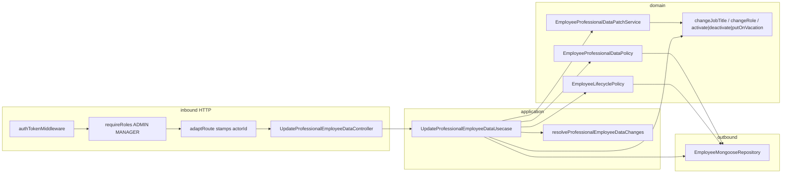

# Design Doc: Update Professional Employee Data (v1)

**Status:** Draft — backend shape  
**Date:** 25/09/2026  
**PRD:** [`docs/prd/update-professional-employee-data-v1.md`](../prd/update-professional-employee-data-v1.md)  
**Glossary:** [`src/modules/employees/CONTEXT.md`](../../src/modules/employees/CONTEXT.md)  
**ADRs:** [`docs/adr/update-professional-employee-data/`](../adr/update-professional-employee-data/)  
**Siblings:** [`update-main-employee-data-v1`](./update-main-employee-data-v1.md) · [`update-personal-employee-data-v1`](./update-personal-employee-data-v1.md) · [`employee-lifecycle-v1`](./employee-lifecycle-v1.md)  
**Constitution:** [`AGENTS.md`](../../AGENTS.md) · hexagon: [`employees/AGENT.md`](../../src/modules/employees/AGENT.md)

This document closes **where** Update Professional Employee Data lives in `grau-api`, **which seams** it crosses, and **how** HTTP looks for the frontend. It does **not** replace the PRD for product copy or Vue screens. Implementation specs: [`docs/specs/update-professional-employee-data/`](../specs/update-professional-employee-data/). Load the spec for the slice you are implementing.

---

## 1. Problem

The PRD already defines **what** must happen. The employees hexagon today does **not**:

1. Expose a write that corrects Job Title or Role after Create. There is no `PATCH /professional-data`. Operators cannot save the professional section of Edit Collaborator without inventing a full-record replace or two HTTP calls.
2. Provide an entity mutator for Job Title. `changeRole` exists; `jobTitle` is only set on Create / reconstitute.
3. Distinguish a Role **delta** from an echoed Role. The form always sends Cargo. Treating presence as intent would 403 a MANAGER who only changed Função.
4. Count login-capable ADMINs (`ACTIVE | VACATION`). `countActiveAdmins` is ACTIVE-only and is the wrong predicate when the Last Admin **leaves** the `ADMIN` role.
5. Apply Job Title, a Role delta, and a Status delta in **one** `$set`. `updateStatus` only writes `status` / `deactivateAt`. Two `updateOne`s are not all-or-nothing.

`EmployeeLifecyclePolicy` already owns Deactivate / Reactivate / Vacation / Remove. This command reuses it when Status actually changes ([ADR 0001](../adr/update-professional-employee-data/0001-status-travels-with-professional-save.md)). It does **not** add a `CHANGE_ROLE` intent to that policy.

---

## 2. Objectives and non-goals

### Objectives v1

- Keep work in the existing `employees` hexagon (no new module).
- One command: `UpdateProfessionalEmployeeDataUsecase`.
- One domain policy: `EmployeeProfessionalDataPolicy` (Job Title matrix + Role delta ADMIN-only + Last Admin when leaving `ADMIN`).
- One domain patch service: `EmployeeProfessionalDataPatchService` (Job Title + Role only; no outbound ports).
- Status delta: reuse `EmployeeLifecyclePolicy` + `activate` / `deactivate` / `putOnVacation` in the use case (same mapping as Update Status).
- Sparse `PATCH /api/employee/:id/professional-data` — only present professional / status keys are considered; Job Title is clearable to `null`.
- HTTP gate: `authTokenMiddleware` + `requireRoles('ADMIN', 'MANAGER')` + `adaptRoute`.
- Persist with one `$set` of fields that actually change (`jobTitle` and/or `role` and/or `status` + `deactivateAt`). Never `toJSON()`. Never call `updateStatus` from this command.
- New `CountLoginCapableAdminsPort`. Do not change `countActiveAdmins`.
- HTTP codes the frontend can branch on: `400` / `401` / `403` / `409`.

### Non-goals v1

- Get employee by id (modal hydrates from List or later query).
- Main / Personal sections.
- Writing `employmentId`.
- Self-service (`EMPLOYEE` editing their own professional data).
- `password` — Auth (reset / future change). Reject if the key is present.
- Replacing `POST /api/employee/update-status` — that endpoint stays for one-shot list actions and still refuses an unchanged status.
- Widening `EmployeeLifecyclePolicy` Actor from `ACTIVE` to login-capable (same recorte as Main / Personal).
- Widening `countActiveAdmins` to include `VACATION` (Deactivate Last Admin stays as-is).
- Revoking Session Tokens when Role or Status changes (Auth sibling; same gap as Deactivate).

---

## 3. Language

Use the employees glossary. Do not invent parallel terms.

| Term | In this hexagon |
|------|-----------------|
| Edit Collaborator / Professional Employee Data / Update Professional Employee Data / Job Title / Role / Employment Id / Actor / Target / Removed / Login-capable / Last Admin | [`CONTEXT.md`](../../src/modules/employees/CONTEXT.md) |

`EmployeeProfessionalDataPolicy` and `EmployeeProfessionalDataPatchService` are implementation names, not glossary terms. Do not call this command update employee, update profile, or Edit Collaborator.

Presence of a field means the JSON **key** is in the body (`"jobTitle": null` is present). Omitted keys are unchanged. Present + `null` / blank / whitespace on `jobTitle` → clears to `null`. `role` / `status` present + `null` / blank → `400`.

Status is **not** a professional field. It may travel in the same save as a lifecycle action.

Frontend labels are inverted relative to the first screenshot: Função → `jobTitle`, Cargo → `role`. The API does not invert.

---

## 4. Forms considered

Closed in the grilling session. Product rules stay in the PRD; these are **shape** decisions.

### Where the three authorities live

| | A — `EmployeeProfessionalDataPolicy` (Job Title + Role) + lifecycle on Status | B — Three policies | C — `CHANGE_ROLE` intent on lifecycle | D — Rules in the use case |
|--|--|--|--|--|
| Last Admin of Role | Ports on the professional policy | Role policy isolated | Lifecycle owns a non-lifecycle intent | Application copies the invariant |
| Status | Use case calls `EmployeeLifecyclePolicy` on a delta only | Same | Role and Status in one class | Easy to forget all-or-nothing |
| Symmetry | Each Edit Collaborator family has its own policy | Role becomes a third family | Lifecycle becomes “everything with Last Admin” | No policy |

**Chosen: A.** Job Title and Role abort the same save. Status already has a owner ([ADR 0001](../adr/update-professional-employee-data/0001-status-travels-with-professional-save.md)). Do not reuse `EmployeeMainDataPolicy` (403 would say “main data”).

### Login-capable ADMIN count

| | A — New `countLoginCapableAdmins` (`ACTIVE \| VACATION`) | B — Widen `countActiveAdmins` | C — Count in memory in the use case |
|--|--|--|--|
| Deactivate this wave | Untouched | Changes Last Admin semantics of lifecycle | Untouched |
| Honest name | ✅ | ❌ “active” would mean login-capable | Application copies the invariant |

**Chosen: A** ([ADR 0002](../adr/update-professional-employee-data/0002-login-capable-admin-count-is-its-own-port.md)). Reuse `countNonRemovedAdmins` for the second barrier. Call counts only when the Target **leaves** `ADMIN`.

### VACATION Actor on a Status delta

| | A — Lifecycle as-is | B — Widen lifecycle Actor now | C — Use case skips lifecycle Actor check |
|--|--|--|--|
| POST `/update-status` / Remove | Untouched | Also accept VACATION Actor | This PATCH only |
| Job Title / Role with VACATION Actor | ✅ professional policy | ✅ | ✅ |
| Status delta with VACATION Actor | `401`, same as the list | Allowed if the matrix allows | Two Actor rules |

**Chosen: A.** Same recorte as Main / Personal. Echoed Status does not call lifecycle.

### Who applies mutations

| | A — Patch service (Job Title + Role); Status in the use case | B — Use case applies all three | C — Patch service also calls `activate` / `deactivate` / `putOnVacation` |
|--|--|--|--|
| Symmetry | ✅ Main / Personal already have a patch service | Thicker than siblings | Status becomes a “professional field” in the domain |
| Status mapping | Copy `mapIntent` + `applyTransition` from Update Status | Same + inline Job Title / Role | Second home for transitions |

**Chosen: A.**

### Persist

| | A — One `updateProfessionalData` (`jobTitle?`, `role?`, `status?`, `deactivateAt?`) | B — `updateProfessionalData` then `updateStatus` | C — Widen `updateStatus` |
|--|--|--|--|
| Atomicity | One `$set` | Two `updateOne`s | One `$set`, but the lifecycle port learns Função |

**Chosen: A.** This command does not call `updateStatus`.

### Job Title mutator

| | A — `changeJobTitle(string \| null)` next to `changeRole` | B — `assignJobTitle` | C — `applyProfessional` on the entity |
|--|--|--|--|
| Family | ✅ Role is already `change*` | Looks like Personal Data | Entity learns HTTP presence |

**Chosen: A.** Patch service normalizes blank → `null`. No `patchJobTitle` on the entity. No Employment Id mutator.

### Error family

| | A — New professional forbidden + empty; reuse Last Admin and lifecycle | B — Reuse Main Data errors | C — Separate Role-change 403 |
|--|--|--|--|
| Logs / `instanceof` | ✅ | ❌ professional refusal named “main data” | Two 403s; frontend does not distinguish |

**Chosen: A.**

### Slice cut

| | A — Four slices (count query in persistence) | B — Five slices (count isolated) | C — Merge use case + HTTP |
|--|--|--|--|

**Chosen: A.** The port *interface* is slice 0 (the policy needs it). The *query* is slice 1.

---

## 5. Decision of form (v1)

```text
shared adaptRoute                 → actorId from JWT (already shipped)
employees domain                  → changeJobTitle
                                    + EmployeeProfessionalDataPolicy
                                    + EmployeeProfessionalDataPatchService
                                    + CountLoginCapableAdminsPort (interface)
employees application             → UpdateProfessionalEmployeeDataUsecase
                                    + resolveProfessionalEmployeeDataChanges
                                    + EmployeeLifecyclePolicy (reuse, Status delta only)
employees persistence             → countLoginCapableAdmins
                                    + updateProfessionalData $set of changed keys
employees HTTP                    → PATCH /employee/:id/professional-data
                                    + requireRoles('ADMIN', 'MANAGER')
```



Do **not** put the matrix in Vue only. Do **not** call the repository from a controller. Do **not** persist `employee.toJSON()`. Do **not** add a Role intent to `EmployeeLifecyclePolicy`. Do **not** call `updateStatus` from this command.

---

## 6. As-is vs to-be (this hexagon)

| Surface | Today | v1 |
|---------|--------|----|
| Edit Collaborator professional section write | missing | `PATCH /api/employee/:id/professional-data` |
| `Employee` mutators | `changeRole`; no Job Title mutator | + `changeJobTitle(string \| null)` |
| Authority | Main / Personal policies; lifecycle for Status | + `EmployeeProfessionalDataPolicy`; lifecycle **reused** on Status delta |
| Last Admin counts | `countActiveAdmins` (ACTIVE-only); `countNonRemovedAdmins` | + `countLoginCapableAdmins` (`ACTIVE \| VACATION`); ACTIVE-only count unchanged |
| Domain patch service | Main (async, occupancy); Personal (sync, pure) | + `EmployeeProfessionalDataPatchService` (sync; Job Title + Role) |
| Errors | Main / Personal forbidden + empty; lifecycle + `LastAdminProtectedError` | + `EmployeeProfessionalDataForbiddenError`, `EmptyProfessionalEmployeeDataError` |
| Persist professional / combined write | only Create `insert`; Status via `updateStatus` | + `updateProfessionalData` one `$set` |
| `EmployeeSnapshotMapper` | does not forward `jobTitle` | forwards `jobTitle` (slice 2) |
| Route gate | Create/List/update-status/remove/main/personal already `requireRoles` | Same helper on the new PATCH |
| `adaptRoute` | stamps `actorId` / `actorRole` | unchanged |
| `POST /update-status` | already-in-status → `400` | **unchanged** |
| Session after Role / Status change | leftover JWT | leftover JWT (Auth sibling) |

---

## 7. Domain

### 7.1 `Employee` — `changeJobTitle`

```ts
changeJobTitle(jobTitle: string | null): void
```

Stores the value as given. The patch service is responsible for blank / whitespace → `null`. Do not validate a placeholder. Do not touch `employmentId`. `changeRole` stays as it is (`InvalidEmployeeRoleError` on a non-enum).

### 7.2 `CountLoginCapableAdminsPort`

New domain port, next to `CountActiveAdminsPort`:

```ts
interface CountLoginCapableAdminsPort {
  countLoginCapableAdmins(): Promise<number>;
}
```

Predicate: `role === ADMIN` and `status ∈ { ACTIVE, VACATION }`.

`EmployeeProfessionalDataPolicy` constructor:

```ts
constructor(
  private readonly countPort: CountLoginCapableAdminsPort &
    CountNonRemovedAdminsPort,
) {}
```

Do not inject `CountActiveAdminsPort` here. Do not change `EmployeeLifecyclePolicy`'s constructor.

### 7.3 `EmployeeProfessionalDataPolicy`

```ts
async assertCan(input: {
  actor: Employee
  target: Employee
  roleChange: boolean
}): Promise<void>
```

`roleChange` is `true` only when the body `role` is present **and** different from `target.role`. The use case computes it after both entities are reconstituted. Echoed Role → `roleChange: false`.

Rules (in this order):

1. Actor is login-capable (`ACTIVE | VACATION`). Else `ActorAuthenticationFailedError`.
2. Target is `REMOVED` → `EmployeeAlreadyRemovedError`.
3. Matrix (Job Title / any professional save):
   - `EMPLOYEE` actor → `EmployeeProfessionalDataForbiddenError`.
   - `MANAGER` actor → allow only if `target.role === EMPLOYEE` **and** `actor.id !== target.id`; else `EmployeeProfessionalDataForbiddenError`.
   - `ADMIN` actor → allow any Target including self.
4. If `roleChange`:
   - Actor is not `ADMIN` → `EmployeeProfessionalDataForbiddenError` (nothing else runs; no counts).
   - If Target **is** `ADMIN` (leaving `ADMIN`):
     - `countLoginCapableAdmins() === 1` → `LastAdminProtectedError`.
     - `countNonRemovedAdmins() === 1` → `LastAdminProtectedError`.
   - Promoting **to** `ADMIN`, or `MANAGER` → `EMPLOYEE`, never hits the counts.

`requireRoles` already refuses `EMPLOYEE` at the route. Rule 3 remains belt-and-braces.

Do not call `EmployeeMainDataPolicy`, `EmployeePersonalDataPolicy`, or `EmployeeLifecyclePolicy` from this class.

### 7.4 `EmployeeProfessionalDataPatchService`

Pure, synchronous. No outbound ports.

```ts
apply(
  target: Employee,
  changes: ProfessionalEmployeeDataChanges,
): ProfessionalEmployeeDataPersistPatch
```

`ProfessionalEmployeeDataChanges` is keys present after the resolver, values never `undefined`:

```ts
type ProfessionalEmployeeDataField = 'jobTitle' | 'role'

type ProfessionalEmployeeDataChanges = {
  jobTitle?: string | null
  role?: EmployeeModel.Role
}

type ProfessionalEmployeeDataPersistPatch = {
  jobTitle?: string | null
  role?: EmployeeModel.Role
}
```

| Field | Rule |
|-------|------|
| `jobTitle` present | Normalize already done (null or non-empty string). `target.changeJobTitle(value)`. **Always** include `jobTitle` in the persist patch (even if the string equals the current value). |
| `role` present and **equal** to `target.role` | No-op. Do **not** call `changeRole`. Do **not** put `role` on the persist patch. |
| `role` present and **different** | `target.changeRole(value)`. Include `role` on the persist patch. |
| `role` present and not a `Role` | `InvalidEmployeeRoleError` (or let `changeRole` throw). |

Status is **not** a field of this service.

### 7.5 Errors

| Error | Typical HTTP | When |
|-------|-------------|------|
| `ActorAuthenticationFailedError` | `401` | Actor id missing/blank, not found, or not login-capable. Also: lifecycle Actor check on a Status delta (`ACTIVE`-only today). |
| `EmployeeProfessionalDataForbiddenError` | `403` | Job Title matrix, or MANAGER sending a Role delta |
| `EmployeeLifecycleForbiddenError` | `403` | Status delta refused by lifecycle matrix |
| `LastAdminProtectedError` | `409` | Leaving `ADMIN` (either barrier), or lifecycle Last Admin on a Status delta |
| `EmployeeAlreadyRemovedError` | `409` | Target Removed |
| `EmployeeNotFoundError` | `400` | Target id miss |
| `InvalidEmployeeRoleError` | `400` | `role` present and not in the enum |
| `InvalidEmployeeStatusError` | `400` | `status` present and not operational (including `REMOVED`) |
| `EmptyProfessionalEmployeeDataError` | `400` | No `jobTitle` / `role` / `status` after resolve (safety net) |

Do not throw `EmployeeMainDataForbiddenError` or `EmployeePersonalDataForbiddenError` from this command.

Already-in-status errors (`EmployeeAlreadyActiveError` / `Inactive` / `OnVacation`) must **not** be thrown on this PATCH when Status is echoed. The use case must not call `activate` / `deactivate` / `putOnVacation` on an echo. Dedicated Update Status **keeps** those as `400`.

---

## 8. Application

### 8.1 Ports and DTOs

```ts
interface UpdateProfessionalEmployeeDataPort {
  execute(
    params: UpdateProfessionalEmployeeDataDto,
  ): Promise<UpdateProfessionalEmployeeDataResultDto>
}

interface UpdateProfessionalEmployeeDataDto {
  actorId: string                   // adaptRoute; never from the client body
  id: string                        // path :id
  jobTitle?: string | null          // present + null/blank → clear (controller normalizes)
  role?: string                     // present; never null (controller already refused)
  status?: string                   // present; never null; never REMOVED (controller already refused)
}

interface UpdateProfessionalEmployeeDataResultDto {
  id: string
}

interface UpdateProfessionalEmployeeDataRepositoryPort {
  updateProfessionalData(params: {
    id: string
    jobTitle?: string | null
    role?: EmployeeModel.Role
    status?: EmployeeModel.Status
    deactivateAt?: Date | null
  }): Promise<void>
}
```

Inbound DTO only contains keys the controller decided were present.

### 8.2 `resolveProfessionalEmployeeDataChanges`

Application-layer function (mirrors Main / Personal resolvers):

```ts
function resolveProfessionalEmployeeDataChanges(
  fields: ProfessionalEmployeeDataInput,
): { jobTitle?: string | null; role?: string; status?: string }
```

Strips `undefined`. Throws `EmptyProfessionalEmployeeDataError` if none of `jobTitle` / `role` / `status` survive.

### 8.3 Use case flow

1. `actorId` empty/blank → `ActorAuthenticationFailedError`.
2. `FindEmployeeByIdPort.findById(actorId)` — miss → same `401` error.
3. `FindEmployeeByIdPort.findById(id)` — miss → `EmployeeNotFoundError`.
4. `EmployeeSnapshotMapper.toEntity` for Actor and Target. Mapper **must** forward `jobTitle` (today it does not). Never `Employee.create`.
5. `resolveProfessionalEmployeeDataChanges(...)`.
6. Compute `roleChange = role !== undefined && role !== target.role` (after `EmployeeModel.isRole` / `InvalidEmployeeRoleError` if present and invalid).
7. Compute `statusChange = status !== undefined && status !== target.status`. If `status` is present and not operational (including `REMOVED`) → `InvalidEmployeeStatusError` **before** any write.
8. `EmployeeProfessionalDataPolicy.assertCan({ actor, target, roleChange })`.
9. If `statusChange` → map intent (`ACTIVE→REACTIVATE`, `INACTIVE→DEACTIVATE`, `VACATION→VACATION`) → `EmployeeLifecyclePolicy.assertCan({ actor, target, intent })`.
10. `EmployeeProfessionalDataPatchService.apply(target, { jobTitle?, role? })`.
11. If `statusChange` → `activate` / `deactivate` / `putOnVacation` on the Target (same switch as `UpdateEmployeeStatusUsecase`).
12. Merge persist patch: professional keys from step 10 + `{ status, deactivateAt }` from the entity **only if** `statusChange`.
13. If the merged patch has **no** keys besides `id` (only echoed `role` and/or echoed `status`, no `jobTitle`) → return `{ id }` **without** calling the repository (`200`, no write).
14. Else `updateProfessionalData({ id, ...patch })`.
15. Return `{ id }`.

No encrypter. No occupancy. No `EmployeeMainDataPolicy`. No `EmployeePersonalDataPolicy`.

Evaluate **all** refusals that can be known before mutate+persist. Any refusal → no `$set`. Order above is the contract: professional policy (including Role Last Admin) before lifecycle, both before persist.

---

## 9. HTTP (frontend contract)

```http
PATCH /api/employee/:id/professional-data
Authorization: Bearer <Actor token>
Content-Type: application/json

{ "jobTitle": "Barbeiro", "role": "EMPLOYEE", "status": "ACTIVE" }
```

`:id` is the Target. Do not send `id` or `actorId` in the body. `adaptRoute` merges params then stamps `actorId` last — path `id` wins over a forged body `id`; JWT wins over a forged `actorId`.

Route:

```ts
router.patch(
  '/employee/:id/professional-data',
  authTokenMiddleware,
  requiredRoleEmployee, // requireRoles('ADMIN', 'MANAGER')
  adaptRoute(updateProfessionalEmployeeDataController),
)
```

Success: `200` `{ data: { id } }` via `ok(...)`.

| Situation | HTTP |
|-----------|------|
| No `jobTitle` / `role` / `status` / only unknown keys / only `employmentId` | `400` |
| `password` key present | `400` `InvalidParamError('password')` |
| `role` / `status` present and null / blank | `400` |
| Invalid `role` (not in enum) | `400` |
| Invalid `status` (not operational, including `REMOVED`) | `400` |
| Target not found | `400` |
| Already-in-status **echo on this PATCH** | `200` (no-op), not `400` |
| Actor missing, not found, or not login-capable | `401` |
| Status delta + Actor not `ACTIVE` (lifecycle as-is) | `401` |
| `EMPLOYEE` token | `403` at `requireRoles` (and/or domain) |
| MANAGER on MANAGER / ADMIN / self | `403` |
| MANAGER sending a **different** `role` | `403` |
| Status delta refused by lifecycle matrix | `403` |
| Target Removed | `409` |
| Last Admin leaving `ADMIN`, or Last Admin Status transition | `409` |
| Unexpected | `500` |

**Presence:** `'jobTitle' in body` (JSON `null` is present → clear). After `adaptRoute`, detect professional / status / dangerous keys on the flattened request; do not treat path `id` or stamped `actorId` as professional keys.

**`jobTitle`:** present + `""` / whitespace / `null` → forward `null` (clear).  
**`role` / `status`:** present + empty / `null` → `400`; do not forward.  
**`password`:** key present → `400` (not an unknown key).  
**`employmentId` and other unknown keys:** ignored; they do not count as a field to correct.

Controllers stay Express-free. Raw shape: `UpdateProfessionalEmployeeDataRequest`.

`POST /api/employee/update-status` is unchanged (already-in-status still `400`).

---

## 10. Persistence

No schema change. `jobTitle`, `role`, `status`, `deactivateAt` are already in the schema. No index change.

`EmployeeMongooseRepository` implements `CountLoginCapableAdminsPort` and `UpdateProfessionalEmployeeDataRepositoryPort`:

```ts
countLoginCapableAdmins(): Promise<number> {
  return this.employeeModel.countDocuments({
    role: EmployeeModel.Role.ADMIN,
    status: {
      $in: [EmployeeModel.Status.ACTIVE, EmployeeModel.Status.VACATION],
    },
  })
}

updateOne(
  { _id: id },
  { $set: /* only keys !== undefined on the params object */ },
)
```

| Key on params | `$set` |
|---------------|--------|
| omitted | not in `$set` |
| `jobTitle: 'Barbeiro'` | `jobTitle: 'Barbeiro'` |
| `jobTitle: null` | `jobTitle: null` |
| `role: 'MANAGER'` | `role: 'MANAGER'` |
| `status` + `deactivateAt` | both, only when the use case passed them (Status delta) |

`matchedCount === 0` after a successful `findById` → throw unexpected (`500`), same as `updateMainData` / `updatePersonalData`. Do not silent-`200`.

Do **not** `$unset`. Do **not** write `employmentId`, password, Main Data, or Personal Data. Mapper `toCreate` / list read model: unchanged (List already returns `jobTitle`, `role`, `status`, `employmentId`).

---

## 11. Wiring

`makeEmployeesModule` today already has `EmployeePoliciesService`, `EmployeeLifecyclePolicy`, Main / Personal policies, and `requireRoles`. Extend:

1. `EmployeeProfessionalDataPolicy(repository)` — same instance already implements `countNonRemovedAdmins`; add `countLoginCapableAdmins`.
2. `EmployeeProfessionalDataPatchService` (no ports).
3. `UpdateProfessionalEmployeeDataUsecase(findById, professionalPolicy, professionalPatchService, lifecyclePolicy, updateProfessionalDataRepo)`.
4. `UpdateProfessionalEmployeeDataController`.
5. `makeEmployeeRoutes` + `PATCH /employee/:id/professional-data`.

Do not construct the repository inside the controller or use case. Do not construct a second lifecycle policy.

---

## 12. Sequences

```text
Client
  → authTokenMiddleware
  → requireRoles('ADMIN', 'MANAGER')
  → adaptRoute (path id + actorId from JWT)
  → UpdateProfessionalEmployeeDataController
      → reject empty professional/status body / only-unknown / only employmentId
      → reject password key
      → reject role/status present + null/blank
      → normalize jobTitle blank → null
  → UpdateProfessionalEmployeeDataUsecase
      → find Actor (miss → 401), find Target (miss → 400)
      → resolveProfessionalEmployeeDataChanges
      → compute roleChange / statusChange
      → EmployeeProfessionalDataPolicy.assertCan
          → login-capable Actor; Removed Target; Job Title matrix
          → if roleChange: ADMIN only; if leaving ADMIN: two Last Admin counts
      → if statusChange: EmployeeLifecyclePolicy.assertCan (Actor ACTIVE-only today)
      → EmployeeProfessionalDataPatchService.apply (jobTitle always if present; role only on delta)
      → if statusChange: activate | deactivate | putOnVacation
      → if merged patch empty: return { id } (no write)
      → else updateProfessionalData one $set
  → 200 { data: { id } } | 400 | 401 | 403 | 409
```

---

## 13. Implementation slices (API playbook)

Follow [`AGENTS.md`](../../AGENTS.md) new-command steps. Specs: [`docs/specs/update-professional-employee-data/`](../specs/update-professional-employee-data/). Do not implement HTTP in slice 0.

Implement **one slice at a time**, in this order. Do not skip. Do not pull later-slice HTTP/use-case work into an earlier slice.

`adaptRoute` already stamps `actorId`. `forbidden` / `conflict` helpers already exist. No infra-shared slice. No schema migration.

| Slice | Spec | Ships | Does **not** ship | Prompt sketch |
|-------|------|--------|-------------------|---------------|
| **0 — Domain** | `00-domain.md` | `changeJobTitle`; `EmployeeProfessionalDataForbiddenError`, `EmptyProfessionalEmployeeDataError`; `CountLoginCapableAdminsPort` (interface only); `EmployeeProfessionalDataPolicy.assertCan` + specs (login-capable Actor; Removed Target; Job Title matrix; Role delta ADMIN-only; Last Admin two barriers; counts not called on promote / echo / Job Title-only); `EmployeeProfessionalDataPatchService.apply` + spec (clear Job Title; echo Role omitted from patch; Role delta calls `changeRole`). | Mongo `$set`, `countDocuments`, HTTP, use case, lifecycle Actor change. | Implement slice 0 of Update Professional Employee Data following `00-domain.md`. Do not add a lifecycle intent. Do not change `EmployeeLifecyclePolicy`. Do not implement the repository count. |
| **1 — Persistence** | `01-persistence.md` | `countLoginCapableAdmins` on `EmployeeMongooseRepository` + spec (`ACTIVE \| VACATION` only); `UpdateProfessionalEmployeeDataRepositoryPort` + `updateProfessionalData` + spec (one `$set` of present keys; `jobTitle: null` persists; `matchedCount` guard). | Use case, routes. | Implement slice 1 following `01-persistence.md`. Do not change `countActiveAdmins`. Do not call or widen `updateStatus`. No schema migration. Do not write `toJSON()`. |
| **2 — Use case** | `02-usecase.md` | DTO + inbound port + `resolveProfessionalEmployeeDataChanges` + snapshot mapper forwards `jobTitle` + `UpdateProfessionalEmployeeDataUsecase` + spec. Policy then lifecycle (Status delta only); patch service; skip persist when only echoed Role/Status; one persist patch. | Controller, route, `AGENT.md`. | Implement slice 2 following `02-usecase.md`. Reconstitute with snapshot `jobTitle`. Do not throw already-in-status on an echoed Status. Never `Employee.create`. Do not call `updateStatus`. |
| **3 — HTTP + contract** | `03-http-and-contract.md` | Request + controller (sparse presence; `password` → `400`; `employmentId` ignored; path `:id`) + `PATCH` route with `authTokenMiddleware` + `requireRoles('ADMIN','MANAGER')` + module + `employee.http` + living `AGENT.md`. | Get-by-id, JWT revoke, lifecycle Actor change, `employmentId` on Create. | Implement slice 3 following `03-http-and-contract.md`. Map professional forbidden → `403`. Map lifecycle forbidden → `403`. Map `LastAdminProtectedError` → `409`. Do not trust body `id` / `actorId`. Leave `POST /update-status` unchanged. |

**Dependencies:** `1` does not need `2`. `2` needs `0` + `1`. `3` needs `2`. Do not merge `2` and `3`.

---

## 14. Jira cards

To be created as **Tarefa** on Grau System Board (`KAN`), column **Prioritized**, labels `update-professional-employee-data` + `slice-N`.

| Slice | Card | Spec |
|-------|------|------|
| 0 — Domain | TBD | `docs/specs/update-professional-employee-data/00-domain.md` |
| 1 — Persistence | TBD | `docs/specs/update-professional-employee-data/01-persistence.md` |
| 2 — Use case | TBD | `docs/specs/update-professional-employee-data/02-usecase.md` |
| 3 — HTTP + contract | TBD | `docs/specs/update-professional-employee-data/03-http-and-contract.md` |

---

## 15. Interview notes (backend grilling)

Product rules live in the PRD. These were **shape** decisions:

- **Own policy, not a lifecycle intent** — Role change is not Deactivate. A future reader must not “fix” Cargo by adding `CHANGE_ROLE` to `EmployeeLifecyclePolicy`.
- **Own policy, not Main / Personal reuse** — the Job Title matrix is identical today, but the 403 must name this command, and Role Last Admin does not belong on those classes.
- **`countLoginCapableAdmins`, not a widened `countActiveAdmins`** — ACTIVE-only is still what Deactivate uses. Leaving `ADMIN` needs `ACTIVE | VACATION`; reusing `=== 1` on the ACTIVE-only count both false-allows a lone VACATION ADMIN and false-blocks a VACATION+ACTIVE pair.
- **Lifecycle Actor stays `ACTIVE`-only** — same recorte as Main / Personal. VACATION Actor can correct Função/Cargo. A Status delta on this PATCH takes the same `401` as the list until lifecycle’s own follow-up.
- **Patch service is Job Title + Role only** — Status transitions already live in `UpdateEmployeeStatusUsecase`; copying them into a “professional” domain service would reclassify Status.
- **`changeJobTitle`, not `assignJobTitle`** — sits next to `changeRole`. Personal `assign*` stays the personal-data convention.
- **One `$set`, not `updateStatus` + professional write** — two `updateOne`s are not all-or-nothing.
- **Skip persist on echoed Role/Status with no Job Title** — `200`, no write, no already-in-status.
- **New forbidden + empty errors** — honest names, same pattern as Main / Personal.
- **Reuse `LastAdminProtectedError`** — same `409`; leaving `ADMIN` is the same Last Admin concept.
- **Four horizontal slices** — domain → persist → use case → HTTP. Count *interface* in 0; count *query* in 1.

---

## 16. Trade-offs and alternatives

| Decision | We chose | We rejected | Cost we accept |
|----------|----------|-------------|----------------|
| Authority home | Professional policy + reuse lifecycle | Lifecycle intent; three policies; use-case `if`s | Two policies run on a Status+Role save; two Last Admin entry points |
| Login-capable count | New port | Widen `countActiveAdmins`; in-memory count | Third ADMIN count in the hexagon until Deactivate is aligned |
| VACATION Actor + Status | Lifecycle as-is (`401`) | Fix lifecycle Actor in this PR | VACATION operator cannot save Status on this section until lifecycle follow-up |
| Mutations | Patch service (Job Title + Role) | Use case inline; Status inside patch service | Use case still copies Update Status’ transition switch |
| Persist | One `updateProfessionalData` | Two writes; widen `updateStatus` | Port accepts optional `status` / `deactivateAt` |
| Mutator | `changeJobTitle` | `assignJobTitle`; `applyProfessional` | Third `change*` family on the entity |
| Matrix / Role 403 | One professional forbidden | Reuse Main Data; split Role error | Controller maps one class for two refusals |
| Empty body | New empty error | Reuse Main / Personal empty | One more error class |
| Slices | Four | Isolated count slice; merge 2+3 | Slice 0 ships a port with no adapter until slice 1 |

---

## 17. Open questions

They do **not** block slice 0.

| # | Question | Who | Default if unanswered |
|---|----------|-----|------------------------|
| 1 | When to widen `EmployeeLifecyclePolicy` Actor to login-capable (and POST `/update-status` / Remove)? | Lifecycle follow-up | Do not change it in these slices; VACATION + Status delta → `401` |
| 2 | When to change Deactivate Last Admin from `countActiveAdmins` to login-capable? | Lifecycle follow-up | Keep ACTIVE-only; this command uses the new port only for leaving `ADMIN` |
| 3 | When to revoke JWTs after Role / Status change? | Auth sibling | Do not implement here; document in `AGENT.md` slice 3 |
| 4 | `employmentId` format / uniqueness on Create | Product / Create follow-up | This command never writes it |
| 5 | Get-by-id for modal hydration | Product / query follow-up | List hydrates this version |
| 6 | 0-document `$set` after a successful `findById` | Backend at slice 1 | Unexpected `500`, not silent `200` |
| 7 | Vue Save: always echo `role` + `status`? | `grau-frontend` | Yes; this PATCH must treat equals as no-op |

---

## 18. Acceptance mapping (API)

Mirrors PRD §8 at the HTTP boundary (slice 3 closes these; earlier slices prove the same rules under the ports):

- [ ] ADMIN + Target `EMPLOYEE` + `{ "jobTitle": "Barbeiro" }` → `200 { data: { id } }`; role and status unchanged.
- [ ] `{ "jobTitle": "" }` or `{ "jobTitle": null }` → Job Title becomes `null`; other fields unchanged.
- [ ] ADMIN + `{ "role": "MANAGER" }` on an `EMPLOYEE` → role persisted; Last Admin counts not called.
- [ ] ADMIN + Last Admin leaving `ADMIN` → `409`; no write.
- [ ] Last login-capable ADMIN is `VACATION` + leaving `ADMIN` → `409`.
- [ ] MANAGER + Target `EMPLOYEE` + echoed current `role` + new `jobTitle` → `200`; Job Title persisted.
- [ ] MANAGER + Target `EMPLOYEE` + **different** `role` → `403`; Job Title / status not persisted.
- [ ] MANAGER + Target `MANAGER` / `ADMIN` / self → `403`.
- [ ] EMPLOYEE token → `403`.
- [ ] `{ "status": "INACTIVE" }` when Target is `ACTIVE` → lifecycle policy + persist `status` / `deactivateAt` (ADMIN/MANAGER per matrix).
- [ ] `{ "status": "ACTIVE" }` when Target is already `ACTIVE` → `200`; no already-in-status error; no write unless Job Title also present.
- [ ] `{ "status": "REMOVED" }` → `400`; no write.
- [ ] `POST /api/employee/update-status` with the same status as current still → `400`.
- [ ] Target `REMOVED` → `409`.
- [ ] Target `INACTIVE` + Job Title or Role patch → allowed; not Reactivate.
- [ ] `{}` or only unknown keys → `400`.
- [ ] `password` in the body → `400`.
- [ ] Body cannot spoof `actorId`; Target id is `:id`.
- [ ] Persistence writes only the fields that changed (no full document / redacted password / no `employmentId`).
- [ ] Role-delta refusal or lifecycle refusal → no partial write.
- [ ] Actor `VACATION` + Job Title only → `200`.
- [ ] Actor `VACATION` + Status **delta** → `401`; no write.
