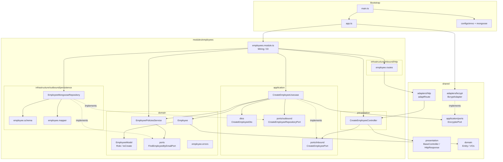
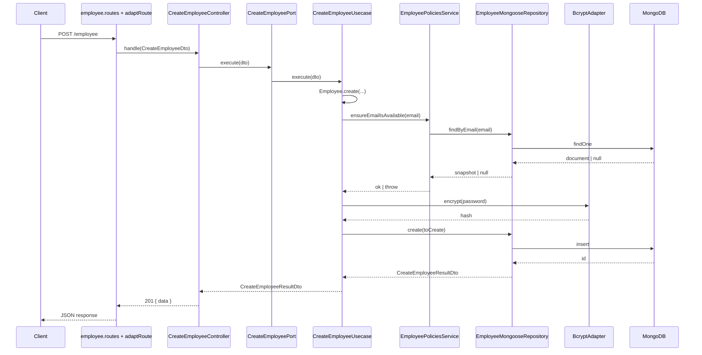

# Project structure — Ports & Adapters (Hexagonal)

Visual deep-dive of the `grau-api` architecture (diagrams + folder tree), based on the `employees` module.

## Documentation hierarchy

| Document | Role |
|----------|------|
| [`AGENTS.md`](../AGENTS.md) | Constitution for agents/devs: rules, patterns, conventions, playbooks |
| This file | Mermaid diagrams and detailed folder tree |
| `src/modules/<module>/AGENT.md` | Living contract for that hexagon |

Update this file when the **organization** of a module or the bootstrap changes (folders, diagrams).  
Global rules and naming → [`AGENTS.md`](../AGENTS.md). Employees contract → [`src/modules/employees/AGENT.md`](../src/modules/employees/AGENT.md).

## Principles

Summary (normative detail in [`AGENTS.md`](../AGENTS.md)):

- Each **module** is an independent hexagon (`employees` is the reference module).
- Dependency rule: `presentation / infrastructure → application → domain`.
- The **domain** does not know frameworks, HTTP, database, or DI — and does **not** import `application`.
- Cross-module communication: via **ports** / events — never import another module’s internal `domain`.
- Shared value objects live in `shared/domain`; use-case DTOs in `application/dtos`; domain concepts in `domain/models`.
- Wiring (ports → adapters) lives in `*.module.ts`; bootstrap (`main.ts` / `app.ts`) only composes the application.
- Each module owns its HTTP routing (`infrastructure/inbound/http`); `adaptRoute` stays in `shared`.

## Architecture diagram



### Request flow (Create Employee)



## Official structure

```text
grau-api/
├── src/
│   ├── main.ts                                         # entrypoint (env, DB, listen)
│   ├── app.ts                                          # Express + modules composition
│   │
│   ├── configs/
│   │   ├── envs/
│   │   │   └── index.ts                                # DATABASE_HOST, PORT
│   │   └── database/mongoose/
│   │       ├── database-connection.ts                  # connectDatabase / disconnectDatabase
│   │       ├── test-setup-mongoose-menory.ts           # MongoMemoryServer (tests)
│   │       └── testables.ts                            # chainable Mongoose mocks
│   │
│   ├── modules/
│   │   └── employees/                                  # module hexagon
│   │       ├── AGENT.md                                # living module contract
│   │       ├── domain/                                 # 🔒 pure business rules
│   │       │   ├── entities/
│   │       │   │   ├── Employee.ts
│   │       │   │   └── employee.spec.ts
│   │       │   ├── models/
│   │       │   │   ├── employee.model.ts               # Role, toCreate, isRole
│   │       │   │   └── employee.model.spec.ts
│   │       │   ├── ports/
│   │       │   │   └── find-employee-by-email.port.ts  # port used by domain service
│   │       │   ├── errors/
│   │       │   │   └── employee.errors.ts
│   │       │   └── services/
│   │       │       ├── employee-policies.service.ts
│   │       │       └── employee-policies.service.spec.ts
│   │       │
│   │       ├── application/                            # use cases + ports + DTOs
│   │       │   ├── dtos/
│   │       │   │   ├── create-employee.dto.ts          # CreateEmployeeDto / ResultDto
│   │       │   │   └── create-employee.dto.spec.ts
│   │       │   ├── ports/
│   │       │   │   ├── inbound/                       # driving ports
│   │       │   │   │   └── create-employee.port.ts
│   │       │   │   └── outbound/                      # driven ports
│   │       │   │       └── create-employee-repository.port.ts
│   │       │   └── usecases/
│   │       │       ├── create-employee.usecase.ts      # implements CreateEmployeePort
│   │       │       └── create-employee.usecase.spec.ts
│   │       │
│   │       ├── presentation/                           # controllers (HTTP, no Express)
│   │       │   └── controllers/
│   │       │       ├── create-employee.controller.ts   # depends on CreateEmployeePort
│   │       │       └── create-employee.controller.spec.ts
│   │       │
│   │       ├── infrastructure/
│   │       │   ├── inbound/http/                      # driving adapter (Express)
│   │       │   │   └── employee.routes.ts
│   │       │   └── outbound/persistence/              # driven adapter (Mongo)
│   │       │       ├── employee.schema.ts
│   │       │       ├── employee.mapper.ts
│   │       │       ├── employee-mongoose.repository.ts
│   │       │       └── employee-mongoose.repository.spec.ts
│   │       │
│   │       └── employees.module.ts                     # wiring / DI
│   │
│   ├── shared/                                         # cross-cutting (no employee rules)
│   │   ├── domain/
│   │   │   ├── entity/
│   │   │   │   ├── entity.ts
│   │   │   │   └── entity.spec.ts
│   │   │   ├── errors/
│   │   │   │   └── domain.error.ts
│   │   │   └── value-object/
│   │   │       ├── value-object.ts
│   │   │       ├── value-object.spec.ts
│   │   │       ├── index.ts
│   │   │       ├── id/unique-entity-id.vo.ts
│   │   │       ├── name/name.vo.ts
│   │   │       ├── email/email.vo.ts
│   │   │       ├── password/password.vo.ts
│   │   │       └── nif/nif.vo.ts
│   │   ├── application/
│   │   │   └── ports/
│   │   │       └── encrypter.port.ts
│   │   ├── presentation/
│   │   │   ├── protocols/
│   │   │   │   ├── base-controller.ts
│   │   │   │   └── http-response.ts
│   │   │   ├── helpers/
│   │   │   │   └── http-helper.ts
│   │   │   └── errors/
│   │   │       ├── presentation.error.ts
│   │   │       └── missing-param.error.ts
│   │   └── infrastructure/
│   │       └── adapters/
│   │           ├── http/
│   │           │   └── express-route.adapter.ts        # Express req/res ↔ controller
│   │           └── bcrypt/
│   │               ├── bcrypt.adapter.ts               # implements EncrypterPort
│   │               └── bcrypt.adapter.spec.ts
│   │
│   └── client/
│       └── employee.http                               # REST Client requests
│
├── docs/
│   └── project-structure.md                            # diagrams + tree (this file)
│
├── AGENTS.md                                           # global constitution (agents/devs)
├── docker-compose.yml                                  # local MongoDB
├── .env
├── jest.config.js
├── lefthook.yml
├── eslint.config.mjs
├── tsconfig.json
└── package.json
```

## Layers, types, aliases, and naming

Normative tables (layers, where to put types, path aliases, naming, testing, Do/Don’t) → [`AGENTS.md`](../AGENTS.md).

## Structure notes

- Controllers in `presentation` do not import Express; `adaptRoute` bridges the gap.
- Module HTTP routes live in `infrastructure/inbound/http` and are mounted by `employees.module.ts`.
- `EncrypterPort` is shared; the concrete implementation (`BcryptAdapter`) is injected at the composition root (`app.ts`).
- Current employees hexagon contract (ports, DTOs, HTTP) → [`src/modules/employees/AGENT.md`](../src/modules/employees/AGENT.md).
