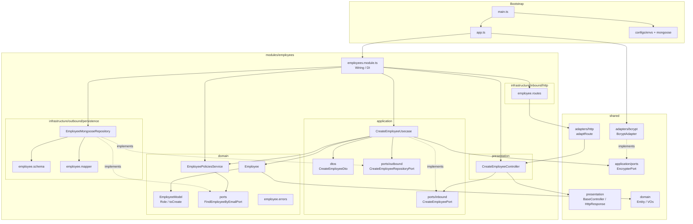
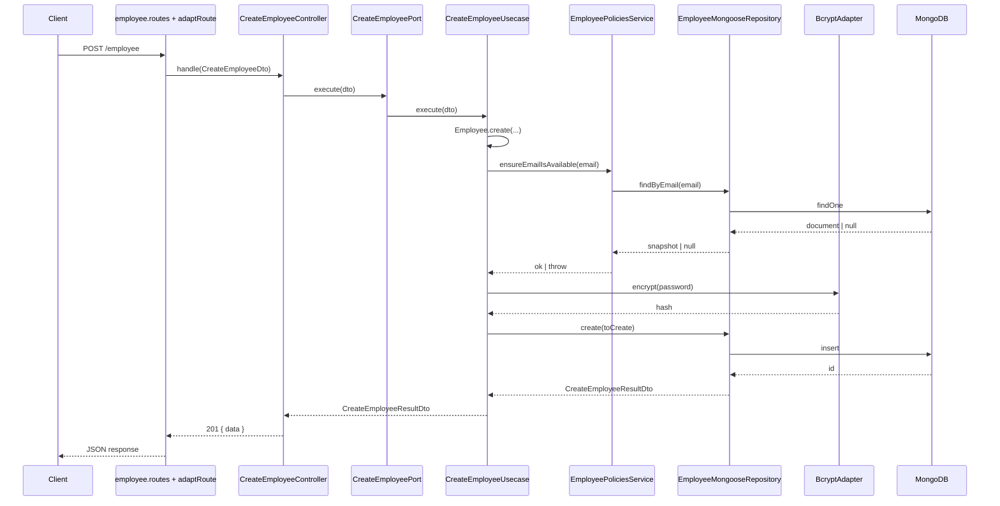

# Estrutura do projeto — Ports & Adapters (Hexagonal)

Documento oficial da arquitetura do `grau-api`, baseado no módulo `employees`.  
Atualize este arquivo sempre que a organização do módulo ou do bootstrap mudar.

## Princípios

- Cada **módulo** é um hexágono independente (`employees` é o módulo de referência).
- Regra de dependência: `presentation / infrastructure → application → domain`.
- O **domínio** não conhece frameworks, HTTP, banco ou DI — e **não importa** `application`.
- Comunicação entre módulos: via **ports** / eventos — nunca importar o `domain` interno de outro módulo.
- Value objects compartilhados (`Name`, `Email`, `Password`, `Nif`, `UniqueEntityId`) vivem em `shared/domain`.
- DTOs de entrada/saída de casos de uso vivem em `application/dtos`.
- Conceitos de domínio (`Role`, snapshot da entidade) vivem em `domain/models`.
- O wiring (ports → adapters) fica no `*.module.ts`; o bootstrap (`main.ts` / `app.ts`) só compõe a aplicação.
- Cada módulo é dono do seu roteamento HTTP (`infrastructure/inbound/http`).
- `adaptRoute` permanece em `shared` (transversal ao Express).

## Diagrama de arquitetura



### Fluxo de uma requisição (Create Employee)



## Estrutura oficial

```text
grau-api/
├── src/
│   ├── main.ts                                         # entrypoint (env, DB, listen)
│   ├── app.ts                                          # composição Express + módulos
│   │
│   ├── configs/
│   │   ├── envs/
│   │   │   └── index.ts                                # DATABASE_HOST, PORT
│   │   └── database/mongoose/
│   │       ├── database-connection.ts                  # connectDatabase / disconnectDatabase
│   │       ├── test-setup-mongoose-menory.ts           # MongoMemoryServer (testes)
│   │       └── testables.ts                            # mocks encadeáveis do Mongoose
│   │
│   ├── modules/
│   │   └── employees/                                  # hexágono do módulo
│   │       ├── domain/                                 # 🔒 regras de negócio puras
│   │       │   ├── entities/
│   │       │   │   ├── Employee.ts
│   │       │   │   └── employee.spec.ts
│   │       │   ├── models/
│   │       │   │   ├── employee.model.ts               # Role, toCreate, isRole
│   │       │   │   └── employee.model.spec.ts
│   │       │   ├── ports/
│   │       │   │   └── find-employee-by-email.port.ts  # port usada pelo domain service
│   │       │   ├── errors/
│   │       │   │   └── employee.errors.ts
│   │       │   └── services/
│   │       │       ├── employee-policies.service.ts
│   │       │       └── employee-policies.service.spec.ts
│   │       │
│   │       ├── application/                            # casos de uso + ports + DTOs
│   │       │   ├── dtos/
│   │       │   │   ├── create-employee.dto.ts          # CreateEmployeeDto / ResultDto
│   │       │   │   └── create-employee.dto.spec.ts
│   │       │   ├── ports/
│   │       │   │   ├── inbound/                       # driving ports
│   │       │   │   │   └── create-employee.port.ts
│   │       │   │   └── outbound/                      # driven ports
│   │       │   │       └── create-employee-repository.port.ts
│   │       │   └── usecases/
│   │       │       ├── create-employee.usecase.ts      # implements CreateEmployeePort
│   │       │       └── create-employee.usecase.spec.ts
│   │       │
│   │       ├── presentation/                           # controllers (HTTP, sem Express)
│   │       │   └── controllers/
│   │       │       ├── create-employee.controller.ts   # depende de CreateEmployeePort
│   │       │       └── create-employee.controller.spec.ts
│   │       │
│   │       ├── infrastructure/
│   │       │   ├── inbound/http/                      # driving adapter (Express)
│   │       │   │   └── employee.routes.ts
│   │       │   └── outbound/persistence/              # driven adapter (Mongo)
│   │       │       ├── employee.schema.ts
│   │       │       ├── employee.mapper.ts
│   │       │       ├── employee-mongoose.repository.ts
│   │       │       └── employee-mongoose.repository.spec.ts
│   │       │
│   │       └── employees.module.ts                     # wiring / DI
│   │
│   ├── shared/                                         # transversal (sem regra de employees)
│   │   ├── domain/
│   │   │   ├── entity/
│   │   │   │   ├── entity.ts
│   │   │   │   └── entity.spec.ts
│   │   │   ├── errors/
│   │   │   │   └── domain.error.ts
│   │   │   └── value-object/
│   │   │       ├── value-object.ts
│   │   │       ├── value-object.spec.ts
│   │   │       ├── index.ts
│   │   │       ├── id/unique-entity-id.vo.ts
│   │   │       ├── name/name.vo.ts
│   │   │       ├── email/email.vo.ts
│   │   │       ├── password/password.vo.ts
│   │   │       └── nif/nif.vo.ts
│   │   ├── application/
│   │   │   └── ports/
│   │   │       └── encrypter.port.ts
│   │   ├── presentation/
│   │   │   ├── protocols/
│   │   │   │   ├── base-controller.ts
│   │   │   │   └── http-response.ts
│   │   │   ├── helpers/
│   │   │   │   └── http-helper.ts
│   │   │   └── errors/
│   │   │       ├── presentation.error.ts
│   │   │       └── missing-param.error.ts
│   │   └── infrastructure/
│   │       └── adapters/
│   │           ├── http/
│   │           │   └── express-route.adapter.ts        # Express req/res ↔ controller
│   │           └── bcrypt/
│   │               ├── bcrypt.adapter.ts               # implementa EncrypterPort
│   │               └── bcrypt.adapter.spec.ts
│   │
│   └── client/
│       └── employee.http                               # requests REST Client
│
├── docs/
│   └── project-structure.md                            # este arquivo
│
├── docker-compose.yml                                  # MongoDB local
├── .env
├── jest.config.js
├── lefthook.yml
├── eslint.config.mjs
├── tsconfig.json
└── package.json
```

## Camadas do módulo

| Camada | Responsabilidade | Pode depender de |
|--------|------------------|------------------|
| `domain` | Entidade, model (`Role`/`toCreate`), errors, domain services, ports do domínio | apenas `shared/domain` |
| `application` | Use cases, inbound/outbound ports, DTOs | `domain` + `shared` |
| `presentation` | Controllers HTTP (framework-agnostic) | `application` + `shared/presentation` |
| `infrastructure/inbound` | Rotas Express do módulo | `presentation` + `shared` adapters HTTP |
| `infrastructure/outbound` | Repositório Mongoose, schema, mapper | `application` + `domain` + frameworks |
| `employees.module.ts` | Wiring: instancia adapters e injeta nas ports | camadas do módulo + `shared` |

## Onde colocar tipos

| Tipo | Pasta | Exemplo |
|------|-------|---------|
| DTO de caso de uso (entrada/saída) | `application/dtos/` | `CreateEmployeeDto` |
| Conceito de domínio / snapshot | `domain/models/` | `EmployeeModel.Role`, `toCreate` |
| Port usada pelo domain service | `domain/ports/` | `FindEmployeeByEmailPort` |
| Port de entrada (driving) | `application/ports/inbound/` | `CreateEmployeePort` |
| Port de saída (driven) | `application/ports/outbound/` | `CreateEmployeeRepositoryPort` |

## Path aliases

Definidos em `tsconfig.json` / `jest.config.js`:

| Alias | Resolve para |
|-------|--------------|
| `@modules/*` | `./src/modules/*` |
| `@shared/*` | `./src/shared/*` |
| `@configs/*` | `./src/configs/*` |
| `@config/*` | `./src/configs/*` |

## Convenções de nomenclatura

| Tipo | Padrão | Exemplo |
|------|--------|---------|
| Entidade | `PascalCase.ts` | `Employee.ts` |
| Value object | `kebab-case.vo.ts` | `email.vo.ts` |
| Port | `kebab-case.port.ts` | `create-employee.port.ts` |
| DTO | `kebab-case.dto.ts` | `create-employee.dto.ts` |
| Use case | `kebab-case.usecase.ts` | `create-employee.usecase.ts` |
| Controller | `kebab-case.controller.ts` | `create-employee.controller.ts` |
| Routes | `kebab-case.routes.ts` | `employee.routes.ts` |
| Repository | `kebab-case.repository.ts` | `employee-mongoose.repository.ts` |
| Schema | `kebab-case.schema.ts` | `employee.schema.ts` |
| Spec | co-locado (`*.spec.ts`) | `create-employee.usecase.spec.ts` |
| Module wiring | `*.module.ts` | `employees.module.ts` |

## Notas

- Specs unitários ficam **co-locados** com o código de produção (`*.spec.ts`).
- Controllers em `presentation` não importam Express; o `adaptRoute` faz a ponte.
- Rotas HTTP do módulo ficam em `infrastructure/inbound/http` e são montadas pelo `employees.module.ts`.
- `EncrypterPort` é shared; a implementação concreta (`BcryptAdapter`) é injetada no composition root (`app.ts`).
- Coverage (`jest.config.js`) exclui bootstrap, modules de wiring, routes/adapters HTTP, schemas e configs.
