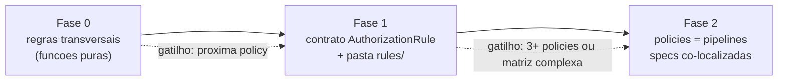

# Refactor Plan: Employee Authorization Policies

**Status:** Draft — proposta de tech lead
**Date:** 12/09/2026
**Escopo:** `src/modules/employees/domain/services/` (authorization policies)
**Constitution:** [`AGENTS.md`](../../../../AGENTS.md) · hexagon: [`employees/AGENT.md`](../../../../src/modules/employees/AGENT.md)
**Policies alvo:**
- [`employee-main-data.policy.ts`](../../../../src/modules/employees/domain/services/employee-main-data.policy.ts)
- [`employee-lifecycle.policy.ts`](../../../../src/modules/employees/domain/services/employee-lifecycle.policy.ts)

**ADRs relacionados:**
- [`update-main-employee-data/0001-main-data-policy-is-a-domain-service.md`](../../../adr/update-main-employee-data/0001-main-data-policy-is-a-domain-service.md)
- [`remove-or-inactivate-emp/0010-lifecycle-policy-is-a-domain-service.md`](../../../adr/remove-or-inactivate-emp/0010-lifecycle-policy-is-a-domain-service.md)

> Este é um plano de refatoração **faseado e orientado por gatilhos**. Nenhuma fase é obrigatória "agora": cada uma só é ativada quando o gatilho correspondente ocorre. Todo exemplo de código nos documentos é **conceitual** e não existe no repositório ainda.

---

## 1. Problema

As duas policies concentram **regras de autorização diferentes dentro de um único método `assertCan`**:

- [`EmployeeMainDataPolicy`](../../../../src/modules/employees/domain/services/employee-main-data.policy.ts): actor login-capable → target não removido → matriz por role (4 blocos sequenciais).
- [`EmployeeLifecyclePolicy`](../../../../src/modules/employees/domain/services/employee-lifecycle.policy.ts): actor ACTIVE → self-remove → target não removido → matriz role/intent → last-admin (async) → REMOVE exige INACTIVE (6 blocos sequenciais).

Sintomas:

- **Acúmulo de regras** conceptualmente distintas no mesmo método.
- **Duplicação** entre as policies — notavelmente "Target não REMOVED" (`EmployeeAlreadyRemovedError`).
- A matriz `role × intent × status` tende a crescer dentro de um único encadeado de `if`.

---

## 2. Veredito (tech lead)

O design atual — **Policy Object + regras sequenciais + testes por regra** (`describe('Rule N')`) — **é adequado ao estágio do produto**. As policies são pequenas (~40 e ~90 linhas), corretas e testáveis.

**Não** adotar Specification Pattern completo hoje: o custo (muitos arquivos, pipeline sync/async, composição por role) supera o ganho atual. A resposta é **preparar o terreno** — regras atômicas compartilhadas + um contrato simples — e **escalar para Specification quando a 3ª policy ou a complexidade da matriz justificar**.

---

## 3. Fases

| Fase | Gatilho de ativação | Entrega | Risco |
|------|---------------------|---------|-------|
| [**0**](./00-fase-0-extrair-regras-transversais.md) | Agora (opcional, baixo risco) | Extrair `assertTargetNotRemoved` (+ helper opcional "actor EMPLOYEE → forbidden") | Muito baixo |
| [**1**](./01-fase-1-contrato-authorization-rule.md) | Surgir a **próxima policy** de autorização | Pasta `domain/authorization/rules/` + interface `AuthorizationRule<TContext>` (e `AsyncAuthorizationRule`) | Baixo |
| [**2**](./02-fase-2-policies-como-pipelines.md) | **3+ policies** ou matriz complexa / auditoria | Policies viram pipelines; specs co-localizadas `*.rule.ts` + `*.rule.spec.ts` | Médio |

---

## 4. Critérios de done (globais, valem para qualquer fase)

- Contrato público `assertCan` **inalterado** — use cases e `employees.module.ts` não mudam.
- **Mesma ordem de erros** garantida pelos specs existentes (Rule 1 antes de Rule 2, etc.).
- **Zero nova dependência** de framework.
- **Cada regra testável isoladamente**, espelhando os `describe('Rule N')` que já existem.

---

## 5. O que NÃO fazer

| Evitar | Motivo |
|--------|--------|
| Big-bang refactor das duas policies de uma vez | Risco/regressão > benefício atual |
| Specification boolean puro + camada `Result` em todo lugar | Boilerplate; erros de domínio já são a API correta |
| Unificar "actor login-capable" (main-data: `ACTIVE`\|`VACATION`) com "actor ACTIVE" (lifecycle) | Regras de negócio **intencionalmente diferentes** |
| Mover regras para `@shared` | São bounded context de employees |
| Criar "Rule Engine" configurável | YAGNI; a matriz cabe em código explícito |

---

## 6. Índice

1. [Fase 0 — Extrair regras transversais](./00-fase-0-extrair-regras-transversais.md)
2. [Fase 1 — Contrato `AuthorizationRule`](./01-fase-1-contrato-authorization-rule.md)
3. [Fase 2 — Policies como pipelines](./02-fase-2-policies-como-pipelines.md)
